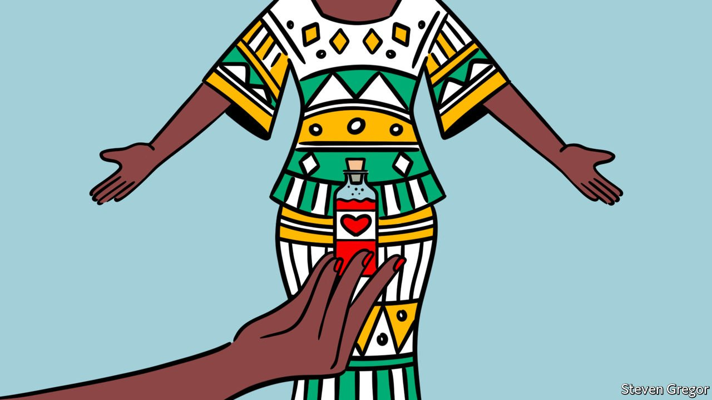

###### Potions for prudes

# Nigeria’s conservative north is overflowing with aphrodisiacs 

##### The call to prayer is often followed by offers of more earthly upliftment 

 

> Jan 22nd 2022 

BESIDE THE food-sellers at a street market in Abuja, a man in a flowing white kaftan holds a brown leather bag in one hand. In the other, well, is a baby crocodile, which he holds out to a potential customer. “Do you want to touch it?” he asks in Hausa, a language spoken in northern Nigeria and surrounding countries, before offering far more than a fondle of a ferocious reptile: medicines for a cold; for chest pain; for a sore back; and to improve sexual performance.

A protracted haggle ensues. Details are discussed. Instructions are issued. Money changes hands, as do powdered herbs wrapped in paper. The trade in aphrodisiacs in northern Nigeria is old and pervasive. Herbs are sold in markets, shops, the grounds of mosques, and now on social media. How odd. This is a region that is seen as culturally and religiously conservative. States enforce sharia on the Muslim majority. Women here, who are often garbed in body-length hijabs, are thought of as sexually repressed.


In the movies and literature of the region, mostly in Hausa, physical contact between men and women is frowned upon. Two popular television shows were banned by the government of Kano, the most populous state in the north, because of a scene in which three men held a woman in an auto-rickshaw. Since they were unmarried, the scene offended the region’s “norms, culture, values and religion”, said the head of the censorship board. (That the men were trying to abduct the woman seems to have been less concerning.)

But this seeming prudishness does not extend to the marital bed, perhaps because people believe God would like them to procreate more. Imams may preach against adultery. But when the call to prayer ends on Fridays, a voice booms out over another set of loudspeakers advertising a somewhat earthlier elevation.

“It is everywhere now,” says Muhammadu Sani, a customer. “Even practitioners of Islamic medicine now sell them.” Some draw their formula from the recommendations of Islamic texts and practices of early Muslim scholars. Their shops are often neat, with shelves stacked with bottles of herbs and decoctions.

Women are not overlooked. The trade in kayan mata (literally “women’s things” in Hausa) is an old one, though it has been engorged of late by claims that goron tula (the “snot apple” fruit) boosts libido and fertility. Among those promoting its powers is Hauwa Saidu Mohammed, popularly known as Jaruma, an entrepreneur and sex therapist who boasts that her clients include the wives of government ministers and state governors. By offering doorstep delivery and a suave service, she has helped turn kayan mata into a major export from the north to cities in the south such as Lagos, the commercial capital.

More than a million people follow Jaruma on social media. Many women are there for the scandals. In some posts she has shamed politicians who she claims bought her goods but did not pay up. In others she offers salacious gossip about celebrities whose marriages were consummated (or wrecked) with the help of her potions. Others just want to buy her tonics, which include: “Divorce is not my portion” (500,000 naira, or $1,200); “Love me like crazy” (250,000 naira); and Ecstacy9 (65,000 naira). In a country where many people earn no more than the minimum wage of 30,000 naira per month, such prices may arouse passion, even if the products themselves do not. ■

