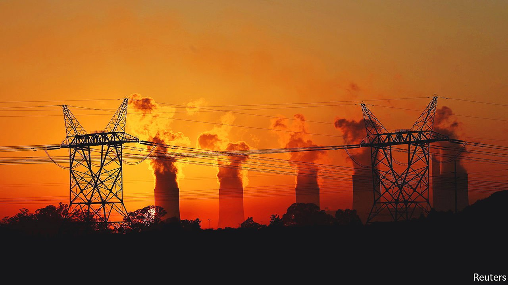
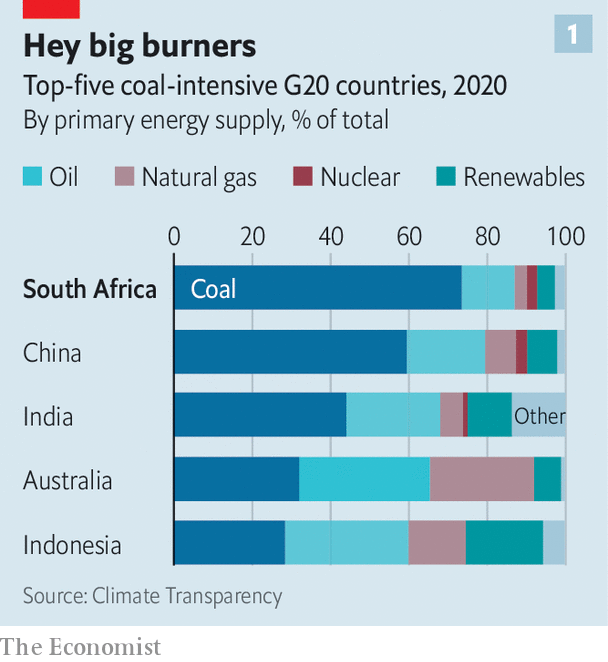
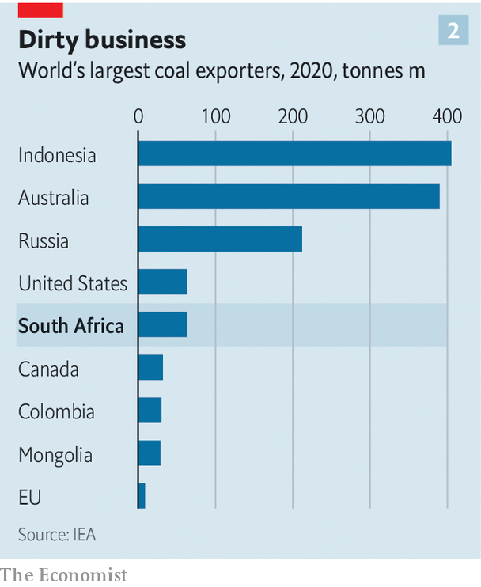

###### Soot, loot, reboot

# South Africa, the world’s coal junkie, tries to quit 

##### But a gang of coal-dependent politicians is making it hard 

 

> Jan 22nd 2022 

TRAVEL EAST from Johannesburg—South Africa’s economic capital—and dusty industrial towns line the road to the city of Emalahleni (“place of coal” in the local language, Tswana). The flat veld is dotted with mines and the smokestacks of coal-fired power stations.

 


This is South Africa’s coal belt. Here, miners dig up about three-quarters of the coal that fuels one of the world’s most coal-fired economies. The sooty stuff provides 27% of the world’s energy, but no less than 77% of South Africa’s (see chart 1). That includes almost all of its electricity and—uniquely—28% of its petrol and diesel, which it synthesises from coal using a process perfected during an oil embargo in the 1980s aimed at ending apartheid.


The fuel that once helped preserve apartheid continues to cause problems for the party that eventually supplanted it, the African National Congress (ANC). Diversifying away from coal would help end South Africa’s decade-long energy crisis, and with it a period of economic stagnation, marked by flat or falling incomes. The brewing political battle over whether to do so may also determine the fate of Cyril Ramaphosa, South Africa’s timidly reformist president, who hopes to secure the ANC’s nomination to run for a second term in 2024 at a party conference later this year.

The case for shifting away from coal is straightforward. South Africa is windy and sunny. It can produce renewable energy by building new wind turbines and solar farms far more cheaply that it can by digging up coal and shovelling it into power stations that have already been built. (What’s more, many of these coal plants are old and will soon have to close.) Since wind and solar farms can be built quickly, they are well-suited to help end a desperate power shortage. The national utility, Eskom, has rationed electricity by scheduling regular power cuts every year since 2018, making it harder to run almost any kind of business.

The winds blowing through inter national capital markets are pushing in this direction, too. Although Eskom is broke and unable to service its debts without help from the government, private investors are keen to put money into renewable projects. So are Western governments. At the COP26 climate conference in Glasgow last year, a group of rich countries including America, Britain, France and Germany pledged $8.5bn in grants, cheap loans and investments to help finance South Africa’s shift away from coal. South Africa, for its part, published ambitious new climate commitments to start cutting greenhouse-gas emissions from 2025, a decade earlier than previously planned.

The COP deal places special emphasis on supporting the workers and areas set to be hurt by the phasing out of coal. That is no small consideration: the industry employs roughly 200,000 people, directly and indirectly, and props up the regional economy around Emalahleni. Such concern is typical of the conciliatory approach to politics of Mr Ramaphosa, once a hard-charging mining-union boss who these days prefers compromise over conflict and consensus over rapid change.

Take the latest version of South Africa’s Integrated Resource Plan, which maps the future of energy infrastructure. The document, approved in 2019, proposed decommissioning 35,000 of the 40,000 megawatts (MW) of coal-power capacity currently in operation by 2050. Most new capacity is to come from wind and solar. But little has happened since, largely because of resistance from mining unions, populists and politicians who have grown rich selling overpriced coal to Eskom.

Among the most prominent advocates of coal is Gwede Mantashe, the minerals and energy minister and a former mineworker. In the 1980s, when Mr Ramaphosa was running the National Union of Mineworkers, Mr Mantashe co-founded and led the union’s branch in Witbank, as Emalahleni was then known. He later rose to the top of the union.

Although once a close ally of Mr Ramaphosa, Mr Mantashe has tried to thwart the president’s plans to ease the power shortage by attracting private investment in renewable generation. Regulations used to make it practically impossible for big businesses such as mines to generate their own power, since private generation capacity of more than a megawatt required unobtainable licences. Mr Mantashe doggedly resisted efforts to raise the cap to 50MW, despite pleas from power-starved firms. In an act of uncharacteristic boldness, Mr Ramaphosa overruled him last year and raised the cap to 100MW.

The episode has done little to chasten Mr Mantashe, who is continuing to lobby for new coal-burning plants, even as he drags his heels about approving deals by private investors to build wind and solar farms. He has also seemed determined to award an expensive 20-year contract for “emergency” electricity to Karpowership, a Turkish operator of floating power stations. That deal has been blocked by environmental regulators and also faces a legal challenge from a losing bidder, who alleged in papers before the courts that he had been asked to pay bribes to have his bid considered. Mr Mantashe has said the tender was “correct, above board and trans parent”. Karpowership has also denied any wrongdoing. Yet until the case is resolved the banks whose loans are needed will stay well away from the deal.

Time is of the essence for Mr Ramaphosa, whose rivals within the ANC are already lining up to challenge him for the leadership of the party at its next five-yearly conference in December. Although national elections are more than two years away, the party has a habit of defenestrating sitting presidents. It booted out two of Mr Ramaphosa’s predecessors, Thabo Mbeki and Jacob Zuma, before their presidential terms were up.

 


Mr Mantashe may well stand with Mr Ramaphosa against the pro-corruption wing of the ANC—as he did in 2017—though some pundits reckon he may also be considering knifing the president to make his own run for power. In either case he will want the backing of the country’s two main industrial trade unions, representing miners and metalworkers, which between them muster some 650,000 members. Both unions back coal, a big export (see chart 2), and have opposed renewable power, which has become a touchstone for the political left: Floyd Shivambu, a leader of the populist Economic Freedom Fighters party, thinks renewable energy is “a colonial takeover engineered by the West”.

While the ANC is focused on its internal power struggles, many South Africans will see the national elections in 2024 as an opportunity to express their views on energy policy. The start of Mr Ramaphosa’s campaign for the party’s presidential nomination provides a fitting metaphor. As he was addressing a fundraising gala in Polokwane, a city in the north, the power cut out, leaving him, and the assembled ANC grandees, fumbling in the dark. ■

