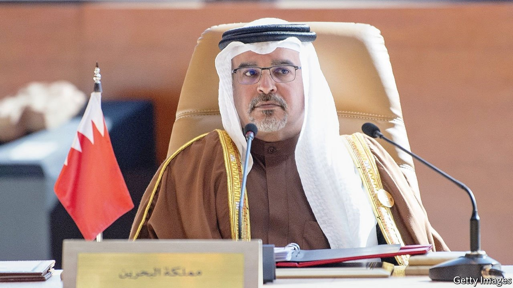

###### Full of tension

# Sunnis and Shias in Bahrain remain as far apart as ever 

##### A prime minister who once called for dialogue has disappointed 

 

> Jan 22nd 2022 

THE DEATH in 2020 of Khalifa bin Salman al-Khalifa, the world’s longest-serving prime minister, prompted mourning in Bahrain, but also a ripple of excitement. His nephew, Salman bin Hamad al-Khalifa, was slated to take his place. Prince Salman, who is first in line to the throne, was seen as a potential bridge between the kingdom’s ruling Sunnis and its oppressed Shia majority. In 2011, when the authorities, backed by Saudi and Emirati forces, crushed Shia protests, he called for a dialogue between the sects. Shia leaders, who have endured prison and torture, hoped Prince Salman would free those in jail, give followers of their faith equal rights and perhaps even pass a law against discrimination.

None of that has happened. The main Shia opposition group, al-Wefaq, was banned in 2016 for creating “a new generation that carries the spirit of hatred”—though it would be easy to implicate the government in that crime, too. Al-Wefaq’s leader, Ali Salman, and hundreds of lowlier members remain behind bars. But without some kind of deal with the Shias, the kingdom will flare up again, predict both officials and critics of the government. Some fear a worst-case scenario, in which violence in tiny Bahrain (an island 48km long and 16km wide, with a population of 1.8m) spills over into the Eastern Province of Saudi Arabia, which is just 20km away, and home to both restive Shias and big oilfields.


Improving Sunni-Shia relations in Bahrain was always going to be difficult. The king, Hamad bin Isa, is surrounded by people who prefer that he rule with an iron fist. One such figure is Prince Salman’s younger brother, Nasser, the national security adviser and reportedly the king’s favourite son. Two prominent cousins—Khalid, the minister for the royal court, and Khalifa, a military man—also take a hard line with the Shias. Then there are Bahrain’s neighbours, Saudi Arabia and the United Arab Emirates. They treat the kingdom as a client and oppose any hint of democracy. Western powers, meanwhile, have stopped pressing hard for reform.

The Shias themselves are divided. Ayatollah Isa Qassim, the spiritual leader of al-Wefaq, moved from London to Qom, Iran's holiest city, a few years ago. He seems intent on turning the group into a cat’s paw of Iran. Some Shias paint the al-Khalifa clan as foreigners, although they arrived from the Arabian hinterland centuries ago. Others are more willing to talk with the regime. Abdullah al-Ghuraifi, a Shia cleric, had a meeting with the king last year. But such moderates are often branded as traitors.

Prince Salman (pictured) could certainly do more. He has excluded Shias from serious jobs and seems unenthused about leading parliament, which last year voted to curb its already limited powers still more. According to his Twitter feed, the prince chairs weekly cabinet meetings, though it is not clear what is discussed. The “vision” section of his website reads simply: “Bahrain will continue to realise its ambitious goals, benefiting all in the Kingdom.”

But the fiscal picture is bleak. Ordinary Bahrainis have suffered the pain of austerity in recent years—most of all Shias, who have gained little from the aid of other Gulf states. “Hunger and limited opportunities could ignite another wave of protests,” says a Shia businessman in Manama, the capital.

Prince Salman has won praise for rolling out covid-19 vaccines to all Bahrainis, regardless of sect. Some prisoners have been freed and the authorities are said to be torturing less. But even his courtiers say the prince needs a jolt. He spends much of his time in his palace. Meanwhile, his failure to soothe Sunni-Shia tensions is setting Bahrain up for trouble. “The sectarian divide from a decade ago hasn’t healed,” says the businessman. “For now the island is quiet, but we’re used to a lull before the storm.”

