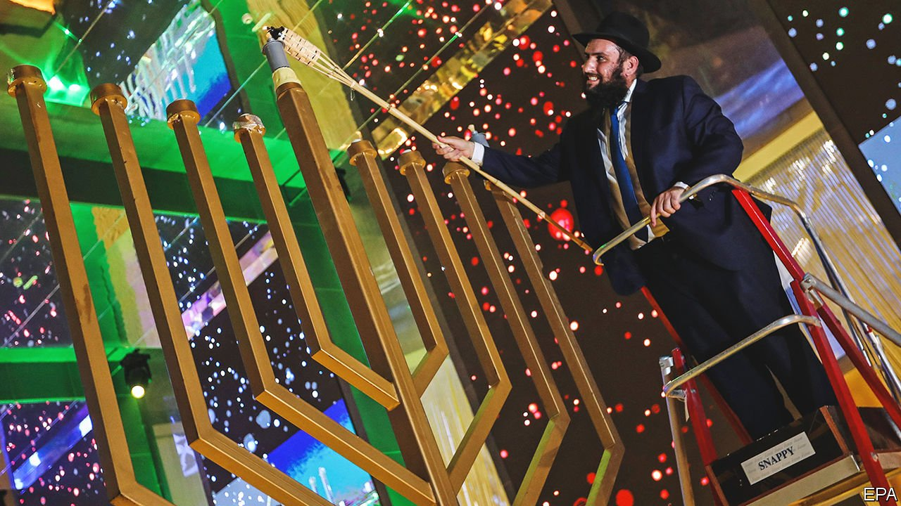

###### Welcome back

# The Arab world is re-embracing its Jews 

##### Changing attitudes and self-interested leaders are behind a surprising religious revival 

 

> Jan 22nd 2022 

THE SLOGAN of the Houthi rebels, who control northern Yemen, is blunt. “Death to Israel, curse on the Jews,” it reads in part. So it was no shock when the group chased Jews out of its area of control. What might be surprising is where some of those Jews ended up. Yusuf Hamdi and his extended family were rescued in a mission organised by the UN, America, Qatar and the United Arab Emirates (UAE) in 2021. Mr Hamdi and company then passed up a chance to go to Israel, instead becoming the first Yemenite Jews to settle in the UAE.

The UAE offered inducements: a rent-free villa, fancy car and monthly welfare cheques. It is all part of an effort to seed new Jewish communities in the country. Since the government declared 2019 the year of tolerance, and officially recognised the existence of Jews in the UAE, new kosher restaurants and a Jewish centre have sprung up. During the festival of Hanukkah last year the state erected large menorahs in city squares (pictured). It plans to open a state-financed synagogue later this year. “Jews are back in the Middle East,” says Edwin Shuker, an Iraqi Jew who fled to Britain, but resettled in Dubai last year.


From Morocco to the Gulf, a surprising number of Arab countries are welcoming back Jews and embracing their Jewish heritage. The reasons vary. The failures and excesses of Arab nationalism and Islamism have forced many countries to rethink chauvinist dogmas. Modernising autocrats have jettisoned communal tropes and pursued multicultural agendas. And the  is no longer seen as a priority in the region. “The Arab world has too many problems to still care about Palestine,” says Kamal Alam, an expert on Syria and its Jewish diaspora. “Instead they begrudgingly look at Israel and Jews as models for running a successful country that feeds itself without oil.”

Before the establishment of Israel in 1948, more Jews lived in the rest of the Arab world than in Palestine. At least a quarter of Baghdad’s population was Jewish. So was Iraq’s beauty queen in 1947. But after the creation of Israel and its displacement of Palestinians, Arab rulers turned on their Jewish subjects. Many were stripped of their citizenship and their property. State media and school textbooks promoted anti-Semitism, and the sermons of Muslim preachers fanned the flames. Arab states chased away all but a few thousand of the region’s non-Israeli Jews.

In recent years, though, the mood has drastically changed. Most Arabs have no memory of the big Arab-Israeli wars of last century. Milder opinions have been encouraged by leaders who see the Jewish state as a  and ally against Iran, and who seek more acceptance in the West. The rulers of Egypt, Saudi Arabia and the UAE, for example, host multicultural gatherings and often muzzle clerics who step out of line. Sympathetic portrayals of Jews have appeared in Arab films and TV shows; documentaries have explored the region’s Jewish roots. Some Arab universities have opened departments of Jewish history. Such is the change in attitude that when four Arab countries—Bahrain, Morocco, Sudan and the UAE—agreed to normalise relations with Israel in 2020, there were no big protests.

Saudi Arabia has not formally made peace with Israel. But the kingdom—once one of the world’s most closed and intolerant countries—now welcomes Jews, even Israelis (if they are travelling on foreign passports). Hebrew can be heard at fairs and festivals. An Israeli psychic performed at a recent royal party. Anti-Jewish calumnies have been culled from Saudi textbooks. To the consternation of some, an Israeli rabbi called Jacob Herzog is a frequent visitor to Riyadh, the capital. He sits in cafés wearing ultra-Orthodox garb and distributes prayer books. Sometimes he posts pictures of himself dancing with merchants in the bazaar. “Jews used to be afraid of saying they were Jews in the kingdom,” says Mr Herzog, who calls himself the chief rabbi of Saudi Arabia. “Now we’re getting embedded.”

This goes hand in hand with Muhammad bin Salman’s push to attract . The crown prince and de facto ruler of Saudi Arabia has defied the clerics by sponsoring archaeological digs of Jewish sites in the hopes of one day attracting Jewish sightseers. In November an Israeli opened Habitas, a luxury hotel in Al Ula, an ancient rock city. Prince Muhammad has located one of his pet projects, a planned $500bn high-tech city called Neom, on the kingdom’s north-west coast—the better to attract Israeli expertise, say his advisers. “Saudis are becoming closer to Jews than to Palestinians and Lebanese,” says Sultan al-Mousa, the author of a bestselling Saudi novel about a Jewish revolt against the Roman Empire.

In Egypt the government of Abdel-Fattah al-Sisi is renovating Jewish cemeteries and what was once the biggest synagogue in the Middle East. This may, in part, be an effort to charm America, which gives Egypt heaps of aid. Elsewhere, the motives are clearer. The blood-soaked regime of Bashar al-Assad in Syria is restoring synagogues and has reached out to the many Syrian Jews in New York, hosting a delegation of them in Damascus. “Syria is engaging with its Jewish exiles in order to buff up its image as a protector of religious minorities and to connect with communities who might possibly give it some political leverage in Washington at a time when it has very little of it,” says David Lesch of Trinity University in Texas.

Mizrahi Jews from Israel are also driving change in the region. With roots in the Middle East, many of them feel marginalised in Israel, where schools tend to focus on European Jewish history. Large numbers of Mizrahim have gone to , some hoping to build a new housing complex for Jews in Marrakech. Others pack dozens of flights each week between Tel Aviv and Dubai. Those who stay put are more open about their heritage. In contrast to their grandparents, who listened to Umm Kulthum, an Egyptian diva, in secret, young Mizrahim blast Arabic music in public. In 2015 three sisters of Yemenite origin released Israel’s first Arabic chart-topper. “Coldness is turning to curiosity about the region,” says Liel Maghen, who runs the Centre for Regional Initiatives, a think-tank in Jerusalem. “There’s an Arabisation of Israeli culture.”

Some take a cynical view of all the bonhomie. “I’ll imprison you [Palestinians] at checkpoints. And then take a selfie in [Dubai’s] towers,” croons Noam Shuster-Eliassi, an Israeli comedienne, in her satirical song “Dubai, Dubai” (which is in Arabic). Others fear Jews could be targeted in the event of a popular backlash against the region’s despots. But the trajectory of Morocco suggests that the improvement in relations could endure. The kingdom began reaching out decades ago. Jews of Moroccan origin are able to reclaim their citizenship. The country has a Jewish museum and a new Jewish study centre and has restored dozens of old Jewish sites, notes Avraham Moyal, a rabbi of Moroccan descent. “We’ve smashed the taboo.” ■

