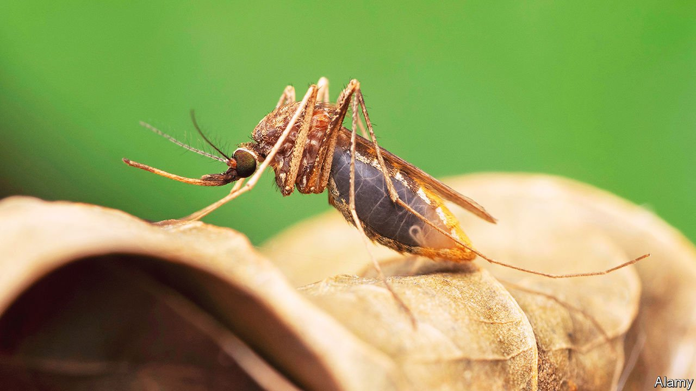

###### Tropical diseases

# A field test for malaria resistance 

##### It will help to save lives, and may slow resistance’s spread 

 

> Jan 22nd 2022 

AN ARMS RACE between pharmacologists and malaria parasites has been going on since the mid-19th century, when widespread use of quinine began. Few better illustrations of natural selection exist than the repeated emergence of resistance to such drugs. Even artemisinin, the most recent addition to the arsenal, has already provoked an evolutionary pushback.

At the moment, working out which drugs, if any, a particular case of malaria is resistant to means sending a sample to a laboratory for a PCR test. But malaria is most often a problem in poor countries, where such laboratories are scarce, and so is money to pay for tests and to maintain the machines needed to conduct them. A better way for doctors and paramedics in the field to be able to tell, for a particular patient, which drugs the infection is resistant to would thus be welcome. And that may soon be possible, thanks to work by Ron Dzikowski and Eylon Yavin of the Hebrew University in Jerusalem. As they write in ACS Sensors, they have come up with a trick which they think could be turned into a cheap and deployable detector for drug resistance.


The term “malaria” covers several similar illnesses caused by single-celled parasites of the genus Plasmodium. The deadliest, Plasmodium falciparum, kills around 600,000 people a year, 80% of them children under five. Dr Dzikowski and Dr Yavin therefore focused their attention on this.

They knew from research by others that many of the drug-resistant traits in P. falciparum are marked by small changes in the parasite’s DNA, called single-nucleotide polymorphisms (SNPS). These are often copied into the messenger RNA (mRNA) molecules that transfer instructions from DNA to a cell’s protein-making apparatus.

Their own field of research concerns molecules called forced-intercalation peptide nucleic acids (FIT-PNAs). These resemble DNA and RNA, but instead of having a sugar-based backbone from which the chemical bases that constitute the genetic code depend, they have a protein-like one. This means they bind more strongly to mRNA than do normal nucleic acids. Add a fluorescent “reporter” molecule, which releases a photon of light when this binding occurs, and the result is a way of testing for the presence of particular mRNAs.

No hiding place

To create their resistance assay Dr Dzikowski and Dr Yavin made FIT-PNAs designed to bind to the seven commonest SNP-marked resistance-inducing mutations, adding reporters that glowed red for artemisinin resistance and green to indicate resistance to chloroquine, currently the most widely used antimalarial. They then raised a range of P. falciparum parasites in their laboratory. Some of these were resistant to artemisinin; some to chloroquine; and some to neither.

Once the cultures were established, the two researchers incubated them with their newly created FIT-PNAs for 45 minutes. That done, they took samples and put them under a microscope to look for fluorescence. As they hoped would happen, the artemisinin-resistant cultures glowed red, while the chloroquine-resistant ones glowed green. By contrast, when the cultures containing parasites which lacked resistance were tested, no glow was visible.

This approach seems something that could be turned easily into a robust testing kit for blood taken in local clinics. No fancy equipment is needed, just a basic light microscope. A patient can then be treated immediately with the appropriate drug, resulting both in a better outcome for the individual and a negation of the evolutionary advantage of drug resistance, thus slowing its spread. A double-whammy, then, from a clever piece of molecular manipulation. ■

To enjoy more of our mind-expanding science coverage, , our weekly newsletter.

