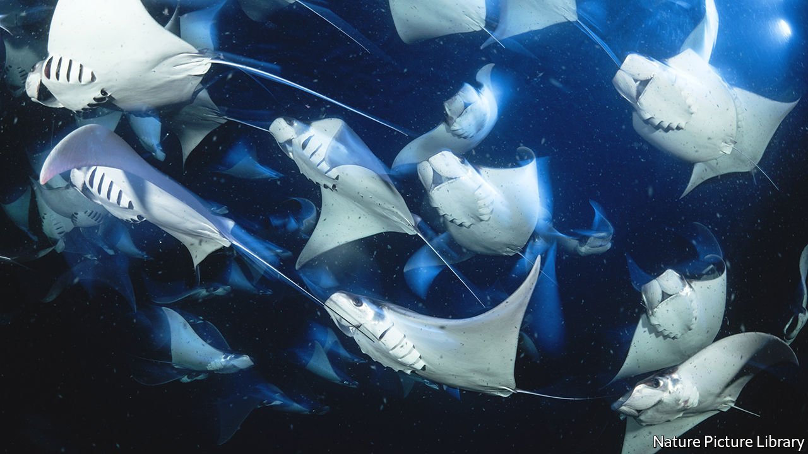

###### Marine conservation

# Illuminating fishing nets may reduce by-catch 

##### A green light for saving sharks and rays 

 

> Jan 22nd 2022 

SMALL-SCALE fisheries supply many people with food. Almost all of those who ply them rely on gillnets to trap their prey. But gillnets trap other things, besides: endangered animals such as turtles; dangerous ones, such as Humboldt squid; and ones that are both endangered and dangerous, such as several types of shark. Everyone involved would be better off if this did not happen.

Building on studies done both by himself and by others, to try to avoid the accidental netting of turtles, Jesse Senko, a marine-conservation biologist at Arizona State University, has been investigating the idea of fitting light-emitting diodes (LEDs) to nets to ward off other unwanted by-catch without discouraging target animals from entangling themselves. And, as he reports in Current Biology, it seems to work.


His particular concern was for the safety of elasmobranchs, as sharks, rays and skates are called collectively. While sharks are better known for their sensitive nostrils than their keen eyesight—some species famously being able to smell traces of blood in vast quantities of water—many have acute vision, too. And, though colloquially referred to as “fish”, elasmobranchs are actually less closely related to teleosts (the bony fish that predominate on most fishmongers’ slabs) than turtles are, so their visual systems might easily be as different. It thus seemed worthwhile checking to see whether the trick that worked with turtles would work with sharks.

Dr Senko and his colleagues therefore set up an experiment in the Gulf of Ulloa, off the coast of Baja California, in Mexico, in which they collaborated with local fisherfolk to deploy over 10,000 metres of nets that had had battery-powered waterproof green LEDs clipped onto them at ten metre intervals. (Green LEDs are more efficient than those of other colours, and their light better penetrates seawater.) In half of the nets these lights were illuminated. The other half were left unlit, as controls.

Each lit net was paired with an unlit one, and the two were deployed alongside one another at prime fishing locations. The fishers’ targets were Californian halibut and large groupers. Dr Senko was interested both in what else got caught and whether the lights decreased catches of the target species.

On the latter point, reassuringly, they did not. On the former, the lit nets caught 95% fewer kilograms of sharks, rays and skates. In particular, several threatened species, including Munk’s devil ray (pictured) and the diamond stingray, turned up less often in the illuminated than the unilluminated nets. Humboldt squid were also discouraged. (Cephalopods, the group of molluscs to which they belong, are also well known for their acute eyesight.)

The advantage from the point of view of fisherfolk was that they needed to spend a lot less time clearing these hostile by-catches from their nets. And, crucially, the LEDs concerned are cheap, robust and easy to fit. There are also plans to make them solar powered, for easy recharging. Here, then, is a conservation idea from which everyone wins.

To enjoy more of our mind-expanding science coverage, , our weekly newsletter.

