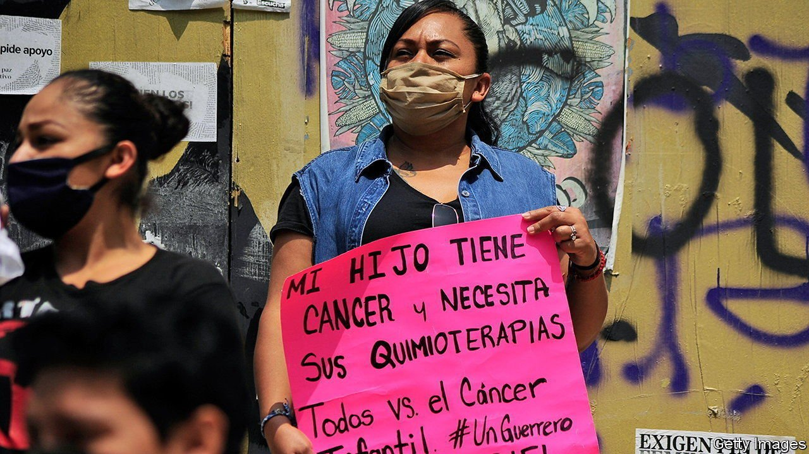

###### Drug bust

# Bills be damned: Mexico’s president decrees better health care 

##### Andrés Manuel López Obrador’s policies have led to shortages of medicine 

 

> Jan 22nd 2022 

WHEN MARÍA FERNANDA, a 15-year-old in Tlaxcala, developed a lump next to her right eye, her family assumed it was a mosquito bite. A few weeks later, when it had not gone away, doctors diagnosed rhabdomyosarcoma, a rare cancer. The family’s woes deepened when the hospital she was referred to, four hours from her home, lacked the chemotherapy drugs to treat her. Eventually a charity stepped in to help buy the medicine. “I don’t understand why [the government] does not want to invest in the health of children,” says Briselda, her mother.

For the past three years public hospitals in Mexico have repeatedly run short of drugs, including those to treat cancer, high blood pressure and diabetes. In November President Andrés Manuel López Obrador scolded health officials for the shortages. Yet they are caused by his policies.


Mexico has long had a fragmented health service, with public provision generally tied to health insurance gained through employment. Previous governments have tried to make health care more accessible, particularly to those with informal jobs. In 2003 Seguro Popular (or Popular Insurance) was introduced to cover roughly half of Mexicans. It was lauded as an example of how developing countries could provide health services to the poor.

When Mr López Obrador came to power in 2018 he vowed to replace this system with one that was both universal and free, similar to Britain’s. He scrapped Seguro Popular and created the Institute of Health for Wellbeing, which he said would cover everyone and every treatment. He also said he would root out alleged corruption. The finance ministry became responsible for buying and distributing drugs.

The reality has not lived up to the hype. Despite the president’s promises, the new system does not cover all treatments. Although the new system had “terrible luck”, in that it came into being at the same time as the pandemic, it also has “terrible management”, says Carlos Magis Rodríguez, a doctor and former bureaucrat. The first person in charge of it was an archaeologist with little experience in public health, but who is friendly with the president.

What is more, the finance ministry lacks experience in buying, storing and distributing drugs. It bought some 1.2bn items in 2020 when Mexico needs more like 1.7bn each year, reckons Enrique Martínez Moreno, an analyst. Drugs were bought at the last minute, at higher prices, even though the new system is underfunded.

Mr López Obrador’s reform was “budgetary suicide”, says Julio Frenk, a former health minister who was behind Seguro Popular. Spending on health care rose under that scheme, but within clear para meters to avoid nasty fiscal surprises. The government was obliged to allocate a set amount for each person enrolled. The law also set up a fund for “catastrophic” expenses not covered by the scheme, such as cancer treatment. By contrast, funding for Mr López Obrador’s system is ad hoc.

Mexico spends just 5.4% of GDP on health care, less than Uruguay, Argentina or Venezuela before its economy collapsed. The budget for 2022 includes an increase in health spending of 15%, compared with 2021. But this comes after several years of austerity.

The result is a system that is creaking. The country has fewer doctors, nurses and hospital beds than the average in the OECD, a club mostly of rich countries. Many have turned to private care: 41% of total spending on health comes from Mexicans’ own pockets, the highest proportion in the OECD. According to Ipsos MORI, a pollster, Mexico is the only country it surveys where trust in doctors declined between 2019 and 2021, from 71% to 66%.

In December Mr López Obrador declared he would put the army in charge of distributing drugs. But even if the soldiers prove logistical wizards, they cannot magic pills out of thin air. ■

