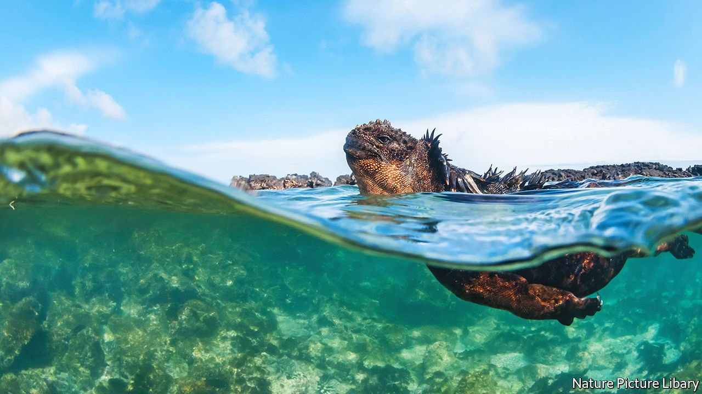

###### Of conservation and cash

# Ecuador’s president is expanding the Galapagos islands reserve 

##### He also wants to pump more oil and dig up more minerals 

 

> Jan 22nd 2022 

FEW DOUBT the scientific importance of the Galapagos islands. Situated in the Pacific Ocean, they pullulate with iguanas, giant tortoises and sea lions—indeed, after visiting the islands in 1835 Charles Darwin developed the theory of evolution. Since 1998 a marine reserve has been in place to protect the waters around the islands. On January 14th Guillermo Lasso, the president of Ecuador, created a new reserve to expand the protected area by around 50%.

The announcement follows on from an agreement struck in November at the UN summit in Glasgow between Mr Lasso and the leaders of Colombia, Costa Rica and Panama to create a vast protected area spanning the four countries’ territorial waters. Iván Duque, Colombia’s president, has claimed that the new reserve will “guarantee the survival” of 40% of the world’s marine species. The deal also suggests that South America’s centre-right governments are trying to burnish their green credentials.


A marine corridor stretching up to the waters of Costa Rica’s Cocos island will now be patrolled by the boats of the Galapagos national park, with a member of the Ecuadorian navy on board. The new reserve of 60,000 square kilometres (23,000 square miles) will be enforced in six months. Fishing is completely banned across the main migration route within the reserve and longline fishing—a method that often ensnares turtles and dolphins—is forbidden throughout. This should protect endangered species like the green turtle, says Sylvia Earle, a marine biologist.

The importance of the new reserve stems from an undersea mountain range that links the Galapagos with the waters of Costa Rica and Panama. “These under water mountains are the key for marine life,” says Gustavo Manrique, Ecuador’s environment minister. This is because they divert currents—and the nutrients they carry—towards the surface, allowing plankton and the food webs it sustains to flourish.

Ecuador is discussing long-term funding to monitor and patrol the area with potential lenders or donors, according to Simón Cueva, the finance minister. Germany has announced $70m in aid. The four presidents have also been working with Chile and Peru to safeguard the waters off their shores from industrial fishing fleets, mostly from China.

Despite the recent announcement, many green types are wary of Mr Lasso. Ecuador has large reserves of oil, copper and gold in rainforests that are home to jaguars, monkeys and tropical birds. Mr Lasso, an ex-banker, inherited a crippling national debt from the previous authoritarian regime. Part of his plans for recovery include doubling oil production and boosting mining projects. Many indigenous Ecuadorians oppose these plans.

Indeed Mr Lasso, whose approval ratings have fallen since he took office, says that the balancing act between profit and preservation keeps him awake at night.

