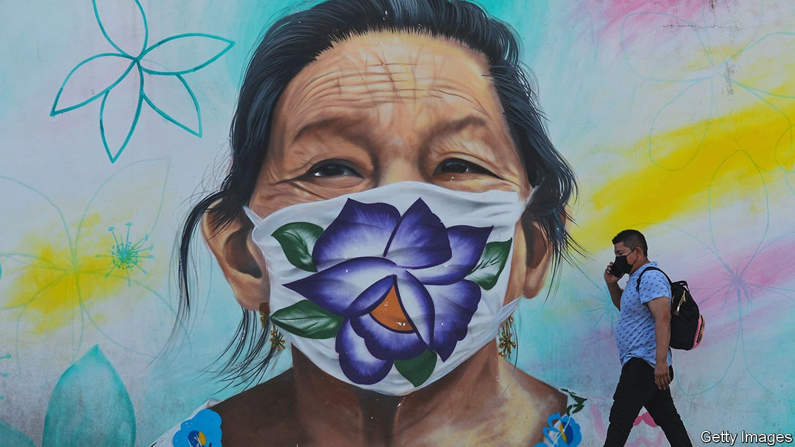
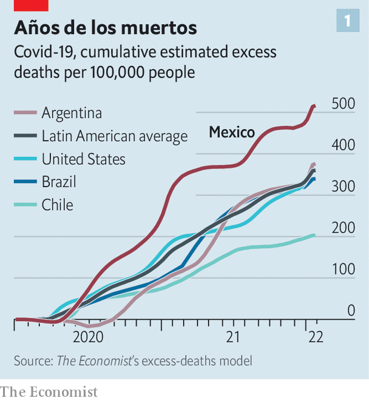
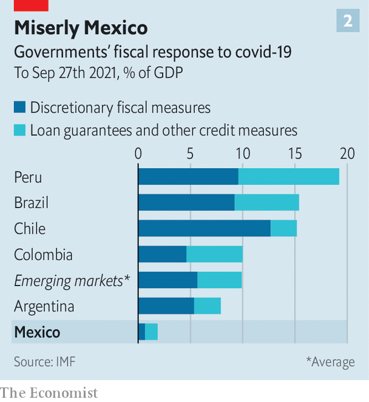

###### The last wave?

# Omicron comes to Mexico, a place that never really shut down 

##### The country has already seen over 600,000 excess deaths 

 

> Jan 22nd 2022 

A FEW DAYS after Andrés Manuel López Obrador, Mexico’s president, caught covid-19 for the second time he was back in person at his daily press conference, extolling the virtues of Vicks VapoRub, an ointment, for treating his covidcito (mini-covid). Such a blasé approach to the virus is showing in the data. Mexico’s official caseload, which is undercounted, has risen more than tenfold since December. Tests are so scarce that people have been told to assume they have the disease.

 


According to The Economist’s excess-death tracker, 600,000 more Mexicans have died since March 2020 than would normally have been expected. This is a much higher proportion than in the United States or Brazil, where the anti-lockdown president Jair Bolsonaro has refused to get jabbed (see chart 1). Over 4,500 health workers have died, possibly a greater number than anywhere else.


Now Omicron is sweeping through the country. Officials say the rising caseload is not leading to more hospitalisations or deaths. It is too early to tell on the latter; the former is not true. Between mid-December and mid-January hospital admissions have risen. Some 179 facilities are reporting that over 70% of their beds are full, up from 75 a month ago.

Relatively high levels of prior infection and vaccination, as well as Omicron’s apparently milder effects, may help make this wave less terrible. But Mexico uses a range of vaccines. Some, such as China’s Sinovac and Russia’s Sputnik V, offer lower protection against the virus.

Mexicans are vulnerable because, although they are on average quite young, some 75% of those over the age of 15 are overweight. And the government has a poor record of tackling covid.

In some ways, Mexico offers lessons on how not to deal with a deadly virus. It only shut down for two months at the beginning of the pandemic. Half the population work informally; the government lacked the funds to pay everyone to stay at home. Instead it emphasised personal responsibility. That has worked in some parts of the country. Masks are not compulsory, but people largely wear them in cities, even outdoors. In 2020 67% of Mexicans said they wore masks regularly, compared with 63% of Americans.

Interest groups such as the teachers’ unions had more sway over policymaking than epidemiologists. For most of the past two years people could cram into gyms or restaurants. But schools were shut for 17 months. Children, especially poor ones, lost a lot of learning, and will presumably find it harder to succeed in later life.

 


Keeping most things open suited Mr López Obrador, a fiscal hawk. Mexico spent less than any other emerging market on pandemic-related support, according to the IMF. The government spent 0.65% of GDP on handouts, compared with 9% in Brazil and 4% in India (see chart 2). This may have placed Mexico in a better fiscal position. At the same time, many businesses went bust, and in the first year of the pandemic nearly 4m people fell into poverty (using a measure that includes government transfers and non-cash income).

The country never shut its borders. Visitors could come and go without having to brandish a negative covid test or proof of vaccination. Mexican officials claim, with some justification, that it would be hard to seal its porous frontiers. The government also wants to encourage tourism, which generates almost 9% of the country’s GDP.

The government tried to increase hospital capacity. Wards were converted to boost the number of beds available. More ventilators were bought, and more nurses hired. The expansion helped, reckons Nora Martínez Gática, a doctor. But she adds that the focus should have been on prevention, not least as the health-care system is already in .

Similarly, an attempt early in the pandemic to teach medical staff how to deal with covid-19 petered out. Protective clothing was lacking. Jaime Sepúlveda, a former health official who wrote a scathing report for the World Health Organisation on Mexico’s response to covid-19, says more beds were not enough. He thinks the high mortality in Mexico was due to poor training and lack of equipment.

The government’s focus has now switched, quite sensibly, to vaccination. Around 60% of the population has been double-jabbed, a share which rises to 80% for over 18s. Some 51% of the elderly have had booster shots. Mr López Obrador initially seemed unsure about whether he would get the jab, but then got it in April.

With the arrival of Omicron, authorities in some parts of the country are moving away from Mr López Obrador’s laissez-faire strategy. The state of Jalisco has made it compulsory for bars and other indoor spaces to request proof of vaccination or a negative test. In Tlaxcala people must show proof of vaccination to go to the super market. Ecatepec, a poor area on the outskirts of Mexico City, has brought in a fine of 864 pesos ($42, or five days of the minimum wage) for people not wearing a face covering (one man has been arrested). Some museums have once again shut their doors in Mexico City, while some states have delayed pupils returning to school.

“Mexico showed its face with the pandemic,” says Laura Flamand, a health researcher at El Colegio de México, a university, who points to the lack of universal health care and a social safety net in the country. More Mexicans may be masked, but they are not safe yet. ■

Dig deeper

All our stories relating to the pandemic can be found on our . You can also find trackers showing ,  and the virus’s spread across .

