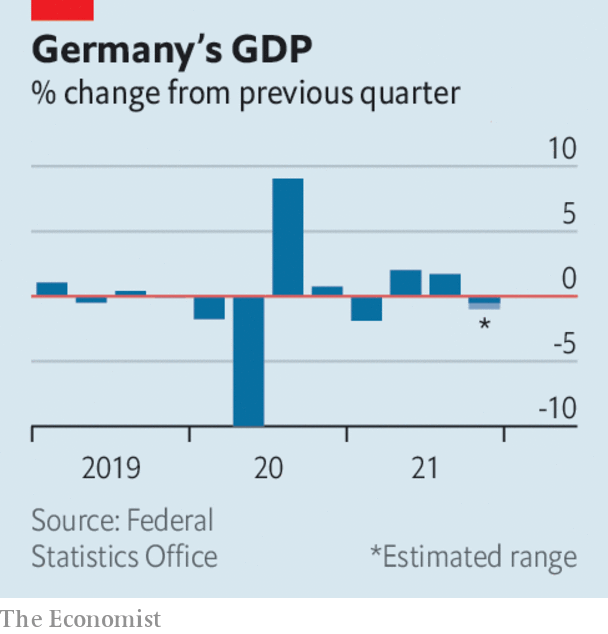

###### The world this week

# Business 

#####  

 

> Jan 22nd 2022 

In what is by far the biggest-ever takeover in the gaming industry, , the company behind the “Call of Duty” series and “Warcraft”, for $69bn. Microsoft is hungry for new content as it seeks to develop a Netflix for games, which can be streamed from any device, such as phones, and not just its Xbox console. Gaming “will play a key role in the development of metaverse platforms”, stated Satya Nadella, Microsoft’s boss.


Unilever said it would not increase its £50bn ($68bn) offer for , which in effect ends its pursuit of a deal. Its ambitious play for the business, which includes such familiar brands as Advil, Nicorette, Panadol and Sensodyne, and in which Pfizer owns a 32% stake, didn’t go down well with Unilever’s investors. The conglomerate’s stock swooned when news of the bid was made public. 

Better late than never

 laid out its strategy to reduce carbon emissions, with an aim to reach net-zero emissions by 2050 and a pledge to reduce them by a fifth by 2030 compared with 2016. But the plan counts only the company’s own greenhouse gases from its production of oil and gas, and not the broader category of “Scope 3” emissions, which are generated across a firm’s value chain, suppliers and customers.

Providing reassurance that pandemic restrictions really do apply to everyone, António Horta-Osório resigned as chairman of Credit Suisse after the bank’s board reportedly found that he broke quarantine rules, including on a trip to the Wimbledon tennis final in July. Mr Horta-Osório had held the job for less than nine months.

The global job market will take longer to recover from the covid-19 crisis than had been thought, according to the International Labour Organisation. Its latest forecast estimates that there will be 52m fewer jobs in 2022 compared with 2019, and that a full recovery in 2023 “remains elusive”.

 


Another surge in covid and supply-chain bottlenecks caused Germany’s economy to shrink by up to 1% in the fourth quarter of 2021 compared with the third, according to an initial official estimate. For the whole year, German GDP rose by 2.7%, though output was still 2% lower than in 2019, before the pandemic.

The People’s Bank of China cut one of its main interest rates. The reduction was small, but a signal to markets that officials are prepared to act to stabilise the economy amid covid and difficulties in the housing market. The main lending rate for mortgages was also cut.  grew by 4% in the fourth quarter, year on year, the slowest pace since the depths of the pandemic. The economy officially grew by 8.1% for the whole of 2021.

Britain’s annual rate of  inflation rose to 5.4%, its highest level in 30 years. Food prices are climbing at their fastest pace since 2008. Energy costs are also rocketing, and are expected to soar even higher when the regulator’s price cap is lifted in April. The number of households under “fuel stress”, spending at least 10% of their income on energy bills, is set to jump.

In some good news for the British economy, GDP rose above its pre-pandemic level for the first time in November. Although that was before Omicron struck.

Governments in the EU are also struggling to control the impact of higher energy costs. In France, EDF, an energy provider, saw its market value slump by a fifth after it said that the French government’s attempt to limit rises in electricity bills would hurt its earnings.

Meanwhile oil prices hit a seven-year high, as markets tried to assess whether demand will outpace supply this year. Brent crude traded well above $88 a barrel; the price has risen by 13% since the start of the year.

The Bank of Japan raised its inflation forecast for 2022 to 1.1%, low by international standards but uncommon in a country that has battled deflation for decades. Higher energy and food prices are feeding through to the economy, but with inflation still far below the central bank’s 2% target it sees no need to increase interest rates.

AT&amp;T and Verizon again postponed their roll-out of 5G services at some airports amid warnings that the cellular towers could interfere with aircraft navigation systems.

A squeeze on households

The price of orange-juice futures surged, after this year’s orange crop in Florida was forecast to be the smallest since 1945. The Sunshine State’s orange groves are plagued with tree lice. Orange prices are also sensitive to a drought in Brazil, which has hurt citrus production there. The overall demand for orange has lost some zest in recent years, as consumers switch to low-sugar drinks.

