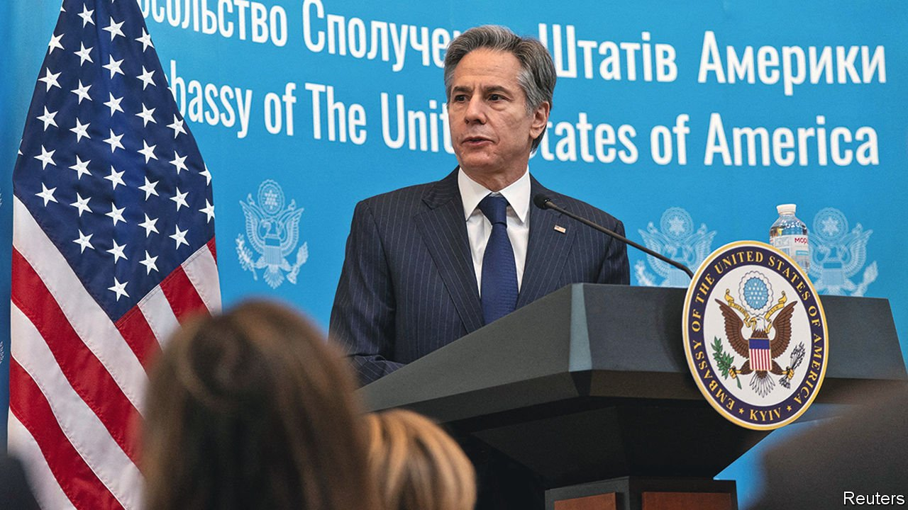
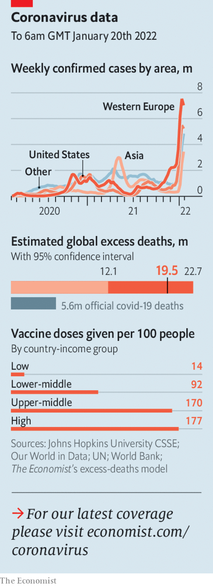

###### The world this week

# Politics 

#####  

 

> Jan 22nd 2022 

Russia stepped up what looked like . Its troops were deployed to Belarus, from which they could open up a second front and threaten Kyiv, Ukraine’s capital. More than 100,000 troops have now massed on Ukraine’s borders. A cyber-attack, allegedly from Russia, closed down Ukrainian government websites. President Joe Biden said Russia was ready to pounce and promised heavy sanctions if it does. America’s secretary of state, Antony Blinken (pictured), was due to meet his Russian counterpart, Sergei Lavrov, in Geneva. Russian domestic television gave little hint that war might be in the offing.


France’s President Emmanuel Macron called on Europe to build its own  in the face of Russian aggression. Atlanticists, especially in eastern Europe, are wary of the idea, which they fear could divide NATO. Mr Macron is hoping to be re-elected in April.

A raucous party

, as more of his Conservative MPs called on him to resign. The British prime minister’s convoluted explanations of why Downing Street held a party when the rest of the country was in a strict lockdown (“nobody told me” it was against the rules) have not gone down well. David Davis, a former minister, quoted words that saw off a premier in 1940 and the whole of Parliament in 1653: “In the name of God, go.” A Conservative MP defected to Labour. This seemed to rally Tory support behind the prime minister, for now.

Houthi rebels in Yemen launched a drone attack on Abu Dhabi, the capital of the United Arab Emirates, killing three people. A day later, an airstrike by a Saudi-led coalition killed at least 20 people in Sana’a, the Houthi-controlled capital of Yemen. In recent weeks forces backed by the UAE and Saudi Arabia have pushed back the rebels.

Nigeria lifted a seven-month ban on people using Twitter after the social-media firm agreed to meet certain conditions, including opening an office in the country. Nigeria blocked people from using the service last year when Twitter removed a tweet by President Muhammadu Buhari that some saw as inciting violence.

Protesters against military rule in Sudan barricaded streets and forced shops to close for two days. The security forces reportedly killed ten people.

John Joël Joseph, a former senator in Haiti, was arrested in Jamaica. Mr Joseph has been accused by the Haitian police of being involved in the murder of President Jovenel Moïse in July last year. He denies it.

Ingrid Betancourt, a former senator in Colombia, said she would run for president in May. Ms Betancourt was captured by FARC rebels in 2002 and held for six years. She presents herself as a centrist. The front-runner is a left-winger, Gustavo Petro.

’s Communist regime held closed trials for peaceful protesters, some as young as 16, who took to the streets last year to demand democracy and reliable electricity. Harsh penalties are expected.

A volcanic eruption in  cut off communications with the archipelagic kingdom for days. Three deaths were confirmed, though the toll is expected to rise. The eruption caused a tsunami so large that two people drowned across the Pacific in Peru. Tongan islands were heaped with ash.

 after judges dismissed his challenge to the cancellation of his visa for a second time. The immigration minister revoked the unvaccinated tennis player’s visa on “health and good order grounds”.

Kazakhstan’s former president, Nursultan Nazarbayev, appeared in public for the first time this year. He gave a televised address more than two weeks after nationwide protests flared up. He claimed there was no conflict with his chosen successor, Kassym-Zhomart Tokayev, who appears to have sidelined him.

The FBI shot dead a British man of Pakistani origin who had taken four people hostage at a synagogue near Dallas. Questions were asked about how the man, who had once been a “subject of interest” to British intelligence, was allowed to enter the United States. His family said he had been mentally ill.

 


America’s Justice Department laid the first indictments for sedition against some of the rioters who stormed Congress on January 6th last year. Eleven people, including the leader of the Oath Keepers, a far-right group, were charged with conspiring “to oppose by force” the transfer of presidential power (Congress was certifying the result of the 2020 election at the time).

In a day of drama in the American Senate, Democrats failed to pass measures that would  across the country, and were also defeated in an attempt to change the filibuster rule that would have allowed the bills to proceed. Republicans were adamantly opposed, accusing the Democrats of exaggerating the effect of state changes to voting rules.

Joe Biden urged companies to implement their own vaccine mandates, after the Supreme Court struck down his order for them to do so. The court found that the federal agency tasked with enforcing the mandate did not have such broad power to regulate public health. The decision opens the way for Republican states to outlaw companies’ “no jab, no job” requirements.

COVAX, a scheme to provide covid-19 vaccines to non-rich countries, delivered its billionth dose. It still has a lot of work to do. Of the WHO’s 194 member countries, 36 have inoculated less than 10% of their populations and 88 less than 40%.

Wait a minute Mr Postman

The Chinese government, which is hoping for a covid-free Winter Olympics in Beijing, urged people to wear gloves and masks when opening mail, especially foreign packages. It claims the Omicron variant may have entered China that way, after a woman tested positive and traces of the virus were found on a parcel she had received from Canada.

