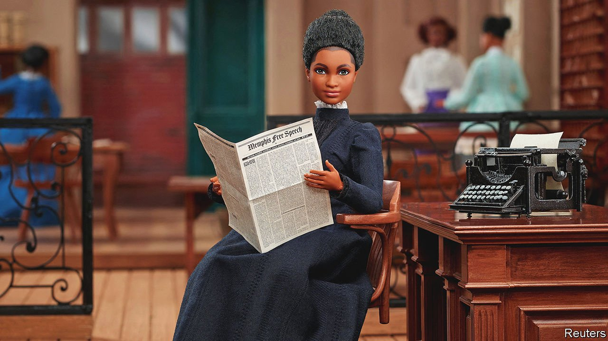

###### Ida B. Wells Barbie

# A new Barbie doll commemorates a 19th-century suffragist 

#####  

 

> Jan 22nd 2022 

MORE THAN HALF a century before Rosa Parks refused to give up her bus seat, Ida B. Wells was removed from a train for refusing to move into a segregated carriage. Wells, a journalist born into slavery in 1862, later exposed the horrors of lynching and co-founded the National Association for the Advancement of Coloured People. She was posthumously awarded a Pulitzer prize in 2020. Now Mattel is honouring her in a Barbie doll. The doll clutches Memphis Free Speech, the newspaper she co-owned. Other women Mattel is honouring include Sally Ride, an astronaut, and Maya Angelou, the author who this week became the first black woman to appear on the quarter coin.■

