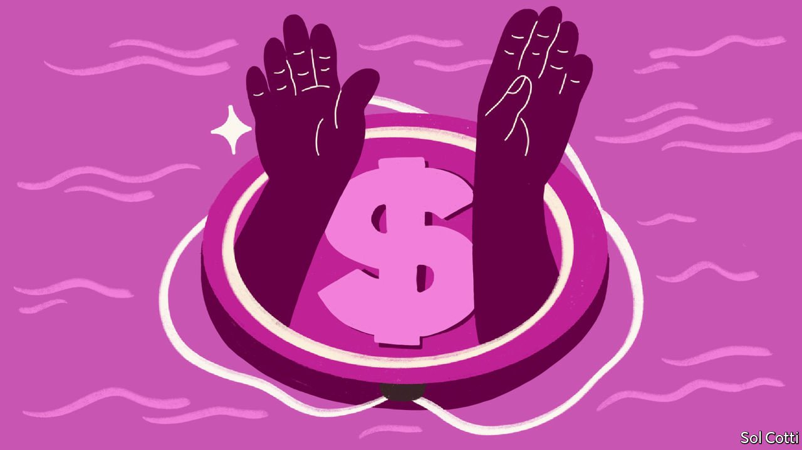

###### Handing out money

# America’s experiments with guaranteed-income schemes show promise 

##### Could the pilot programmes be scaled up? 

 

> Jan 22nd 2022 

JAHED MIAH no longer worries about rent. For much of his time at the State University of New York at New Paltz, the 23-year-old lived on a tight budget. When he needed textbooks, he asked his brothers for cash. But since October 2020 Mr Miah has received $500 a month through a guaranteed-income programme in Hudson, New York. He puts most of it towards housing costs, but he can also now afford to donate to his mosque and take his nieces and nephews for ice cream. “I’m not a financial burden on my family,” he says.

Hudson’s is one of more than 80 such schemes across America. They provide direct cash payments in fixed amounts that people can spend as they choose. Most are small and of limited duration: Hudson’s involves just 75 residents for five years.


Results from pilots already under way show that the payments, unsurprisingly, improve the lives of participants. After one year recipients in Hudson reported greater emotional and physical well-being as well as better relationships. Critics fear that unconditional cash transfers may put people off working. So far, Hudson and a similar experiment in Stockton, California, have found the opposite—perhaps because the payments give people the flexibility to spend time on training or job applications. The Centre for Guaranteed Income Research at the University of Pennsylvania is assessing several of the programmes, and hopes to publish more findings later this year.

Unlike a universal basic income, which would give money to everyone, guaranteed-income programmes generally target poor people. Hudson’s pilot selected participants based on factors such as gender and race. One in Chicago focuses on former prisoners.

Scaling up across America would be hard. Permanent programmes could well affect the willingness to work. And finding the money for bigger schemes could prove impossible. Some cities, including Pittsburgh and Minneapolis, used federal funds from the American Rescue Plan, the stimulus bill passed last March, for their experiments. But most programmes have relied on charitable gifts. Jack Dorsey, who founded Twitter, for example, contributed $15m to Mayors for a Guaranteed Income to help fund pilots.

For now, supporters can celebrate the positive effects for people such as Mr Miah. He plans to move to New York City with his brother and work as a medical assistant. He will continue to receive the cash payments for the next four years. Instead of asking his older sibling for money to cover books, Mr Miah will help him pay the mortgage. “We can support each other,” he smiles.

For exclusive insight and reading recommendations from our correspondents in America, , our weekly newsletter.

