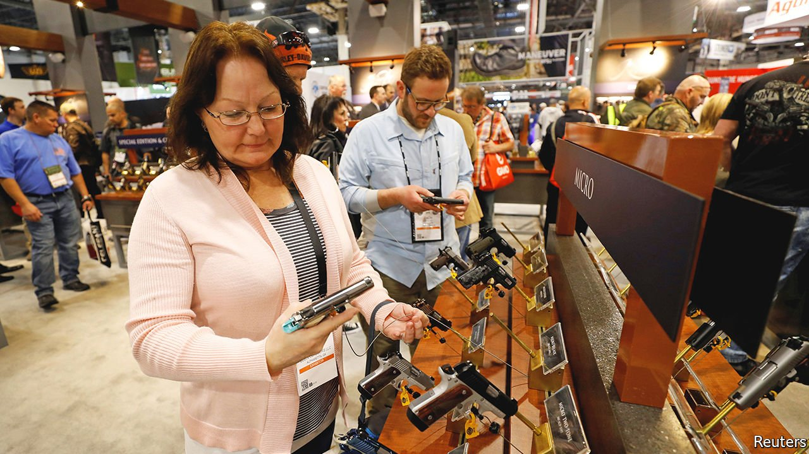

###### Changing gun culture

# Gun-ownership in America is diversifying, because of safety fears 

##### Concerns over safety lead more women and minorities to arm themselves 

 

> Jan 22nd 2022 

PICTURE A GUNSLINGER and Annette Evans probably does not spring to mind. She is Chinese-American, lives in the suburbs of Philadelphia and identifies herself as socially liberal—not the archetypal conservative, rural white man. Yet she owns over a dozen rifles, pistols and shotguns (“one for every occasion, like purses or shoes”) and teaches self-defence courses to women. Her race and gender put her at risk, she says. “It may be a low chance that I’ll run into someone who will kill me, but without a gun, I’ll die.”

More gun-owners, especially new ones, look like Ms Evans. Of the 7.5m Americans who bought firearms for the first time between January 2019 and April 2021—as gun-buying surged nationwide—half were female, a fifth black and a fifth Hispanic, according to a recent study by Matthew Miller of Northeastern University and his co-authors. The share of black adults who joined the gun-owning ranks, 5.3%, was more than twice that of white adults. That is new: in a previous survey, in 2015, new buyers skewed white and male, though they were more politically liberal than long-standing ones. Overall, today’s gun-owners are still largely white (73%) and male (63%). But they are diversifying.


Gun culture has broadened its appeal. Decades ago most people bought guns for hunting and recreational shooting. Now they mostly do so for self-defence, which is a universal concern. People who feel vulnerable to crime or hold less faith in the police are more likely to arm themselves.

Rising murder rates in 2020 and 2021 heightened those anxieties (blacks are the likeliest victims). Membership of the National African American Gun Association grew in 2020 by more than 25%, to 40,000. Blacks have a long history of owning guns: Harriet Tubman toted them, Martin Luther King kept them at home. But this tradition was long “surreptitious”, says Aqil Qadir, a third-generation shooter who runs a firearms-training centre in Tennessee.

Many of the newer gun-owners see firearms as an equaliser—a remedy for the vulnerability they feel. The Pink Pistols, an LGBT group, proclaims “armed queers don’t get bashed”. “God made man and woman, but Sam Colt made them equal,” goes a markswoman’s maxim. Women’s gun-ownership has always trailed that among men: women tended to shoot because men in the family did. But Robyn Sandoval, boss of A Girl and a Gun, a shooting group, increasingly sees women buying guns on their own initiative: a third of new joiners to her organisation in 2021 said they were the only shooter in their family.

The broadening tent is good for manufacturers and bad for gun-control advocates. Owners are more politically active around gun issues than non-owners. Already it may have had an effect. According to polling by Gallup, in 2021 support for stricter laws dropped by five percentage points, to its lowest in seven years. ■

For exclusive insight and reading recommendations from our correspondents in America, , our weekly newsletter.

