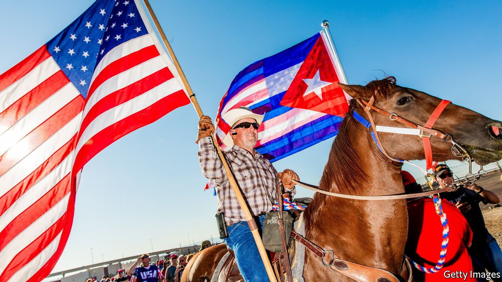
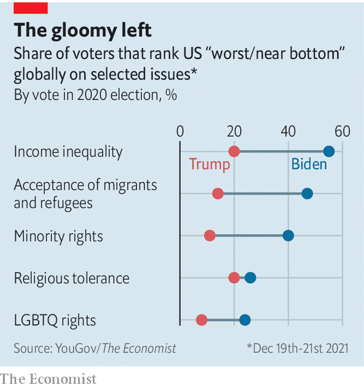

###### Evaluating the United States

# Is America exceptionally good or exceptionally bad? 

##### It depends whether you ask a Biden voter or a Trump one 

 

> Jan 22nd 2022 

WHEN IT COMES to boosterism, Americans are often second to none. Yet new polling from YouGov/The Economist suggests that among Democratic voters, pessimism about their own country is exceptionally rife.

Among some 1,500 people asked at the end of 2021, nearly a quarter of those who voted for Mr Biden in the 2020 election said that on matters of gay rights America ranks towards the bottom compared with the rest of the world. Only 8% of Trump voters placed America so low. Their view would seem closer to reality: a 2021 study from the Williams Institute, a gay-rights think-tank at the University of California, Los Angeles, ranked America in the top 15th percentile for LGBT acceptance among 175 countries surveyed, ahead of Italy, Austria and Japan.

 


Biden voters are even gloomier about other social issues. Some 40% say America is among the world’s worst on minority rights (only 11% of Trump voters thought so). Nearly half of Biden voters, against 14% of Trump ones, are similarly damning of America’s acceptance of migrants and refugees (see chart). Gallup polling from 2019 suggests Americans are actually quite sympathetic to migrants. On a composite measure of migrant acceptance, America was the sixth-most-welcoming country out of 145.


If some Democrats tend to hold excessively dismal views of their country, many Republicans do the opposite. For example, 40% of Trump voters ranked America among the best on income inequality, ignoring the growing inequality that places it well below the worldwide median.

Patriotism is part of the Republican brand. But why do Democrats gravitate to gloom? Some progressive students say it helps to propel their activism.

Asking Americans, or anyone for that matter, to reflect on “the rest of the world” is thorny. People anchor themselves to what is familiar—countries they’ve been to or cultures they can relate to. Though Republican voters are sometimes caricatured as provincial, many Democratic voters seem unaware of their comparative good fortune. Even if Biden voters answered our poll with only other rich democracies in mind, this suggests a parochial view of the world that Democrats typically ascribe to their opponents.

In balancing America’s relative faults and virtues, self-identifying independents tracked much more closely with Republicans than with Democrats. Since elections tend to hinge on the votes of independents, this suggests that Democratic pessimism may be self-defeating. On matters of American exceptionalism, some blue voters could do with more shades of grey.

For more coverage of Joe Biden’s presidency, visit our dedicated  and follow along as we track shifts in his . For exclusive insight and reading recommendations from our correspondents in America, , our weekly newsletter.

