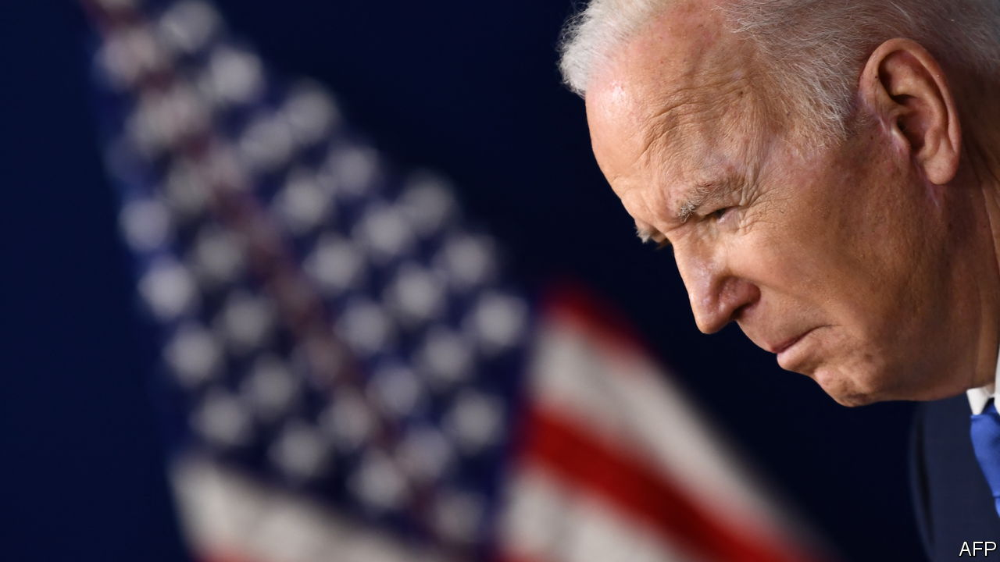
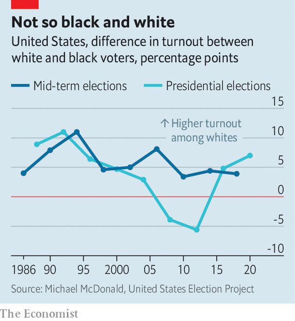

###### Voting rights and wrongs

# Joe Biden’s voting rights push is futile 

##### He doesn’t have the votes—and his proposals are misguided 

 

> Jan 22nd 2022 

WHAT BETTER way to chase one humiliating setback and waste of political capital than with another? That seemed to be President Joe Biden’s strategy after the failure of his signature climate-change and social-policy bill last month. The White House and Democratic leaders in Congress pivoted to campaigning for a voting-rights package which stood no chance of passing. On January 19th, a majority of the Senate blocked the bill, as expected. As expected, too, a majority of senators failed to agree to limit the filibuster.

As a matter of politics, it all might seem underwhelming. But at the level of policy, the legislation, which Democrats described as essential to prevent democratic catastrophe, was not tailored to meet the actual threats to the country.


When a party has unified control of government, as Democrats do now, gridlock should be surmountable. But the filibuster, which requires a supermajority of 60 votes to do most business in the Senate, limits what can be done. An implacable Republican minority (and a few dissenting Democrats) can block the party’s agenda.

How the voting-rights package would escape these realities was never clear. The ten Republican votes needed to surmount a filibuster were never in sight. Neither was the unanimous Democratic support necessary to modify the rules governing the filibuster using a simple majority. Mr Biden seemed to hope that stridency alone would suffice to unblock the bill. On January 11th he gave a speech in Atlanta warning darkly of a Republican plot to “turn the will of the voters into a mere suggestion”.

 


It is true that Republicans across the country are attacking democratic norms. They have embraced Donald Trump’s lie that the last presidential election was stolen. State legislatures have tightened photo-identification and postal-vote rules, which Democrats fear will suppress minority voters that the party relies on. Most worrying, Republicans are mucking with election mechanics like vote certification. Legions of enthusiasts for Mr Trump’s “Lost Cause” movement are now running to be chief elections officers in states.

In an endorsement video that was released in the race to be elections supervisor in Pennsylvania, the ex-president proudly said, “We have to be a lot sharper the next time when it comes to counting the vote…Sometimes the vote-counter is more important than the candidate.”

Yet the Democrats’ proposed solution, which would have imposed minimum federal standards on the hotch-potch of state voting rules, was unfocused. Two bills had been combined to form their voting-rights plan. One aimed to reinstate requirements for states with a history of discriminatory laws to seek approval from the Justice Department for any changes to their voting procedures. The other had some laudable goals—like establishing a minimum number of early-voting days and eliminating gerrymandering—but devoted much of its attention to campaign-finance reform.

However, fears of significant voter suppression may be overblown. Black turnout remains quite high. When Barack Obama was at the top of the ticket in 2012, it even exceeded white turnout. Some cite the growing black-white gap in 2016 and 2020 as evidence of suppression, yet there appears to have been no change in the racial turnout gap for mid-term elections (which you might expect would be even more pronounced as these generate less enthusiasm than presidential contests).

When Enrico Cantoni and Vincent Pons, two economists, examined all voter-ID laws enacted between 2008 and 2018 and their effect on turnout, they found that “the laws have no negative effect on registration or turnout, overall or for any group defined by race, gender, age or party affiliation.” There is still an argument for federal prophylaxis. Republicans are plainly trying to create a voting regime that will skew to their benefit—they just have not yet found one that works all that well.

As with other culture-war issues in America, the parties have little capacity for self-examination over voting issues. Among Democrats, you are either for “voting rights” or against democracy. Yet an inconvenient truth is that the overwhelming majority of Americans, including majorities of African-Americans and Hispanics, think photo-ID should be required to vote. Among Republicans, you are either for “election integrity” and Mr Trump, or you risk excommunication from the party. That is despite the complete lack of evidence of voter fraud.

Mr Biden’s legislative stunts seem not to have bought all that much goodwill with party activists, who still blame him for focusing on economic stimulus over voting rights for months. Hours before being voted down in the Senate, in apparent anticipation of failure, Mr Biden could only lamely offer the assurance that, “We’ve not run out of options yet”.

There is little chance of change. This is illustrated by a recent visit by Mr Biden to Capitol Hill to plead his case to Senate Democrats. Before his arrival Kyrsten Sinema, a Democratic senator from Arizona, reiterated her opposition to eliminating the filibuster, in essence removing the point of the jaunt. While there, Mr Biden went to the office of Mitch McConnell, the Republican Senate leader, intending to deal with him directly. He found that there was no one there for him to negotiate with. ■

For more coverage of Joe Biden’s presidency, visit our dedicated  and follow along as we track shifts in his . For exclusive insight and reading recommendations from our correspondents in America, , our weekly newsletter.

