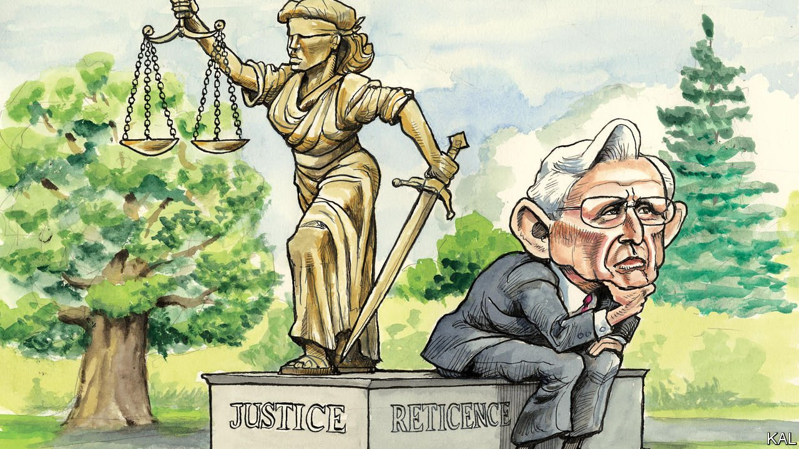

###### Lexington

# Merrick Garland and his critics 

##### The attorney-general needs to bolster the Department of Justice’s defences against Trumpism 

 

> Jan 22nd 2022 

IT IS HARD to pinpoint a moment at which the Republicans abandoned democratic norms for the end-justifies-the-means power politics that connects Mitch McConnell’s Senate leadership to Donald Trump’s demagoguery. Yet Mr McConnell’s refusal in March 2016 to hold confirmation hearings for Merrick Garland, an appeals-court judge nominated by Barack Obama to the Supreme Court bench, is a top contender. Though both parties had hitherto been culpable of eroding the Senate’s traditions of compromise and restraint, Mr McConnell’s ploy raised the damage to a new level. It suggested he would press for maximum partisan advantage at every opportunity, whatever the institutional cost.

When President Joe Biden named Mr Garland as his attorney-general, with prime responsibility for restoring the rule of law and Americans’ faith in it, the symbolism was obvious. No institution was more politicised by Mr Trump than the Department of Justice (DoJ). Under Bill Barr, a culture warrior and for two years Mr Trump’s legal consigliere, its leadership resembled the former president’s personal defence team. Mr Barr effected this with McConnellite tactics. Too canny to break laws, he subverted the unwritten norms that enshrine the DoJ’s independence—such as a custom that attorneys-general do not interfere in criminal investigations to get the president’s cronies off the hook. Also like Mr McConnell, although Mr Barr did not go along with Mr Trump’s effort to steal the election, one or two of his underlings, schooled in his hyper-partisan tactics, were instrumental in it.


Even setting aside the symbolism of his appointment, Mr Garland looked a good choice to right the ship. The owlish 69-year-old is a DoJ veteran who led celebrated investigations of the Oklahoma City bombing and Unabomber cases in the 1990s. There and on the Washington, DC, appellate circuit, which he also led, he was known for his intellect, moderation and discretion. He promised to be the least political attorney-general since Janet Reno, three decades before. And ten months into his tenure he has lived up to that billing. He has been methodical in handling the Capitol-riot investigations and taciturn to the point of inscrutability. DoJ insiders are relieved to have him. “It was abhorrent the way Barr politicised what we do,” one says. “Garland does things by the book.”

Outside the department he faces more scepticism. Left-wing activists, who want a reckoning at the DoJ, not a return to normality, have criticised him for failing to reverse some of his predecessor’s decisions. Mr Garland’s DoJ has, for example, continued to defend Mr Trump in a defamation suit brought by a journalist, E. Jean Carroll, who claims to have been raped by the former president. Why, asked the Nation, is he “carrying water for Bill Barr?” After the department began charging small-fry insurrectionists, but no political bigwig, the sniping from the left increased. Some rule-of-law experts, led by Jack Goldsmith, a conservative scholar at Harvard Law School, have added to it. They fear Mr Garland is not fortifying his department against the next rule-bending attorney-general—as one of his heroes and predecessors, Edward Levi, did in the aftermath of Watergate. The common thread is that the attorney-general, for all his qualities, is suspected of being too conventional to recognise or act upon the threat that America still faces from the Trumpist right.

Much of the criticism seems overwrought. If Mr Garland reversed all of his predecessor’s actions he would not be the impartial arbiter the department requires. And he is hardly holding back on the Capitol riot. The DoJ has charged more than 750 insurrectionists. And it is standard practice in such cases, as Mr Garland explained in a speech this month, to round up the minor actors in search of evidence against the major ones. Last week the department duly charged 11 followers of a far-right militia called the Oath Keepers with “seditious conspiracy” to stop the transfer of power. By far the most serious charge yet levelled over the riot, it is a devastating rebuke to the revisionist Republican view of it as a legitimate protest that got out of hand.

Whether it presages the charges against Mr Trump and his associates that some Democrats crave is unclear. There are no signs that the department is investigating them. But it might yet. Or maybe it sees no cause to. The First Amendment is exceptionally accommodating, notes Benjamin Wittes of the Brookings Institution: “You can give a speech inviting people to riot and keep your hands clean.” And Mr Trump’s critics do have a history of exaggerating the legal peril he faces.

The concern that Mr Garland is not shoring up his department’s defences against a renewed authoritarian assault seems more solid. Mr Goldsmith and his co-author Bob Bauer have proposed many ways to do so, some of which were included in a capacious reform bill passed by the Democratic House. It would compel the DoJ to police presidential pardons for corruption, for example, and it would also require the attorney-general to record all communications with the White House. Other suggestions, which typically involve codifying the unwritten norms that Mr Barr flouted, would not require legislation. Yet there is little progress on any of them. The House bill has been sidelined. The Justice Department has made no discernible effort to make its norms harder to contravene. And it has actively resisted calls to beef up its watchdog, the inspector-general.

Merrick ah be brave

Mr Garland could again confound his critics. The insurrection and many smaller course corrections—on policing, environmental policy and so forth—are dominating his to-do list. And his reticence makes him hard to second-judge. Yet the signs are not promising. Like Mr Biden, who declared American democracy to be in grave danger but then pivoted to economic policy, he appears oddly complacent about the threat of a renewed Republican assault on the system. He of all people should know better. ■

Read more from Lexington, our columnist on American politics: (Jan 15th) (Jan 8th) (Jan 1st)

For coverage of Joe Biden’s presidency, visit our dedicated  and follow along as we track shifts in his . For exclusive insight and reading recommendations from our correspondents in America, , our weekly newsletter.

