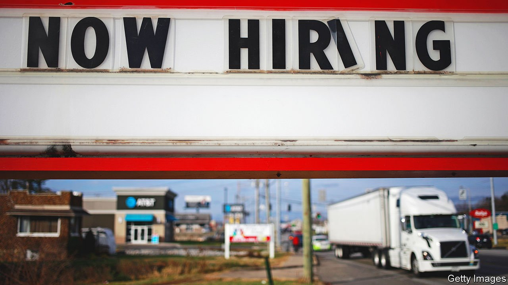

###### Labour constraints

# Staffing shortages in America are a glimpse into its future 

##### Even as the pandemic ebbs, the pool of potential workers may be permanently smaller than once assumed 

 

> Jan 22nd 2022 

FOR NEW truck drivers in Portland, Oregon, a $30,000 signing bonus. For new recruits in the army, a $50,000 bonus. Route closures for public buses from Texas to North Dakota. An end to automatic daily housekeeping at most Hilton and Marriott hotels. Offers by Amazon and Walmart to cover college tuition for their employees.

The thread that runs through all these snapshots—a tiny sample of such stories—is a remarkable imbalance between the need for workers and their availability in America today. The economy has surged beyond its pre-covid-19 level of GDP. Companies in just about every industry, from hospitality to finance, are desperate to hire people to keep up with demand. But the numbers willing to work for them are way down: America has about 3m fewer workers now than on the eve of the pandemic, a 2% contraction in the labour force.


That is great news for jobseekers. It is easy to find work. Wage growth (at least in cash terms) is strong, especially for those on low incomes. For America as a whole, though, it is a bigger concern. If the population is near to full employment—meaning that just about anyone who wants a job can find one—then economic growth is already straining at its upper limits. An overheated jobs market would add fuel to the inflation already spreading through the economy, making it that much harder to stabilise prices.

For much of the past two years, a fair assumption was that as the pandemic ebbed, people would go back to work in droves. That looks less plausible today. Some of the decline in the number of workers appears likely to be permanent. This, in turn, could constrain America’s economic potential, since a shrinking labour pool will be a drag on growth, says Marianne Wanamaker, an economist at the University of Tennessee. “I think that we have shifted to another plane here, unfortunately,” she says.

Those who have left the jobs market can be divided into three broad groups: people in their prime working years who, for various reasons, would rather be at home; older people who were heading towards retirement and have speeded up their departures; and immigrants, whose flow through legal channels has dried up.

It is easiest to be optimistic about prime-age workers. Every month brings more of this group—those aged between 25 and 54—back into the jobs market. At the current pace, their participation rate in the labour force will return to the pre-pandemic level of 83% by the end of this year.

The resumption of in-person schooling since last summer has freed up parents, which is especially important for the women who have been carrying out extra child-care duties. (The Omicron wave, which has led some schools to go back to remote learning, is a setback, but a temporary one.) The expiry of generous unemployment benefits, provided at the height of the pandemic, has also helped to coax people off the sidelines. As more Americans eat into their pandemic savings, pressure to find work will only increase.

Those retiring early may prove harder to budge. Had older Americans, aged 55 and up, continued to work at their pre-pandemic level, the country would have nearly 2m additional workers today.

One factor explaining their reluctance may be the surge in property prices and stocks, according to economists at the Federal Reserve’s branch in St Louis. Those on the cusp of retirement with ample savings may now feel less of a need to punch the clock. There may also be a more troubling explanation. Older people have been hit harder by covid, and ill health, or the threat thereof, could deter them from working, says Betsey Stevenson, an economist at the University of Michigan. Either way, the longer older people stay out of work, the harder it will be for them to get back in.

A decline in immigrants compounds that. For all the attention to illegal border crossings from Mexico, the bigger story is missing foreigners in America. There are about 2m fewer working-age immigrants than there would have been had pre-covid trends continued, according to Giovanni Peri and Reem Zaiour of the University of California, Davis. Roughly half would probably have had university degrees, so their absence hurts high-skill and low-skill industries alike.

An end to the pandemic would ease the backlog in America’s visa system. But shifting political winds—a reluctance to admit as many immigrants as in the past—may cap the inflows. An industry with a 10% higher dependence on foreign workers than another industry in 2019 typically had a 3% higher rate of unfilled jobs in 2021, calculate Mr Peri and Ms Zaiour.

 


One major reason why the Fed had been reluctant to raise interest rates, despite surging inflation, was its view that the economy was far from full employment. But with labour-force participation staying stubbornly low, it has changed its tune. Last week, Jerome Powell, the Fed’s chairman, said America’s best hope of boosting the workforce over time would be to have a long, steady recovery. For that, it needs price stability; hence the imperative to rein in inflation, which hit 7% in December, a four-decade high. Most economists think the Fed will raise rates for the first time since the pandemic in March, with at least two further rate increases this year.

The pandemic adds to uncertainties because of its impact on where people work. When restaurants slashed staff, Amazon and the like swept them up. One commonly expressed hope is that as consumer demand returns to services, away from goods, pressures on prices will ease. That, though, is far from given. “Without a rise in labour-force participation helping to meet the demand, inflation in the second half of 2022 might be fuelled by rising prices for services,” warns Ms Stevenson.

Still, the odds are that the job market will be a little calmer by the end of the year, thanks to a combination of slower economic growth, a fading pandemic and more prime-age Americans resuming work. But the extreme tightness today will have offered a glimpse into the future as ageing depletes the pool of potential workers. Ms Wanamaker describes the prospect as a “perpetual labour shortage”. Getting by with less help will be the new normal. ■

For exclusive insight and reading recommendations from our correspondents in America, , our weekly newsletter.

