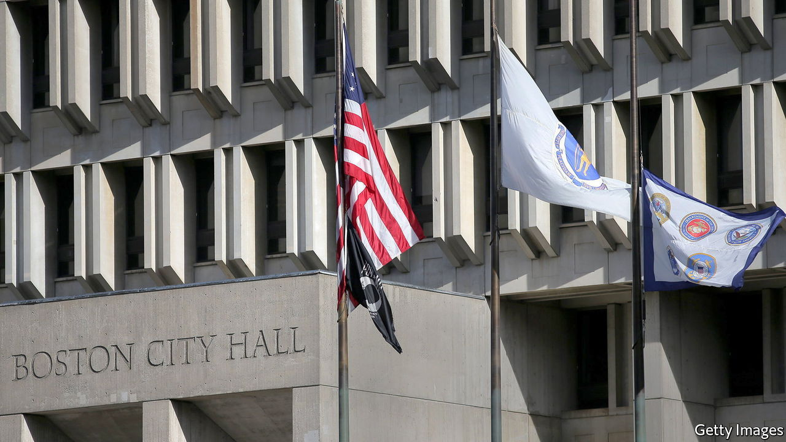

###### Flags and free speech

# The Supreme Court looks askance at Boston’s refusal to fly a Christian flag 

##### A pole dance over the First Amendment 

 

> Jan 22nd 2022 

WHEN BOSTON opened its new city hall in 1969, the building’s Brutalist style prompted both cheers and jeers. On January 18th another dispute involving the site landed at America’s Supreme Court. Shurtleff v City of Boston asks whether Boston infringed an organisation’s freedom of speech when a bureaucrat refused to fly its flag depicting a cross. A lopsided majority of the justices seems to think the city violated the First Amendment.

The plaza in front of Boston’s city hall is typically graced by flags of the United States, Massachusetts and Boston. But since 2005 the city has occasionally swapped its flag for that of a foreign country to mark anniversaries or honour visitors. It has also hoisted flags celebrating gay pride, Malcolm X and the battle of Bunker Hill. But in 2017 it turned down a request from Camp Constitution, a group dedicated to the appreciation of America’s “Judeo-Christian moral heritage”, to raise what it called a “Christian flag”.


It was the first time Gregory Rooney, the commissioner in charge, had rejected an application. Boston had a duty to keep government separate from church, he reasoned. Other flags may have included religious symbols—such as Portugal’s, with its representations of Christ’s wounds—but no group had described its flag in religious terms when seeking airtime.

Camp Constitution sued and lost in two lower courts. The First Amendment “restricts government regulation of private speech in government-designated public forums”, the First Circuit Court of Appeals wrote, but “such restrictions do not apply to government speech”. Since Boston owned and managed the flagpoles, any messages from the pennants were, the judges reasoned, those of the city itself.

This premise did not get a friendly reception among the Supreme Court justices. They seemed to agree with the flag-raisers that, in light of “ 284 flag-raising approvals, no denials, and usually no review” over a 12-year span, Boston had created a public forum. Balking only when the city discovered a religious point of view behind Camp Constitution’s flag is “viewpoint discrimination”, the group’s lawyer argued—anathema to the freedom of speech.

None of the six conservative justices accepted Boston’s defence that the flagpole has served as a megaphone for the city’s point of view. “Does the mayor of Boston really approve of the Montreal Canadiens?”, Chief Justice John Roberts asked, referring to a week in 2014 when Boston flew the rival hockey team’s flag. Well, that was the mayor honouring a bet, Boston’s lawyer explained; if the Boston Bruins had beaten the Canadiens, the Bruins’ flag would have flown over Montreal.

Boston’s lawyer faced critical questions from the liberal justices, too. It is understandable why Mr Rooney thought flying the Christian flag would fall foul of the separation of church and state, Justice Elena Kagan said, but his decision hinged on a misunderstanding. A permanent cross on city hall might be forbidden, but “in the context of a system where flags go up, flags go down, different people have different kinds of flags”, there’s no real worry.

With prospects of prevailing in Shurtleff close to nil when the court rules in the spring, cities may yet have a way to turn away swastika flags while accepting others. If the city exercised more control over each application and brought an official to every flag-raising, Justice Amy Coney Barrett explained, it would be kosher for Boston to say it is “happy to celebrate and communicate pride in Juneteenth”, for example, but decline “to participate in a flag-raising for the Proud Boys”. ■

For exclusive insight and reading recommendations from our correspondents in America, , our weekly newsletter.

