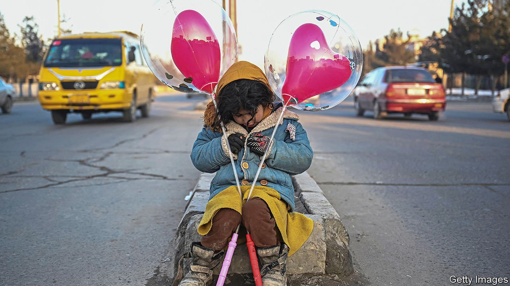
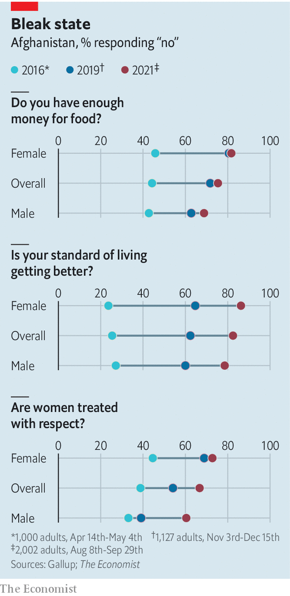

###### Khyber crevasse

# Afghans are more pessimistic about their future than ever 

##### A new survey paints a grim picture of life under the Taliban 

 

> Jan 29th 2022 

WHEN AFGHANS were asked in 2016 to rate their lives on a scale of zero to ten, with zero representing the “worst possible life” and ten the best, they gave themselves a respectable 4.2, the same as Indians and only a little below the median of 5.4 for 142 countries. By the summer of 2021 the score had plummeted to 2.3, making it the most miserable of all the countries polled by Gallup, a research firm, in a long-running series of surveys.

Gallup spoke to a nationally representative sample of 2,002 Afghans between August 8th and September 29th last year, even as the Taliban was completing its takeover of the country. The pollster asked about people’s day-to-day well-being, just as it has done in previous years. Where possible, the researchers spoke in the privacy of people’s homes or at least discreetly out of earshot. The responses paint a grim picture of a population in despair.


Fully 75% of respondents said that there had been times in the past year when they did not have enough money for food, a slight rise from 2019 and a big jump from the 44% in 2016. Asked if women were treated with respect 67% of respondents replied “no”, up from more than half in 2019 and below 40% in 2016. Strikingly, the share of men who replied in the negative has jumped from 39% to 60% in two years.

 


Afghans are pessimistic about the future, too. When asked in 2016 and 2019, they imagined that life would improve within five years. In 2021 they expected the future to be worse. Less than a quarter thought that Afghanistan was a place where children could “learn and grow”, down from two-fifths in 2019. Unsurprisingly, half said they wanted to emigrate. Among young men the figure was two-thirds. In 2016 a third of respondents said their standard of living was improving. Last year 82% said it was deteriorating.

Indeed, in the four months since the survey the situation has become even more bleak. The UN estimated in October that 18.8m of the country’s 42m people faced acute hunger, 4.3m more than a year earlier. A severe drought, the second in four years, has reduced the wheat harvest. But the immediate cause of food scarcity has been the drying up of foreign money. The country used to receive about $8.5bn a year, two-fifths of GDP, from abroad before the Taliban took over.

While Afghans go hungry some $10bn of the country’s foreign reserves is languishing in foreign banks. Those funds could help support the local currency, which has depreciated by 25% against the dollar since mid-August, pushing up the cost of imported staples. But the Afghan government’s foreign accounts have been frozen since the Taliban took power. The rich world would like assurances that the Taliban are no longer the repressive bunch ousted by America 20 years ago. On January 15th a Taliban junior minister said that schools—currently closed to girls over the age of 11—would reopen again at the end of March once segregated classrooms are ready. But for Afghans it is food, not education, that is the most pressing concern. ■

