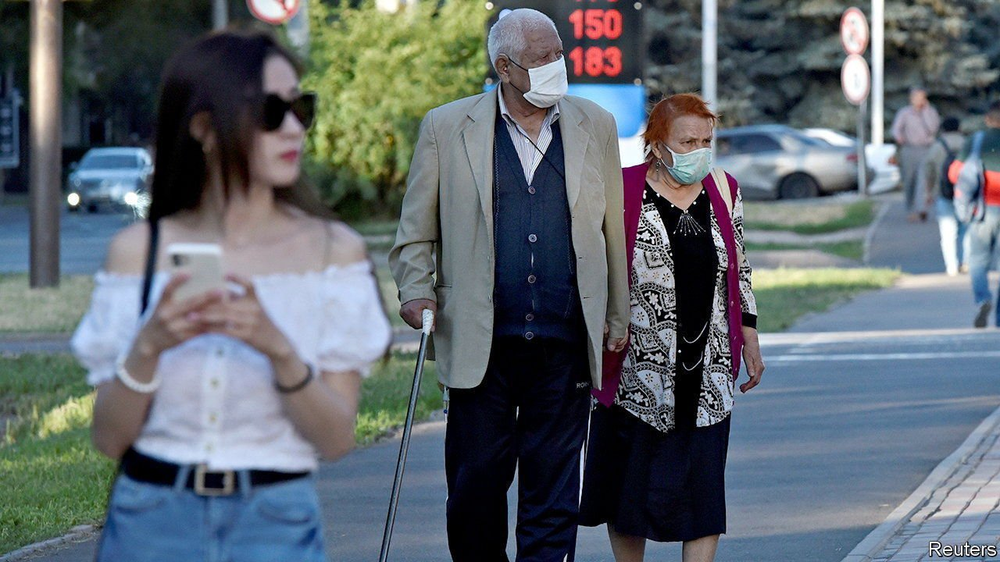

###### Demographic dance

# How Kazakhstan became more Kazakh 

##### Money for migration changed the face of a nation 

 

> Jan 29th 2022 

LIKE MOST autocrats Nursultan Nazarbayev, who ruled Kazakhstan for three decades, thought a lot about how best to honour himself. The 81-year-old resigned as president in 2019 and took on a role pulling strings from behind the scenes, but not before ensuring that the capital city would bear his name. At the start of January days of unrest and violence forced Kassym-Zhomart Tokayev, his successor as president, to promise wide-ranging changes to the regime Mr Nazarbayev had built. But one part of the older man’s legacy will not be easy to undo: the dramatic demographic transformation of the country which he engineered during his decades in power.

When the Soviet Union collapsed in 1991, Kazakhstan was the only ex-Soviet republic where the people after whom it was named were not a majority. Ethnic Kazakhs were just under 40% of the population. Russians were 37%. Other minorities made up the rest. All this was Stalin’s legacy. His famine in the 1930s killed a quarter of the country’s population, and he deported ethnic groups he didn’t trust to Kazakhstan.


By the time Kazakhstan celebrated the 30th anniversary of its independence at the end of 2021, a new census revealed a different country. Ethnic Kazakhs are now 70% of a population of 19m. Ethnic Russians are only 18%. Outward Russian migration and lower birth rates among Slavic minorities contributed to this shift. But a generous government programme designed to persuade foreign-born Kazakhs to move to the country played a big part, resulting in about a million new arrivals since independence.

Mr Nazarbayev launched the programme in the 1990s because he deemed the country’s demographic make-up a threat to its national security. Saying so openly would have alienated both his ethnic-Russian citizens and the government of Russia, with which Kazakhstan shares a border stretching for 7,600 km. So he offered perks such as cash and generous loans to buy homes and businesses in order to lure the millions of Kazakhs scattered abroad back “home”, where many of them had never set foot before.

Foreign-born Kazakhs now make up 6% of the population. Many have settled in seamlessly, especially those from other former Soviet states. Others have struggled with culture, language and politics, including some Chinese-born Kazakhs seeking refuge from anti-Muslim repression in China’s Xinjiang region. They have found that the government’s ties with China trump ethnic solidarity.

Like migrants around the world, they have also faced hostility from those already in the country. Some citizens resent the perks foreign-born Kazakhs are offered. To allay such worries the system now encourages migration to designated regions, mostly in the north along the border with Russia, where large groups of ethnic Russians live. The official goal is to tackle labour shortages. But the unspoken aim is to make these areas more linguistically and culturally Kazakh.

That goal has become more pressing for Kazakhstan’s government since Vladimir Putin, Russia’s president, annexed Crimea in 2014, using the supposed oppression of Russian-speakers as a pretext. Russia’s renewed sabre-rattling on the Ukrainian border has reminded Kazakhs that some Russian nationalists make territorial claims on Kazakhstan, too. Many were anxious when Russian troops briefly got their boots on the ground in Kazakhstan in January, after Mr Tokayev asked Mr Putin for help restoring order.

Kazakhification frightens the 30% of Kazakhstanis from ethnic minorities. They were terrified by deadly attacks in 2020 on villages inhabited by Dungans, Mandarin-speaking Muslims of Chinese descent. Some fear that ethnic nationalism may be unleashed now that Mr Nazarbayev, who at least combined his efforts at Kazakhification with rhetoric about national harmony, has all but left the scene. As legacies go, ensuring that citizens get on may be as hard to make stick as the new name for the capital—which may soon revert to Astana. ■

