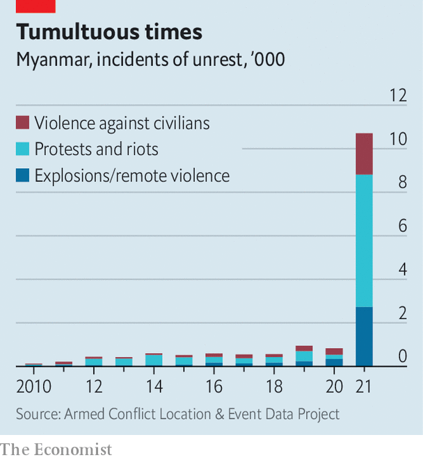
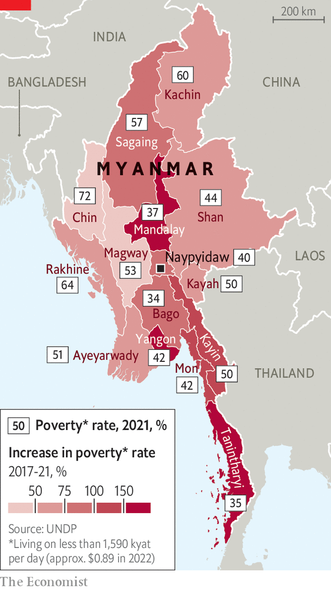

###### The enemy of my enemy

# Myanmar’s generals have united the country—against themselves 

##### A year since taking power, the junta is fighting on more fronts than ever before 

 

> Jan 29th 2022 

Z N HTET AUNG had always loathed the Rohingyas, a Muslim ethnic group from Rakhine, a state in western Myanmar. When the Burmese army led mobs on a rampage through Rohingya villages in 2017, burning, raping and killing and prompting some 700,000 Rohingyas to flee to neighbouring Bangladesh, he believed the military campaign was justified. He regarded the minority as “terrorists” and “illegal immigrants”. Most Bamars, the ethnic majority, to which he belongs, felt the same way.

But one day last June Mr Zin Htet Aung apologised on Facebook for his views and asked the Rohingyas for forgiveness. His contrition is part of a chorus of mea culpas. Since the army launched a coup on February 1st 2021, many Bamars have publicly apologised for pooh-poohing the plight of Rohingyas and other persecuted ethnic minorities. Demonstrations in solidarity with Rohingyas have taken place in cities all over the country in the past year. “Now we are suffering,” says Mr Zin Htet Aung. “We realise that we are oppressed, that we are all in the same boat.”


That is not how Min Aung Hlaing, the commander-in-chief, expected things to go—but then Myanmar’s top brass have never been much good at reading the country’s mood. The armed forces have repeatedly called elections, and then been surprised when the National League for Democracy (NLD), the party of Aung San Suu Kyi, Myanmar’s most famous democracy activist, has won them. In 2008 the generals devised a hybrid form of democracy that entrenched their power and kept down the NLD and Ms Suu Kyi. But the NLD still triumphed in elections in 2015, winning by a landslide, and Ms Suu Kyi found a way around a rule intended to stop her from leading the government.

By the time the NLD was re-elected five years later by an even bigger margin, Mr Min Aung Hlaing decided he had had enough. Yet in wresting power from Ms Suu Kyi, who always praised the army in public and deferred to many of its whims, the generals have inadvertently created the conditions necessary for a new, less chauvinist politics to take root, one which has the potential to unite Myanmar’s many fractious ethnicities—and, perhaps, to evict the army from power.

That is quite an achievement in a country with a long history of enmity between ethnic groups. These tensions were stoked by the British during the colonial era. Within a year of independence in 1948, the army was battling ethnic-minority insurgencies in the country’s borderlands. The fighting has continued ever since. Many Bamars have been indoctrinated by decades of propaganda portraying the army as the guardian of the nation, defending it from rebels, traitors and infiltrators. Prejudice against the Rohingyas even found a supporter in Ms Suu Kyi, who defended the army’s persecution of that group. Many Bamars, who idolise her, cheered her on. It helped that the violence meted out against minorities was easy to ignore, taking place as it did in the distant, mountainous fringes of the country, far from the Bamar heartland in the central lowlands.

But when the army cracked down on the protest movement that arose in opposition to the coup, soldiers turned their guns on minorities and Bamars alike. And when resistance showed no sign of ebbing, the army began razing towns and massacring protesters. The junta’s forces have killed nearly 1,500 civilians since the coup, according to the Assistance Association for Political Prisoners, a charity based in Thailand. “Your average NLD fan now is much more genuinely sympathetic to what ethnic people have gone through,” says Kim Jolliffe, an analyst who specialises in Myanmar’s ethnic politics.

This shift is evident in politics, too. After the coup, deposed lawmakers from the NLD formed a shadow government called the National Unity Government (NUG). They promised that it would be different, in style and substance, from the one that had just been ousted. Ms Suu Kyi was unpopular with ethnic minorities, who were disappointed when she failed to devolve power from the highly centralised state. Some Bamar politicians were disillusioned, too, since she ran her party as an authoritarian, refusing to delegate beyond a small circle of geriatric acolytes.

The NUG has, by contrast, taken pains to show that it is listening to its critics. It is stuffed with young people and ethnic minorities, and says it makes decisions by consensus. It has symbolically repealed the constitution, which was enacted by a previous junta in 2008, and promised to forge a federal state and to grant Rohingyas citizenship. This conciliatory tone and inclusive approach mark “a new era of politics”, says Maw Htun Aung, a 37-year-old activist of Kachin ethnicity who is a deputy minister in the NUG.

These changes are born of pragmatism as much as principle. The parallel government is in a precarious position. It does not control any territory and no foreign government has formally recognised it. One reason that it has tried to make amends for its treatment of Rohingyas is its desire for legitimacy on the international stage, says Mr Aung Kyaw Moe, a Rohingya adviser to the NUG’s human-rights minister. The shadow government is also keenly aware that, to have any hope of conquering territory, it must forge alliances with some of the two dozen established ethnic rebel groups, which between them command 90,000 troops. (The Burmese army is thought to number 300,000 soldiers.) That puts these insurgents in the position of “kingmakers”, writes Min Zin of ISP, a think-tank in Yangon. Their lingering distrust of the NLD has made negotiations with the NUG more difficult.

The ties that bind

Nonetheless, since the coup, four rebel groups have provided safe haven to NLD politicians fleeing the army, nominated members to the NUG, engaged in negotiations about a new constitution and worked with the shadow government to deliver humanitarian aid. They have collaborated on the battlefield, too, helping the NUG obtain weapons and advising its leaders on military strategy. Scores of Bamar militias loyal to the shadow government, known as people’s defence forces, have sprung up. Rebel groups have trained these insurgents and even fought alongside them. This degree of collaboration between Bamars and ethnic minorities “in a popular democratic movement is unprecedented in the country’s history”, says Mr Jolliffe.

The junta is struggling. It is deploying its traditional “four-cuts” counter-insurgency method, which involves severing ties between guerrillas and the locals who provide them with food, funding, intelligence and recruits. In practice that means terrorising entire villages; more than 400,000 people have fled their homes. That is not having the desired effect. Instead of pacifying the population, such acts of cruelty are “like a huge recruiting drive for the local defence forces”, says Mary Callahan, a historian of the army.

 


The army is now fighting on multiple fronts: in cities, where underground cells set off bombs almost every day; in the central lowlands, inhabited by Bamars, which have not seen conflict in generations; and in some ethnic-controlled peripheries (see chart). A handful of rebel groups that have not joined the resistance are seizing the opportunity to expand their territory. The junta is unable to pick its battles, is failing to attract new recruits and is alienating the public. Nor has it managed to sign ceasefires with ethnic rebel groups. It does not have momentum on its side, says Matthew Arnold, a researcher on governance in Myanmar. The opposition does.

 


In the territory that it does control, the junta is finding it difficult to govern. “It is the equivalent of a foreign occupation force,” says a former diplomat, one which can only provide “some limited government” through the application of brute force. Its grip on the levers of power is shaky. Since the coup, some 400,000 civil servants have resigned in protest, according to the NUG. Although the figure is no doubt inflated, it hints at the scale of disruption. Poverty is growing (see map). The economy is in turmoil. The World Bank reckons that it is a third smaller than it would have been without covid-19 or the coup. The junta faces a growing budget deficit and may struggle to pay the civil servants who remain in post. Myanmar “is already at a point where it’s ungovernable”, says Ms Callahan.

The junta’s failure to master the situation does not mean that it is likely to be defeated by the resistance, at least in a conventional manner. The army has far more troops and weapons at its disposal. Opposing forces are dispersed across the country, and have not been knitted into any unified command structure. If their movements are guided by a grand military strategy, it is not discernible (though neither is the junta’s). Victory will not involve resistance troops marching on the capital.

Instead it will consist of concerted pressure from several directions, forcing the army to withdraw from swathes of the country, a process that would sap morale and stoke division among the top brass, perhaps leading to an internal split. Yet such an outcome could take years. It also would depend on the parallel government persuading ethnic minorities, many of whom are still nursing old grievances, to trust it. Yet one thing is already clear: in the struggle for the hearts and minds of the Bamar majority, the army has lost. ■

