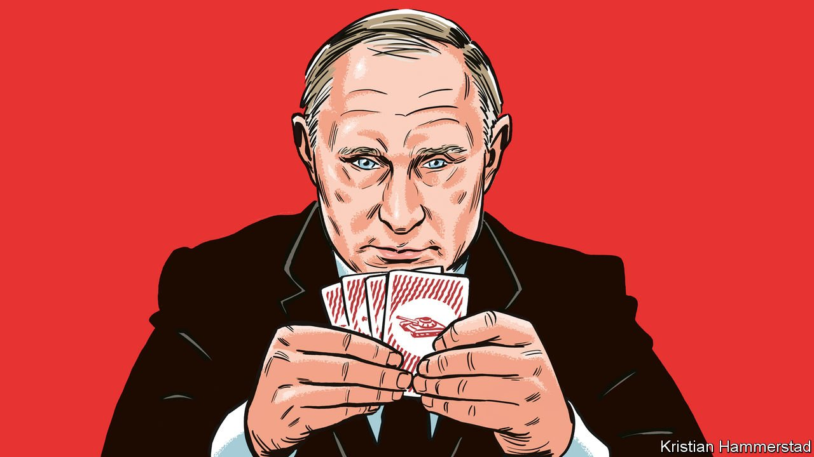
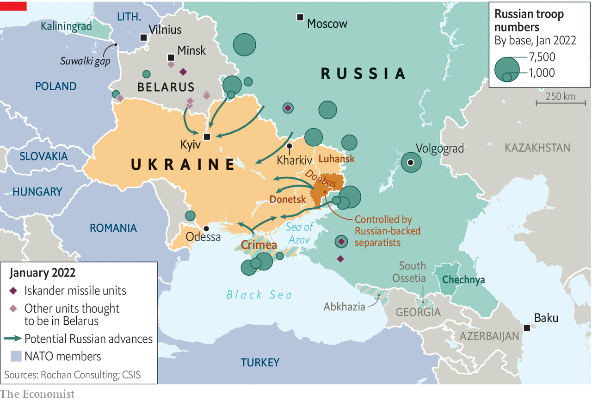
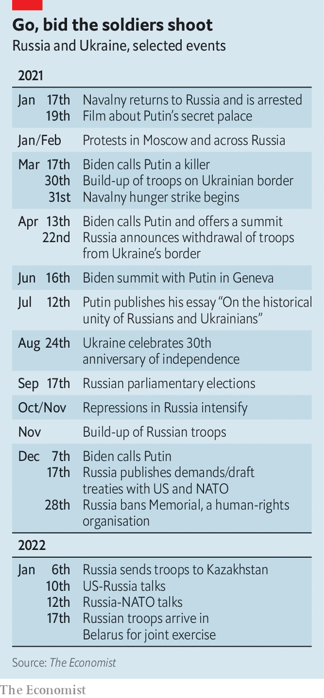
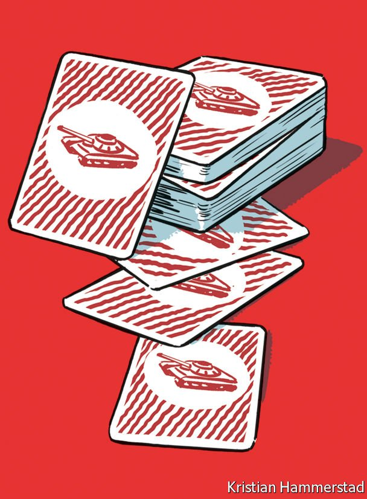

###### A question the size of an army

# What are Vladimir Putin’s military intentions in Ukraine? 

##### Only he can say 

 

> Jan 29th 2022 

A BATTALION TACTICAL GROUP (BTG) is a Russian army unit which consists of 800 or so troops, sometimes rather more, and most of the armour, artillery and air defences they need in order to fight. When Russia attacked Ukraine in 2014, stirring up separatism among Russian speakers in Donbas, at the eastern end of the country, and annexing Crimea, it did so with perhaps half a dozen BTGs. The following year, when its surrogates in Donbas needed help, it responded with roughly ten BTGs.

There are now 56 Russian BTGs on or near Ukraine’s border, according to its government. Other estimates put the number above 70. It is by far the largest concentration of military force seen in Europe since the end of the cold war. And only Vladimir Putin can say how, or if, it will be put to use.


When President Joe Biden said, on January 19th, that he thought Vladimir Putin was going to invade Ukraine, the reason he offered was simply “he has to do something”. Huge clouds of smoke betoken fire; mobilisations have momentum. But the fact that Mr Biden thinks his Russian counterpart, having gone this far, must go further, does not mean Mr Putin agrees. Mr Putin comes from a political culture very unlike Mr Biden’s, one where negotiations often start with threats rather than attempts at understanding. And he is accountable to no one.

Having not specified any objective or target, Mr Putin might feel able to de-escalate in a way a leader who has to build coalitions around courses of action would not. It is striking that, inside Russia, there have been quite a few voices prophesying not war, but its absence—and though the absence of war, as students of Spinoza can attest, is not the same thing as peace, it would nevertheless entail fewer risks for Mr Putin.

Russia is not the only place where people are unconvinced about the imminence of battle. Volodymyr Zelensky, Ukraine’s president, has told the public that Mr Putin’s mobilisation is a form of psychological warfare best countered by staying calm. Years of losing soldiers in Donbas have taught the country a certain stoicism.

But there was a marked increase in tension around January 23rd, when various embassies started withdrawing people from Kyiv. Young members of the middle class are making contingency plans to leave Kyiv or to move family members out of regions where fighting looks more likely. Official reassurance does little to help when it tips over to absurdity. Oleksiy Danilov, the head of Ukraine’s national security and defence council, insisted on January 25th that Russia’s troop movements are nothing out of the ordinary and on the 26th that full-scale invasion would be “physically impossible”. They are, and it’s not.

Mr Putin has made political capital out of armed conflict before. The war in Chechnya which began in 1999 helped him ascend to the presidency. The war in Georgia, in 2008, marked a new defiant anti- NATO nationalism. Seizing Crimea in 2014 was hugely popular at home.

But he has fought shy of committing massive forces or risking dreadful casualties, and many Russian opposition politicians, political analysts and businesspeople think he has no interest in changing that approach now. They suggest the mobilisation along the border was not intended as the prelude to war, but just to generate a sense of conflict and crisis at home, thus shoring up the regime, and to rattle the West, exposing some of its internal tensions. Those goals have been achieved.

The drums of war have drowned out grumbles about inflation, the raging pandemic and corruption. The demands Russia has made of NATO—that it abandon an open-door policy towards new members, that it cease military activity in the countries of eastern and central Europe and that it remove various missile systems—have brought about high-level summitry reminiscent of cold-war superpower stand-offs, confirming the great-power status that Russia sees as its due.

In the Russian media NATO’s rejection of these demands has shown the alliance to be the aggressors and Mr Putin the doughty defender of the motherland. As George Kennan, an American diplomat, put it in 1946 when sketching the basis of America’s cold-war strategy, in Russian nationalism “conceptions of offence and defence are inextricably confused”.

The West’s responses, including promises to supply more arms to Ukraine, have allowed the confusion to be deepened. As Alexei Navalny, an opposition leader who Mr Putin tried to have killed in 2020, recently wrote from jail: “Time and again the West falls into Putin’s elementary traps...It just takes my breath away.”

This all explains why some observers in Russia see it as possible for Mr Putin to lay his cards down and walk away from the table, reserving the right to pick them back up at a later date. Given the risks that war would pose for the Russian economy, the fortunes of Mr Putin’s coterie and the mood of the people, they think he would be mad not to. But that does not mean he will. His personal calculus may be different from theirs. He is becoming increasingly isolated and may be ill-informed on some things, such as the economic impacts to be expected. He may have lost sight of the big picture—or he may think he sees a bigger picture than anyone else.

Part of the picture is that when in 2014 there was a widely discussed plan to carve out the whole of the Russian-speaking south and east of Ukraine Mr Putin turned it down. Control of Crimea and a destabilising insurgency in Donbas seemed like a good enough result. The Minsk agreements, which were aimed at bringing about a ceasefire, required a new federal role for the country’s regions. That would have allowed separatists in Donbas to hobble any Westward drift on the part of the country as a whole.

 


But the Minsk agreements are moribund and Ukraine has remained a unitary state. Although it has not moved towards formal NATO membership during the subsequent eight years, it has benefited a lot from Western assistance, military and otherwise, which looks set to continue.

An independent Orthodox Slavic country that is part of the Western project is a direct affront to Mr Putin’s model of an authoritarian Russia; if that affront is to be avoided, Ukraine must be kept in subaltern turmoil, weak and cowed. And although Ukraine is less vulnerable today than it was in 2014, it looks unlikely that it will ever again be as vulnerable as it is today. That is an argument for changing the run of play as soon as possible. So is the fact that Russia currently has an impressive war chest, the better to ride out sanctions.

There is also an argument from self-preservation. Russian leaders routinely conflate enemies at home with his enemies abroad. A Western plot to destroy Russia which uses both “foreign agents” at home and catspaws abroad (the role allocated to Ukraine) allows Mr Putin to portray himself as the resolute leader of an embattled Russia. This is self-serving but it may also, in its way, be sincere. To quote Kennan again, Russian leaders “have no difficulty making themselves believe what they find is comforting and convenient to believe”. And though it is not exactly comforting, Mr Putin may believe that his enemies within mean America and its allies are actively attempting to get rid of him.

In an ABC News programme aired on March 17th 2021 Mr Biden agreed with his interviewer’s assertion that Mr Putin was “a killer”. Referring to evidence from American intelligence that Russia had sought to interfere in America’s elections, he said that Mr Putin would “pay a price” as a result. Mr Putin may have seen this as a direct threat. People who know the president say he is obsessed with his own security and assassination attempts. Months spent in a bunker isolating himself from covid-19 may well have added to this sense of paranoia.

Two days after Mr Biden’s remarks, Mr Putin and Sergei Shoigu, his defence minister for the past decade, went away for a weekend. When they returned Russia started assembling troops on the Ukrainian border and in Crimea. Less than a month later, Mr Putin published an essay about the historic links between Russia and Ukraine which concluded that Ukraine was no longer a sovereign state but an American bridgehead. It is plausible that he sees an attack on Ukraine as a defensive action, a fight for survival against America’s plot to undermine his rule.

Not single spies, but in battalions

If Mr Putin chooses to use some or all of the forces he has at his disposal, when is he likely to do so? The wherewithal for a major offensive will not be fully assembled until the middle of February, says an eastern European official familiar with the intelligence. The Russian forces massing in Belarus—well placed for an attack on Kyiv—are expected to reach their full complement by February 10th. That is now tagged as the starting day for a hastily announced joint “exercise” called “Allied Resolve”.

Mr Putin may choose to hold his fire during the Winter Olympics in Beijing; a war in Ukraine will make good relations with China an even higher priority than they already are. If so that would suggest a window of opportunity between the end of the games on February 20th and the spring thaw. That said, though soft ground will make the going tougher for Russian armour, a later attack is not impossible.

Ukraine’s paucity of air defences and the weakness of its armed forces means that Russia could drive to Kyiv perhaps as easily as American forces reached Baghdad in the Iraq war of 2003. Michael Kofman, an expert on Russia’s armed forces at CNA, a think-tank, thinks Russia might go so far as to encircle Kyiv, take Odessa, a coastal city due south of the capital and partition the country, leaving only its western fringes unoccupied. “It would be terribly risky, and costly,” he wrote in an essay for “War on the Rocks” a website, “but it would make Putin the Russian leader who restored much of historical Russia, and established a new buffer against NATO.”

As the comparison with the attack on Baghdad suggests, the problem in this scenario is what happens after Russia wins. One Russian-backed thug has already done a midnight flit from Kyiv: Viktor Yanukovych, when faced by revolution in 2014. There would be little to stop a post-invasion quisling from suffering the same fate if, after the invasion, Russia left the stage. So Russia would either have to break up the unitary state or accept an open-ended occupation, one which partisans from western Ukraine would flock to fight.

 


In 2020 RAND, an American think-tank, estimated that Russia would need 80,000 or so troops to seize and hold tracts of eastern Ukraine, including the cities of Donetsk and Kharkiv. A larger effort that included Kyiv would take a lot more, easily absorbing even Russia’s substantial forces. It would not be the first great power to wade into such a conflict on the basis of rosy assumptions about its course. But it may see less risky ways to get what it wants.

This is one reason why Ukraine’s Centre for Defence Strategies, a think-tank, calls a “hybrid invasion” likelier than a traditional one. The CDS says such an effort would involve cyber-attacks, disinformation and psychological operations like bomb threats. There have been several hundred recent bomb scares across Ukraine aimed at schools, political offices and other non-military targets.

If, by demoralising Ukraine’s population and exhausting its security forces, such action brought about regime change on its own, so much the better for Mr Putin. If not, it could become the preparatory phase for something more intense.

The report also moots an “armed escalation” in the Donbas region, of which only 30% is currently controlled by pro-Russian separatists. Mr Putin has long claimed, most recently in December, that Ukraine’s government is committing genocide against Russian-speaking minorities in the region. Their protection could be used as a pretext for taking the rest of Donbas.

On January 26th Vladimir Vasilyev, who leads United Russia, Mr Putin’s party, in parliament, said that “Military shelling in Luhansk and Donetsk regions is increasing, people are dying again, suffering, their property is being destroyed…We appeal to the leadership of our country to provide assistance to the Luhansk and Donetsk republics in the form of supplies of military products necessary to deter aggression, as well as to take all necessary measures to ensure the safety of their citizens.” It is not an appeal he would have made without being asked. If shelling were deemed an insufficient incitement, a “false flag” operation might be put in play.

The front lines in Donbas have hardly moved in years. Breaking through them would involve a substantial and conspicuous Russian intervention. But it would be smaller than a drive to Kyiv, and also possibly more acceptable to outsiders. Antony Blinken, America’s secretary of state, has said that “a single additional Russian force [going] into Ukraine in an aggressive way” would trigger sanctions. But not all America’s allies can be counted on to take as hard a line, and Mr Putin may think he is more likely to get away with expanding a small war than starting a big one from scratch.

Despite some of these attractions, seizing the Donbas has a big drawback. It might not work. In his essay on Russia and Ukraine Mr Putin wrote that “Kyiv simply does not need Donbas”. That cuts both ways. Taking Donbas might be a short-term victory, and in the context of broader hybrid warfare it might bring down the current regime. But in the medium to long term it would be quite likely to consolidate or accelerate an unencumbered drive towards the West by the rest of Ukraine.

A further possibility, which could be undertaken alongside another or on its own, would be for Mr Putin to use the forces he has moved into Belarus to consolidate control over the country. Though he resents it, Alexander Lukashenko, the president of Belarus, relies on Russia in many ways, not least in his suppression of the widespread protest which began as a response to his stealing an election in 2020. An effective annexation of Belarus might not necessarily trigger sanctions. It would leave Russia nicely positioned to go on menacing Ukraine. And it would allow Mr Putin to pose a new level of threat to the Suwalki gap, a narrow corridor which connects Poland to Lithuania, and thus the three Baltic states to the rest of NATO.

The insolence of office

On top of the military risks are political and economic ones. The prospect of war is already sending the stockmarket and the rouble tumbling. War proper, which would trigger new sanctions, would make things a lot worse. There could be a catastrophic run on the banks. Because accommodation with the West, where property rights are secure, is what makes it possible for Russia’s wealthy to pass things on to their children, lasting isolation could be very irksome for the elite.

 


Russian public opinion shows signs of dissonance. The vast majority of Russians blame America and the West for stoking tension and provoking Russia. But despite the propaganda effort, Russians have an increasingly positive attitude towards Ukrainians. Accustomed to seeing themselves as victims, they see Ukraine the same way: “America’s pawn”.

The queasiness Russians may feel at the thought of lots of Ukrainian deaths may be one reason why the Kremlin’s militarism causes anxiety rather than support. As Lev Gudkov of the Levada Centre, a polling outfit, wrote recently, “An ordinary Russian does not want to be held hostage to the insane course of the country's leadership; he cares about his own life and the well-being of his relatives.” A long-drawn-out war in which not just Ukrainians but young Russians die in their thousands would be massively unpopular.

Hence the belief, among many in Russia, that Mr Putin would be best advised to press no further. The problem is that Mr Putin is not looking for advice. He will follow his own mind. ■

All of our recent coverage of the Ukraine crisis can be found 

