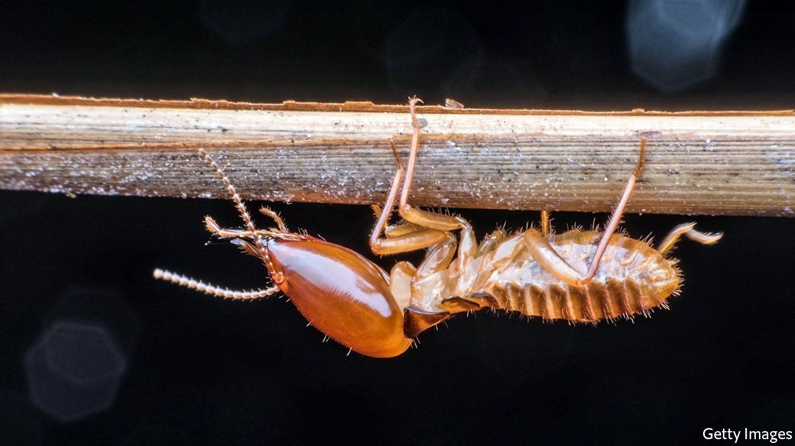

###### Resident weevil

# After more than two decades, Britain is finally rid of termites 

##### Globalisation makes infestations more likely 

 

> Jan 29th 2022 

IN 1994 THE owners of a pair of 1920s timber-frame bungalows in Saunton, Devon, spotted what looked like white ants crawling around their properties. They turned out to be termites—millions of them, thriving in the south-west’s temperate climate and well-draining soil. Four years later, when the Building Research Establishment (BRE), a laboratory paid by the government to eradicate the pests, got to work, termites could be seen wriggling in the flower-beds. No soil or wood could leave the site, for fear of spreading the infestation. The owners had feared their homes would have to be demolished; now they risked being stuck with them indefinitely.

One of the benefits of being an island is that it helps with keeping out pests. But as globalisation sends people and goods whizzing around the globe, the likelihood of an unwelcome arrival grows. The BRE traced the Devon termites back to south-west France. Wine crates were the probable courier, says Ed Suttie of the BRE, who has led the eradication programme since 2003.


Sometimes, all that can be done with non-native pests is to accept that they will become endemic. But termites are highly destructive, causing vast damage in North America, Australia and warmer parts of continental Europe. A counsel of despair was unacceptable. And so the BRE worked with government ministries to design an eradication programme. The first attempt, in 1998, failed because the bait was insufficiently tempting. Another the following year, which used aged, untreated wood from Scots pines to lure the termites out of their nest, was more successful. After nibbling on the timber, which was laced with a chemical that stopped the termites from maturing, they carried both timber and the chemical home.

But in 2009, just as the BRE was about to announce that it had eradicated the termites, it spotted signs that they had been at the timber again. Only in 2021, when ten years had passed without any evidence of their presence, was it able to declare victory. Restrictions on renovation work on the bungalows were lifted late last year.

The exterminators were lucky, in several ways. Chillier weather than the termites were used to meant they hibernated for longer and reproduced more slowly. (Mr Suttie thinks they arrived decades before being noticed.) European termite species are in any case less destructive than those found in North America or Australia. And the Devon colony never reached the point of seeking to establish a new one—a developmental stage in which many of the insects grow wings and take flight. If that had happened, the infestation would have been impossible to contain.

Britain will probably be visited by termites again. Most of the country is too cold and damp for them to thrive—but as the Devon colony shows, not all. And so BRE is teaching surveyors, architects and workers in the timber industry how to spot the signs before termites have a chance to settle in. Better to get rid of unwanted guests straight away than have to spend decades on another eviction. ■

