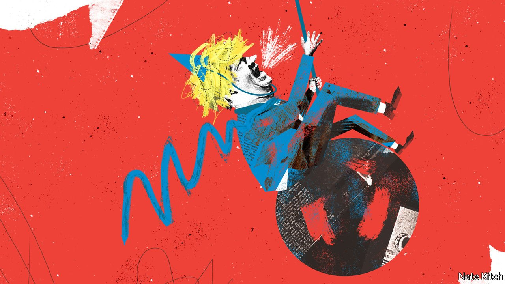

###### Bagehot

# Boris Johnson is making boring politics look attractive 

##### All the chaos is putting voters in the mood for calm 

 

> Jan 29th 2022 

THINGS ARE never dull around Boris Johnson. Since 2019 the prime minister has led the Conservatives to their biggest vote-share since 1979, shaken up politics, taken Britain out of the European Union, endured a pandemic, nearly died, had a child, struck a trade deal with the EU, got married, had another child, and seen his net approval rating swing from +40 to -51 after revelations about potentially illegal parties in 10 Downing Street. His repeated dishonesty—and a police investigation into the high jinks, launched on January 25th—make them the most damaging in a series of scandals. Others include scrounging £53,000 ($72,000) from donors to redecorate his residence and trying to prorogue Parliament illegally. If Napoleon was history on horseback, Mr Johnson is history on a pantomime horse.

With Mr Johnson holding the reins, politics is exhausting and voters are tired. Little wonder that they are telling pollsters they want a change. Nearly dying tends to win widespread sympathy; attending illegal parties in an unprecedented lockdown and being investigated by the police tend to lose it. The prime minister is to blame for his many errors. But he is also the victim of a super cycle in British politics, in which voters’ taste in leaders swings between the charismatic and the boring.


This alternating pattern has lasted for four decades. Margaret Thatcher, Britain’s first female prime minister, was replaced by Sir John Major—a man who, as wags like to note, ran away from the circus to become an accountant (his father was a trapeze artist). Sir John, a modest man, handed over to Sir Tony Blair, a messianic one. The theatrical Sir Tony was replaced by the dour Gordon Brown, who was succeeded by the slick, self-confident David Cameron. Theresa May, surely one of the shyest politicians ever to hold high office, was replaced by Mr Johnson, a show-off.

The great German sociologist Max Weber saw such charismatic authority as a “revolutionary force”. It rests on the performance of miracles. Thatcher healed the sick man of Europe, breaking militant unions and modernising the British economy. Sir Tony converted Middle England’s “small-c” conservatives into Labour voters. Mr Johnson struck a Brexit deal when that seemed all but impossible (admittedly, at the cost of hiving off Northern Ireland). He won “red wall” constituencies in central and northern England that looked demographically Tory but had stuck stubbornly with Labour until 2019. His party hailed him as its saviour. Its election manifesto was decorated with pictures of men in boiler suits waving placards reading: “ WE LOVE BORIS”.

But charisma cannot last. It requires frequent demonstrations that the leader still has the magic touch. There is little evidence that Mr Johnson does. His government’s announcement that the Royal Navy would help stop migrants crossing the Channel largely served as a reminder that the flow had not yet been stemmed. Picking a fight with the BBC, which voters like, won few friends. Unpopular populism is of no use to anyone. Britons are succumbing to drama fatigue. The Tories were elected on a promise to “Get Brexit Done”—and then, implicitly, to make politics go away again. Instead politics has become impossible to ignore. Mr Johnson’s tenure increasingly resembles the grim years of Mrs May: stasis, parliamentary plots and a government unable to govern.

And so Labour is deploying boredom as its secret weapon. Sir Keir Starmer, a former head of the Crown Prosecution Service, revels in the reputation of lawyer-cum-bureaucrat. He likes five-a-side football, the Union flag and the Pineapple, a pub in Kentish Town; he dislikes crime and people who leave football matches early. Under his predecessor, Jeremy Corbyn, the party fizzed with audacious schemes—or madcap ones: free broadband for everyone! Sir Keir specialises in policy-free speeches that amount to little more than an hour of looking presentable in front of a flag.

The Conservatives jostling to replace Mr Johnson are also trying to look as dull as possible. Mr Johnson’s road to Number 10 was chaotic; Rishi Sunak, the favourite to succeed him, glided from backbencher to chancellor in only five years. A teetotaller, he celebrated the reopening of the pubs after the most recent lockdown by posing outside an electrical store. Jeremy Hunt, a former health secretary and a contender for the leadership, contrasted his own seriousness with Mr Johnson’s silliness in the party’s most recent leadership contest. Long-shot candidates for the next one, such as Sajid Javid, the health secretary, are nerdy types. Only Liz Truss, the foreign secretary and one of a handful of front-runners, bucks the trend. She likes to look dashing, using a recent trip to Estonia to be photographed beaming out from a tank turret, even if her advisers would rather she showed off her well-briefed side.

I just closed my eyes and swung

Mr Johnson’s combination of excitement with ineptitude is hardly ideal. But dull people can be failures, too. At a time when the top job required charisma and salesmanship, it was held by Mrs May, who possessed neither. Mr Johnson would have been in his element in 2016, avoiding all talk of Brexit’s drawbacks by simply insisting there were none. Mrs May, for her part, might have thrived in lockdown. It is easy to imagine her shutting every pub in the country before ever asking an aide: “Now, what’s all this about a virus in Wuhan?” The charisma cycle of British politics gives voters what they want, but not always what the times need.

The big difficulty for boring leaders is that they can struggle to sell their vision. Charismatic ones, by contrast, get the chance to create a new political reality before voters tire of them. Thatcher reshaped the country for the foreseeable future; Sir Tony dominated it for a decade. By pressing ahead with Brexit, Mr Johnson has already set the course of British history for a generation. Whoever replaces him may do little more than tidy up after that upheaval—and give Britons time to catch their breath before the pendulum swings and politics becomes interesting again. ■

Read more from Bagehot, our columnist on British politics:

 (Jan 22nd)

 (Jan 15th)

 (Jan 8th)

