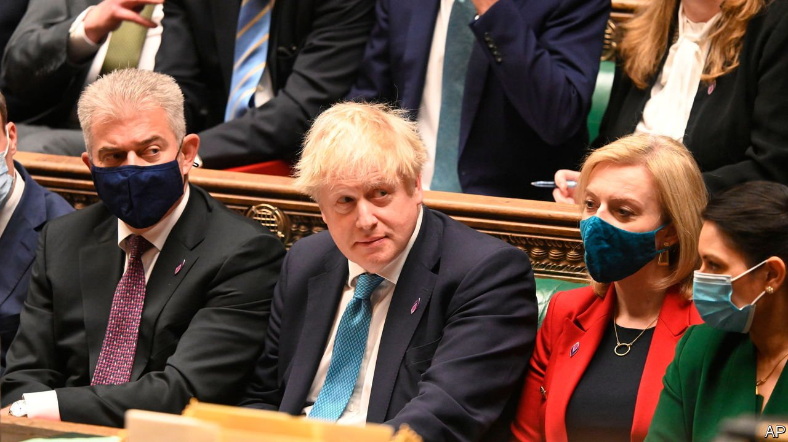

###### Yes man

# Boris Johnson, the prime minister who can’t say no 

##### His future depends on his party indulging him, as he has indulged it 

 

> Jan 27th 2022 

THERE HAVE been many implausible elements of Boris Johnson’s accounts of the “bring your own booze” gathering hosted in the garden of 10 Downing Street in May 2020, when Britain was under strict lockdown. Among them are his insistence that he “believed implicitly” it was a lawful work event, and his reliance on the excuse that “nobody told me” it would trample the restrictions his own government had imposed. Least credible, however, was his statement to the House of Commons that “with hindsight, I should have sent everyone back inside.”

With hindsight, perhaps. Nothing could be more out of character for Mr Johnson than to order aides to drain their glasses and get back to their desks. His career has been marked by an eagerness to be liked, aided by an indifference to truth and a belief that rules are for others. Bombastic on the campaign trail, in private he is conflict-averse. As The Economist went to press, he was awaiting the results of an investigation by Sue Gray, a senior civil servant, into more than a dozen lockdown-busting events, including a Christmas bash, a birthday party and “wine-time Fridays”. On January 25th the Metropolitan Police said it was opening a criminal inquiry in light of information shared by Ms Gray. A desire to say Yes built the prime minister’s career, and may destroy it.


A trawl through the archives of his predecessors reveals one word scrawled again and again: No. The most important part of the top job is to shield the vast power and resources at his disposal from lobbyists, hangers-on and peddlers of bad ideas. The ministerial code, which Mr Johnson stands accused of breaching, is a list of Thou Shalt Nots. To govern is to choose, and more often than not, it requires choosing not to.

Mr Johnson’s inability to say No lies behind a trio of scandals. In August British troops helped airlift dozens of cats and dogs during the evacuation of Kabul. Ben Wallace, the defence secretary, had refused to take them, and in the dash to retreat many Afghans eligible for rescue were left behind. Mr Wallace was overruled; diplomats and soldiers were incensed. Dominic Dyer, an animal campaigner, claimed he had lobbied the prime minister’s wife, his friend. “I have no doubt Carrie Johnson gave him a hard time,” he said. Mr Johnson denied ordering the rescue; internal emails released on January 26th suggest that he did.

To a Yes man, even a blatant conflict of interest can look irresistible. In December the Conservative Party was fined by the election watchdog for failing to report £53,000 ($72,000) donated to fund a lavish redecoration of Mr and Mrs Johnson’s Downing Street flat. Its source, Lord Brownlow, took the chance to lobby Mr Johnson about hosting a “great exhibition” to showcase Great Britain. Mr Johnson fixed him a meeting with ministers.

As for the parties, there is as yet no evidence that Mr Johnson organised them. Rather, his allies’ defence is that he was incapable of saying No to his own office. During one lockdown, Mrs Johnson threw him a birthday party in the Cabinet room. “He was, in a sense, ambushed with a cake,” said Conor Burns, a Johnson loyalist.

Mr Johnson’s deserved reputation for betrayal is not because he is Machiavellian, but because saying Yes to things he cannot deliver is how he governs. His is an operation heavily reliant on focus groups. Dominic Cummings, a former aide and now a bitter enemy, reprises Bismarck’s description of King Frederick Wilhelm’s susceptibility to quacks, buffoons and “uninvited backstairs influences”. Yet Mr Johnson accepted Mr Cummings’s demands to upend the civil service and rewrite procurement laws as the price of his service.

Presented with a plan to prorogue Parliament in 2019, Mr Johnson agreed to it. The move was later ruled unlawful. More recently, he has pandered to one clique of Tory MPs by promising to protect the foreign-aid budget, and to another by cutting it. He agreed to build a new royal yacht, a scheme promoted by no one except the Daily Telegraph, for which he used to write. He said Yes to a grubby scheme to scrap Parliament’s standards watchdog in order to avenge Owen Paterson, a friend whom it sought to sanction. (After the manoeuvre failed, he called it a “total mistake”.)

Saying Yes is now not just the habit of a lifetime: it is essential for survival. Whatever Ms Gray or the police conclude, his fate will be decided by Tory MPs. If 54 submit letters to a party committee, he will face a vote of no confidence. He has sought to buy off rebels, promising to crack down on irregular migration and abolish the levy that funds the BBC. He is under pressure to reverse a planned increase in payroll taxes, and to row back on greenery. Many Tory backbenchers want him to stay. One says the opposition and press are in cahoots to “undemocratically depose” him; another, that calling for his resignation “only strengthens Putin’s hand”. Mr Johnson has indulged his party. His fate depends on whether it indulges him in return. ■

