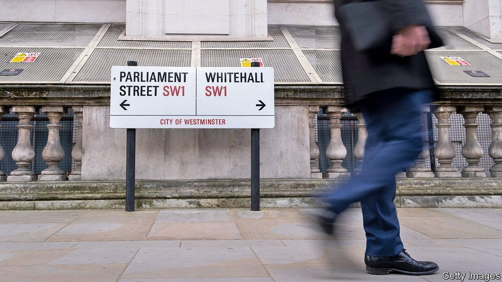
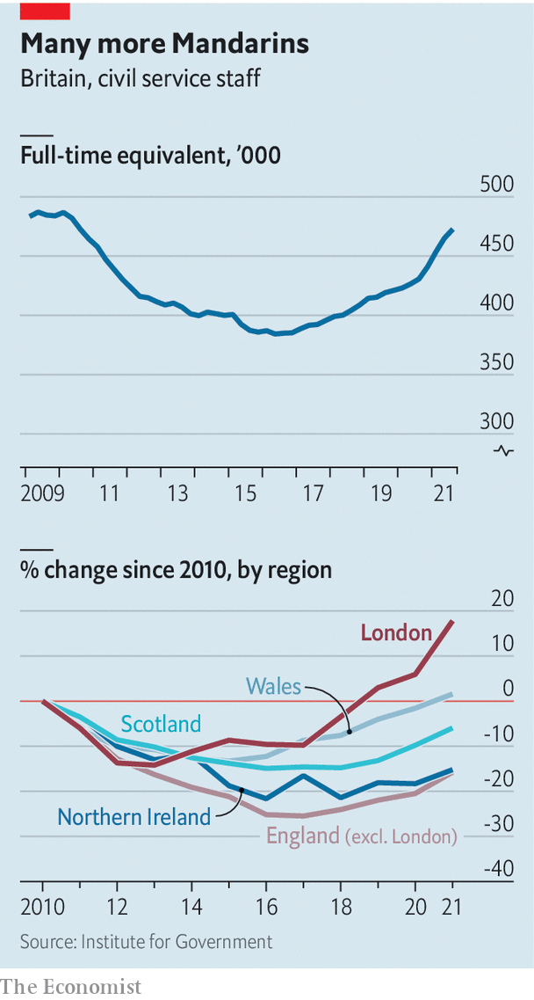

###### State of emergency

# Brexit and covid-19 have produced a bigger civil service 

##### It has also become more metropolitan 

 

> Jan 29th 2022 

CIVIL SERVANTS have been ordered back to their desks as part of the government’s effort to show that post-pandemic life is returning to normal. But there is a problem: lack of space. The civil service is at its biggest in 12 years. Staff numbers at the Department for Health and Social Care nearly doubled in the year to September 2021, with 2,070 extra civil servants battling the pandemic.

The trend is outlined by the Institute for Government (IfG), a think-tank, in its annual Whitehall Monitor. Under the austerity programme of David Cameron’s government, the civil service was cut by a fifth, reaching a low of 384,260 full-time-equivalent staff in summer 2016. Those cuts have been nearly fully reversed: headcount reached 472,700 last autumn, the highest since mid-2010 (see chart).


 


Brexit was one reason: thousands of staff were hired to negotiate trade deals and rewrite regulations. Covid-19 forced a second hiring spree, as yet more experts were needed to run vaccine programmes, find and buy equipment, and administer furlough payments.

This shrink followed by a swell has complicated the government’s aim to spread civil servants round the country, as part of “levelling up”. Junior officials have been shed; senior managers and policy specialists, who tend to cluster in Whitehall, added. London now holds 18% more civil servants than in 2010.

Rishi Sunak, the chancellor, wants to cut the “non-frontline” civil service back to its size in 2019. Depending on the definition, that would mean 28,000 jobs going, says the If G. It is tempting to think it will be easy to swing the axe, now that Brexit is done and covid-19 is subsiding.

But Brexit landed the state with tasks that used to be done in Brussels, such as regulating chemicals and enforcing trade remedies. And the pandemic revealed how threadbare parts of it had become. Ministers want to make it more resilient before the next crisis. That suggests less a brutal chop than a light trim.

Dig deeper

All our stories relating to the pandemic can be found on our . You can also find trackers showing ,  and the virus’s spread across .

For more coverage of matters relating to Brexit, visit our 

