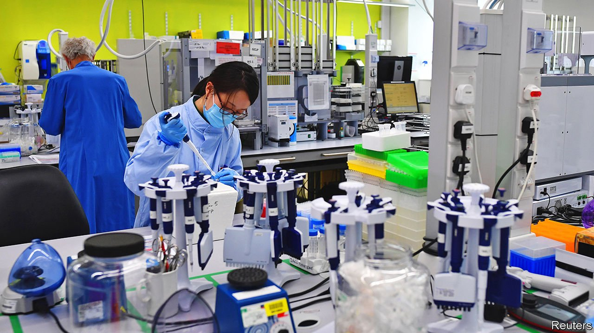

###### Silver linings playbook

# Britain has long been a leader in genome-sequencing 

##### The pandemic has increased its prowess 

 

> Jan 29th 2022 

IN A VIAL of liquid the size of a fingernail sit 384 genomes. A few days ago, each was inside the membrane of a coronavirus, somewhere in a nasal passage in England. The vial’s contents are placed in a printer-sized box packed with lasers and microscopic glass tubes. In the next 24 hours it will tear them into their component molecules, then reassemble them in such a way as to record their original order. That order is the blueprint that determines the virus’s structure—and whether it will co-exist peacefully with humanity, or cause havoc.

In response to the pandemic, Britain increased viral sequencing faster than anywhere else. Since May 2020 it has handled more than a quarter of all SARS-CoV-2 genomes sequenced worldwide, despite recording just 4% of positive results. The Wellcome Sanger Institute on the outskirts of Cambridge sequences 64,000 covid genomes a week. Data from its machines are crunched at the nearby European Bioinformatics Institute (EBI), an outpost of the European Molecular Biology Laboratory, and used by the UK Health Security Agency, a public-health body, to track the evolution of the virus, decipher the meaning of changing case numbers and adjust predictions. Now the government wants to use the expertise honed by the pandemic to improve the diagnosis and treatment of diseases of every kind.


Britain’s head-start in sequencing the covid genome owed much to three scientists, Professors Watson, Crick and Sanger, who won Nobel prizes last century for genetics work done at British institutions. Most of the techniques upon which commercial genome-sequencing is based were invented in Britain. Also crucial was Britain’s contribution to sequencing the human genome starting in the 1990s, as part of a global consortium. Sanger sequenced and published nearly a third of that, the biggest chunk of any institution. The EBI was lured to Britain at the start of the effort.

The project was initially paid for by the Wellcome Trust, a British charity that is one of the world’s largest funders of medical research. It started a virtuous cycle. The Sanger and EBI sequenced and distributed more and more genomes, understanding life’s code better as they went, and getting better at sequencing. Other British genomics departments learned from them. In Silicon Valley, entrepreneurs founded companies and built machines to meet their needs. The cost of sequencing a genome fell dramatically. It took 13 years to sequence the first human genome. Today the job can be done in a few hours.

Until a decade ago, the government was not a big funder of genome-sequencing. That changed under the influence of eminent medics with well-tuned political antennae, such as Sir John Bell and Dame Sally Davies. In 2013 Genomics England was founded, with £100m ($156m) to lead the job of repurposing Britain’s genomics infrastructure to improve health care. Another £250m was committed in 2015. By 2019 it had sequenced the genomes of 100,000 NHS patients, focusing on rare diseases and common cancers. By the end of 2021 UK Biobank, a charity founded in 2006 to catalogue physiological data from 500,000 volunteers, had used the Sanger to sequence the genomes of 200,000 of them.

Since 2019 the NHS has offered genome analysis for any seriously ill child with a suspected genetic disorder. In 2021 this offer was extended to patients in their 20s. Around the same time, the NHS also started testing for variations to a portion of the genome that, when present, cause severe reactions to common chemotherapy drugs.

In its most recent spending review the government funded a Newborn Genomes Programme, which aims to sequence the genomes of up to 200,000 babies in order to improve the early diagnosis and treatment of rare diseases. Our Future Health, a project that will sequence the genomes of 5m adults selected to be statistically representative of the entire population, aims to help personalise health care.

The idea is to save money even while improving treatment. People’s genomes can be examined for clusters of genes that raise or lower the risk of specific diseases—clusters determined by linking the health outcomes of Biobank’s participants with an analysis of their genomes. The patterns revealed can be used to identify people in the wider population whose genomes indicate that they are at higher risk. These people can then be invited for scans and check-ups before the usual age thresholds. Those at lower risk can wait until later.

Because the genome is the instruction manual for human biology, sequencing it offers an unparalleled view into the body, its functioning and what is likely to go wrong with it. And because it does not change over a lifetime, it need be sequenced only once. This makes it very different from other diagnostic tools, says Matt Hurles, who leads a research group at the Sanger that studies the genetic origins of disease. As more genomes are sequenced, and more are correlated with health outcomes, more will be learned.

Through a combination of serendipity, invention and pluck, Britain has built the world’s most advanced genome-sequencing infrastructure. But as happens depressingly often in Britain, technological prowess has failed to produce market-leading firms. Solexa, a sequencing company founded in 1998 by Cambridge scientists, was acquired by Illumina, an American company that makes sequencing machines, in 2007. Oxford Nanopore, a company which provides mobile sequencing technology, had revenues of just £114m in 2020. Fortunately, the Sanger’s contribution to Britons’ health does not depend on where its machines are made. ■

