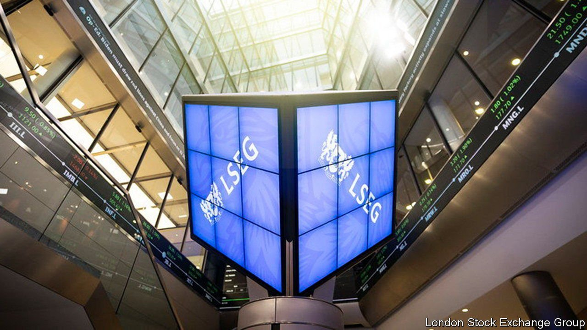
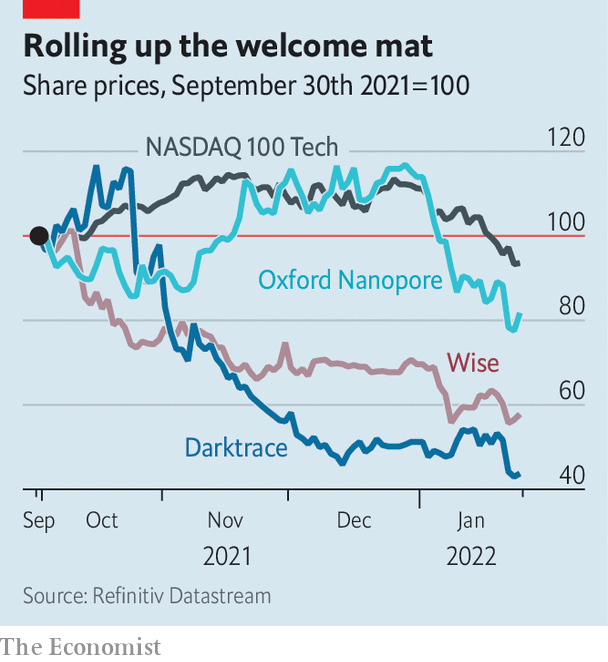

###### The City of London

# Britain’s newly listed tech firms are taking a beating 

##### They are suffering far more than their peers elsewhere 

 

> Jan 29th 2022 

ARM YOURSELF with a hammer, and many problems look nail-shaped. And so regulators imagine a world in which market failures can be fixed by tweaking rules. A recent flurry of activity by the Financial Conduct Authority (FCA) prompted by London’s dwindling share of the global stockmarket is a case in point.

Since December 3rd boards wishing to list their firms on the London Stock Exchange (LSE) can do so while retaining outsized voting rights. Early investors can hang on to more of their shares rather than being forced to sell. Rules that, in effect, barred special-purpose acquisition companies, a listing route that took Wall Street by storm in late 2020, have been relaxed.


The LSE has cheered on the changes and is urging more. In a proposal leaked to the Wall Street Journal on January 15th, it pitched the creation of a new bourse on which private companies’ shares could trade publicly on pre-specified days. Firms could then raise capital without complying with the burdensome regulation associated with listing on public markets.

The reforms capped a stellar 2021 for the LSE. During the year 122 companies chose it to list on, and the £16.8bn ($22.5bn) they raised was more than the total for any year since 2007. Despite the exchange’s reputation as one for “old economy” stocks—miners, banks, insurers and the like—39% of that capital was for tech or consumer internet firms. They included Darktrace, a cyber-security firm, Oxford Nanopore, a genomics innovator, and Wise, a fintech star. Each hit a multi-billion pound valuation on its opening day as its shares soared. Wise, then worth £8.8bn, was the largest tech firm ever to have joined the LSE.

 


But scratch the surface and the LSE’s performance looks less impressive. That bumper year was against the backdrop of a global boom for initial public offerings, just 4% of which took place on the LSE, according to Dealogic, a data provider. In its mid-2000s heyday, the bourse accounted for 20% of the world’s IPOs. And more worryingly for its future, the most exciting firms to come to market have been taking a beating ever since (see chart).

 around the world have suffered a brutal start to 2022. The combined threats of persistent inflation and higher interest rates mean that riskier assets are falling out of favour. Shares of high-growth firms, which derive their value from uncertain earnings in the distant future, have fallen particularly sharply. But the clobbering of those that recently listed in London started earlier and has been much worse. The Nasdaq Tech 100 index of large American tech firms has dropped 18% from a peak in November. Wise has slipped by 47%, and Darktrace by 64%, from their peaks in September.

Their hammering has not been down to poor business performance. Both firms have upgraded their sales forecasts twice in recent months. Wise now expects revenue growth of 30% this financial year; Darktrace expects between 42% and 44%.

Tech bosses and venture capitalists have been left with an uncomfortable suspicion that the City’s equity investors simply aren’t interested in the kind of innovative firms they are trying to build. “I’ve had scepticism from fund managers on whether selling software for subscriptions can actually make money,” says Hussein Kanji of Hoxton Ventures, a venture-capital firm. “That was a reasonable question in 2001, but now it’s like ‘where have you been for the last 20 years?’” As long as it continues to be asked, Britain’s stock exchange will remain unappealing for tech firms that are considering listing—no matter how much rules are relaxed. ■

