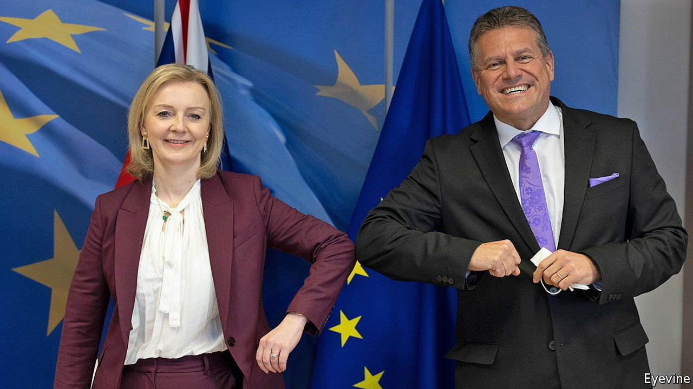

###### Brexit and Northern Ireland

# Little sign of compromise over the Northern Ireland protocol 

##### Hopes of an early deal are likely to be dashed 

 

> Jan 29th 2022 

AT LEAST THE mood music has improved. The meeting on January 24th in Brussels between Liz Truss, the foreign secretary, and Maros Sefcovic, the European Commission’s vice-president, was described as “constructive”, not a word often heard before Ms Truss took over as Brexit negotiator from Lord Frost in December. The two sides have said they would like to settle the long dispute over the Northern Ireland protocol by the end of February, well ahead of elections to the province’s assembly in May. Yet this timetable looks increasingly implausible.

The protocol, part of the Brexit withdrawal treaty, was designed to avoid a hard north-south border with Ireland that might upset Northern Ireland’s fragile peace. It kept the province in the European Union’s single market for goods. But this necessitates east-west customs and border checks between it and Great Britain, which is outside both the single market and the customs union. The government wants to scrap most such controls and remove any role for the European Court of Justice (ECJ) as arbiter of disputes. The EU is ready to simplify many checks, but not to renegotiate the entire protocol. Hence the impasse.


Ms Truss is seen in Brussels as a potential dealmaker, not a Brexit ideologue. Involving the Foreign Office in the negotiation is also deemed helpful. Unlike Lord Frost, it favours a better relationship with the EU; and it is acutely conscious that the Americans, as key outside sponsors of peace in Northern Ireland, would be furious were the delicate balance of the protocol upset. Yet although Ms Truss talks much less than Lord Frost did about invoking the protocol’s Article 16 to allow unilateral suspension of its trade provisions, she is not offering many other hints at compromise. Boris Johnson this week termed the implementation of the protocol “insane and pettifogging”. Mij Rahman of the Eurasia group consultancy says the gap between the two sides remains wide.

Political turmoil in Westminster is also not conducive to early agreement. Mr Johnson’s troubles at home are being watched carefully in Brussels, where diplomats wonder if it is worth even considering further concessions when they may face a new prime minister in the near future. As a leading contender for the succession, Ms Truss is also constrained. An erstwhile Remainer, she knows she would have her work cut out to win support from hardline pro-Brexit Tory MPs. Although they voted for the protocol in 2020, many now regard it as the result of feeble negotiating by Mr Johnson’s predecessor, Theresa May, and would prefer to see it torn up than endorsed in some mushy compromise.

Raoul Ruparel of Deloitte, who was an adviser on the EU to Mrs May, notes that, even if a deal now seems more possible, politics in Northern Ireland will make its implementation very hard. The leader of the Democratic Unionist Party (DUP), Sir Jeffrey Donaldson, continues to reject the protocol completely and to demand the invocation of Article 16. He can hardly back down before elections to the assembly in May. Katy Hayward of Queen’s University Belfast suggests that he wants to turn those elections into a referendum on the protocol. Yet polls suggest voters want it retained if it can be smoothed.

Northern Ireland’s economy has recently done better than the rest of the United Kingdom, perhaps reflecting the benefit of the single market. And the biggest party after the elections is expected no longer to be the DUP but the pro-republican Sinn Fein. Many analysts believe that the DUP would rather engineer the collapse of the power-sharing executive than accept the appointment of a Sinn Fein first minister.

In truth, time has probably run out for an early deal over the protocol. A more flexible British team might have presented the pragmatic concessions offered by Mr Sefcovic last October to eliminate half of all customs checks as a negotiating triumph. But a combination of Mr Johnson’s obstinate refusal to concede that his Brexit deal inevitably meant a border in the Irish Sea, and a theological insistence on rewriting the protocol to get rid of the ECJ, got in the way. The consequence is to prolong uncertainty over Northern Ireland’s future. ■

For more coverage of matters relating to Brexit, visit our 

