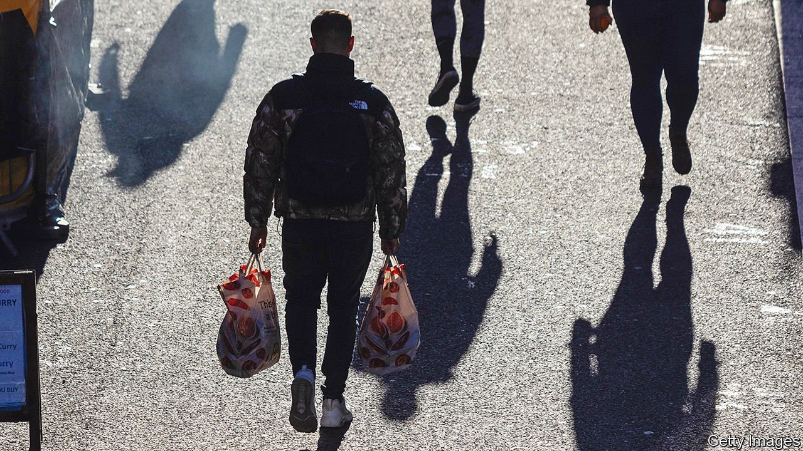
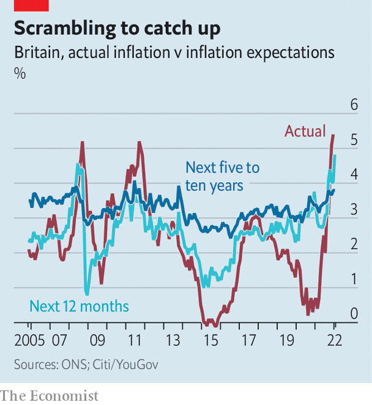

###### Buzzkill

# The Bank of England is determined to prevent a wage-price spiral 

##### Higher inflation is coming. But monetary policymakers are determined to keep it under control 

 

> Jan 27th 2022 

THE GOVERNMENT faces no shortage of crises. As well as the fallout from prime-ministerial parties, it must contend with fizzing inflation of 5.4% in December, the biggest annual increase in almost three decades. Officials are racing for ways to avert a crunch in April, when energy-price rises and higher payroll taxes are due. Public opinion is souring; over half of those polled by YouGov on January 17th thought the government was handling inflation badly, up from a third a year earlier. And on January 27th a report by the Treasury all-party parliamentary committee warned of the potential for a “wage-price spiral”.

High inflation worries monetary policymakers at the Bank of England, too. At their next meeting, on February 3rd, they will probably raise interest rates from 0.25% to 0.5%. And they too are concerned by public opinion. All central bankers care about the public’s confidence in their ability to control inflation. If that is lost, policymakers fear that expectations of price rises will become self-fulfilling. Workers expecting higher inflation may demand higher pay to compensate. As costs surge, companies may raise prices, prompting further pay demands. No such wage-price spiral has developed in Britain for decades, despite consumer-price inflation above 5% in 2008 and 2011 (see chart). But the pandemic may have created the conditions for something extraordinary.


 


So far, household surveys warrant caution, not panic. One published on January 26th showed expectations of inflation in a year’s time rising to 4.8%, much higher than the post-2005 average of 2.6%. Ricardo Reis and colleagues at the London School of Economics find that a growing share of households expect high inflation sometime in the next five to ten years, historically a precursor of untethered expectations. But the shift is still small.

Another place to look for brewing problems is in wage trends. Average pay excluding bonuses grew by 3.8% in the three months to November 2021, in part because of tight awards in 2020. After rising from around 3% to 19% between 2019 and 2020, cash freezes as a share of pay awards fell over 2021, according to Income Data Research, a data firm. In a speech on January 21st Catherine Mann of the Bank of England said that although wages in December were slightly above their pre-covid trend, they “showed little signs of spiralling”.

Still, there are indications that wage pressure could continue. Very few people who want a job do not have one, which gives those in work greater power in wage negotiations. As food and energy prices rise, employers are bracing themselves for pay demands to grow louder. Neil Carberry of the Recruitment and Employment Federation, an industry group, expects median pay settlements to rise above 3% this year, compared with an average of around 2% over the 2010s.

The most direct evidence of planned price increases comes from companies themselves. Faced with higher costs of raw materials, rising energy prices and bigger pay bills (including as the result of a higher minimum wage), companies surveyed in December outlined plans to raise their prices by 5% in 2022, more than the 4% increase they reported in 2021. Ms Mann said that “it should be a concern that the costs from 2021 are becoming reflected in price expectations for 2022”.

Other reasons to be concerned about Britain’s inflationary dynamics include the spread of price increases beyond goods to services. Evidence also suggests that firms facing hot demand raised their prices by more than those facing cooler sales cut theirs. Both add to the risk that price increases will not reverse once all the supply-chain disruption fades. Ms Mann warned that if further shocks hit Britain from abroad, Brexit could make them worse because companies protected by trade barriers from foreign competition might feel safer in raising prices.

These dynamics could peter out on their own. As supply-chain problems subside and energy prices return to more normal levels, goods-price inflation could well sink. Britain’s economic recovery may falter, or tax rises could squeeze incomes. Either would make it harder for companies to shunt higher costs onto consumers. Sanjay Raja of Deutsche Bank points out that the profitability of services firms has increased over the past 18 months, giving them headroom to absorb some of the higher costs, should they choose to, rather than pass them on.

The Bank of England seems unwilling to take any chances. In December it raised interest rates to 0.25%, as a defence against a mutually reinforcing escalation of wages and prices. Then data in January showed that inflation in December had been 0.9 percentage points above what it had predicted a month earlier. That was the bank’s biggest-ever error in a forecast at that time horizon. Unlike those living and working in Downing Street, monetary policymakers still have time to stop events spiralling beyond their control. ■

