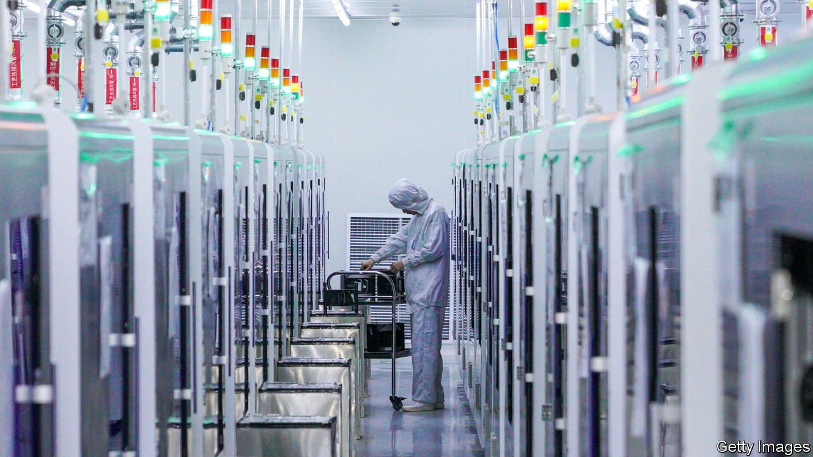
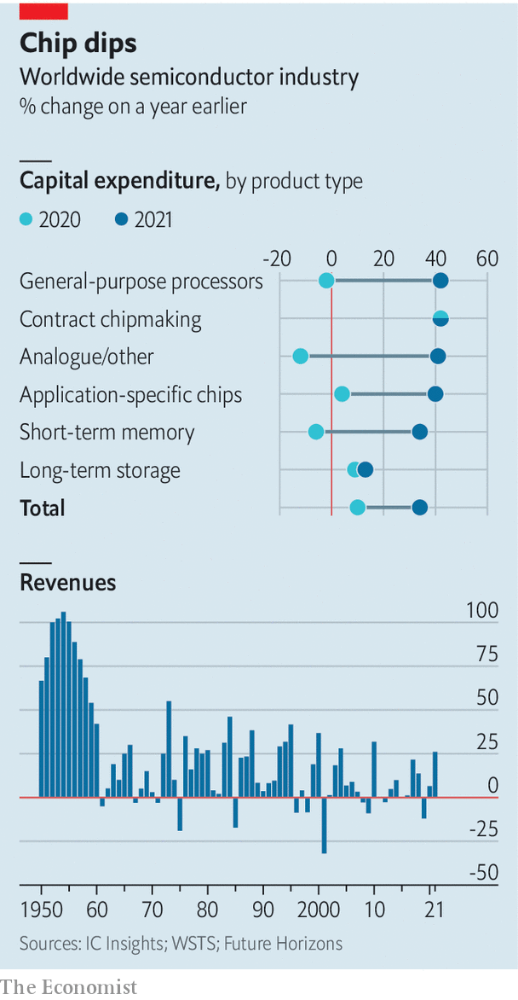

###### After the party

# When will the semiconductor cycle peak? 

##### Busts follow booms in the chip business. Governments could make things worse 

 

> Jan 29th 2022 

AMID A  that has hobbled producers of everything from toys to wind turbines, chipmakers are on a spending spree. On January 13th Taiwan Semiconductor Manufacturing Company (TSMC), the world’s biggest contract manufacturer, said it would spend up to $44bn on new capacity in 2022. That is up from $30bn last year, triple the number in 2019 and ahead of earlier plans to spend over $100bn in total over the next three years. Intel, an American rival, plans to burn through $28bn this year. On January 21st it said it would build two big new factories in Ohio by 2025 at a total cost of $20bn. An option to build six more later would take the overall price tag to $100bn. Samsung of South Korea, TSMC’s closest technological rival, has hinted that its capital spending for 2022 will surpass last year’s $33bn. Smaller firms, such as Infineon in Europe, are also splurging.

IC Insights, a research group, reckons that, across the industry, capital spending rose by 34% in 2021, the most since 2017. That torrent of money is welcome news for the industry’s customers, who have been struggling with shortages for over a year. For the industry itself, it is the latest iteration of a familiar pattern. Bumper revenues, like those reported by Intel on January 26th and Samsung the next day, compel companies to expand capacity. But because demand can change much more quickly than the two or more years needed to build a chip factory, such booms often end in busts. The chip business has swung between over- and undercapacity since it emerged in the 1950s, observes Malcolm Penn of Future Horizons, a firm of analysts (see chart). If history is a guide, then, a glut is in on the way. The only question is when.


 


Soon, many analysts think. Demand for smartphones may be cooling, especially in China, the world’s biggest market. Sales of PCs, which boomed during covid-19 lockdowns, also seem poised to weaken, says Alan Priestley of Gartner, a research firm. A survey by Morgan Stanley, a bank, found that, partly thanks to the shortages, 55% of chip buyers were double-ordering, which artificially inflates demand. High inflation and looming interest-rate rises could hit economic growth—and chip demand with it. Mr Penn expects the cycle to turn in the second half of 2022 or in early 2023.

This time the glut, when it comes, may not affect all chipmakers equally. TSMC’s boss, C.C. Wei, said this month that a correction could be “less volatile” for his firm thanks to its position at the technological cutting-edge. Much of its new capacity is already booked up in long-term agreements with customers such as Apple, which needs a regular supply of the most sophisticated chips for its newest iPhones.

The current cycle may differ from previous ones for another reason. The shortages, and America’s tech-flavoured trade war with China, have reminded politicians how vital chips are to the modern economy—and how over-reliant their supply is on a few giant firms. Worries about the sector’s excessive concentration have led trustbusters to challenge the $40bn acquisition by Nvidia, an American chip designer, of Arm, a British one—successfully, if news reports this week that the deal is being scrapped are to be believed.

But governments’ favoured way to deal with the over-reliance is to lure more chipmaking home, mostly from East Asia, with subsidies. On January 25th America’s Commerce Department issued a report to that effect, urging Congress to pass a bill, already approved by the Senate, that includes $52bn in handouts for chipmakers. Mark Liu, TSMC’s chairman, was frank in 2020 when he said such subsidies were vital to persuade his firm to build a new plant in Arizona, one of only a few outside Taiwan. Intel chose Ohio for its factories partly because of incentives offered by the state. Pat Gelsinger, its boss, has been touring rich places that have made similar offers.

The EU is keen to match the Americans, potentially putting itself on the hook for tens of billions of dollars of its own. It aspires to double Europe’s share of chipmaking, currently around 10%. In May South Korea’s government talked of a national mission to provide $450bn of capital spending over ten years to protect and expand its national industry. In November Japan unveiled a scheme of its own, with TSMC thought to be getting some $3.5bn. China has long nurtured ambitions—invigorated by American sanctions but so far unsuccessful—to .

Adding taxpayer cash to chipmakers’ already rich spending plans, says Mr Penn, could lead them to build even more excess capacity than usual. That should give politicians and chip CEOs pause. The bigger the boom, the deeper the subsequent bust. ■


