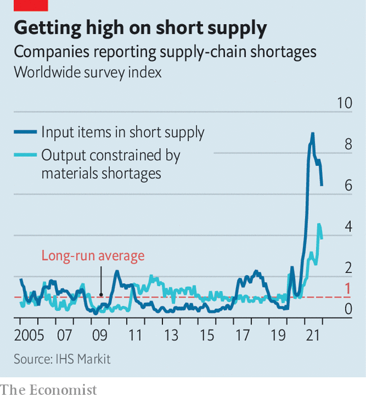

###### In short supply

# Why supply-chain problems aren’t going away 

##### Results season shows the financial effects of supply-chain snarl-ups on industrial firms 

 

> Jan 29th 2022 

SUPPLY CHAINS have seldom featured in companies’ earnings reports over the three decades since globalisation took off in earnest, save for the occasional mention of the benefits of low costs and lean inventories. This earnings season, though, covid-induced shortages are among the first problems mentioned by many firms. The Omicron variant has worsened the logjams by forcing workers, in many industries and the logistics business that weaves them together, to quarantine. And shortages of both staff and materials are contributing to inflation, raising costs across the board.

On January 25th disappointed investors sent GE’s share price down by 6% after Larry Culp, the industrial icon’s boss, said that supply-chain “headwinds” had hit its health-care business especially hard. Fourth-quarter revenues declined by 3.5%, year on year. On the same day Gregory Hayes, boss of Raytheon, presented mixed results, noting that the defence firm had “seen its share of supply disruptions”. Others sniff trouble coming. On January 26th Boeing said that supply chains were not a “constraint” because its airliner production was low and inventories full. But, it added, raw materials, labour and logistical challenges were a “watch item”. Hours later Tesla said supply-chain snags had forced it to run factories below capacity.


European firms are not immune. On January 21st Siemens Gamesa, a wind-turbine giant, blamed supply-chain woes for poor results and a profit warning. Vestas, a rival, has voiced similar concerns. EY, a consultancy, reckons that British-listed firms issued 19% more profit warnings in the last quarter of 2021 than a year earlier. A record number blamed supply-chain disruption and rising costs.

 


Shortages are like nothing seen before (see chart). A chip crunch knocked nearly 10m units, or more than 10%, off annual car production in 2021 as firms slashed orders at the start of the pandemic and were pushed to the back of the queue when demand rebounded. Signs of improvement are scarce. This month Toyota said that it would cut output by 150,000 vehicles, or around 18%, in February for a lack of chips. GE blamed part of its health-care arm’s woes on the chip crunch. Large American firms surveyed by America’s Commerce Department reported that their chip inventories had fallen from 40 days in 2019 to less than five days in 2021—and expected no improvement for at least the next six months. The department has warned that continuing shortages could force factories to close.

The transport of goods is not getting much freer, either. Container-shipping rates are creeping back up to the record levels of last summer. Analysts do not expect much relief before the second half of the year. Shortages of workers are making life harder still. IHS Markit, a consultancy, notes that America’s labour force is 4m below pre-pandemic levels, Europe’s has been disrupted by reduced movement of migrant workers and Asia’s by strict new lockdowns. Raytheon blamed a tight supply of “castings”, vital for jet-engine turbine blades, on a dearth of skilled welders. American Trucking Associations, a trade body, said last year that the industry faced a shortage of 80,000 lorry drivers.

These constraints are all adding to costs of parts, materials and wages. Throw in higher energy prices and industrial companies everywhere face a tough start to 2022. With all these obstacles showing little signs of disappearing, supply chains may well come high up the list of excuses if firms unveil disappointing quarterly results in a few months’ time. ■


