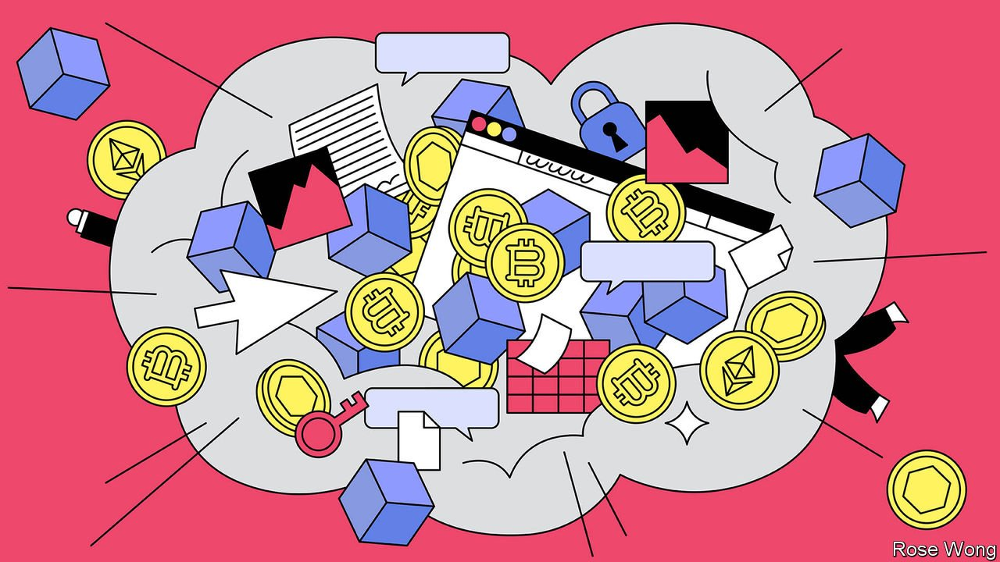
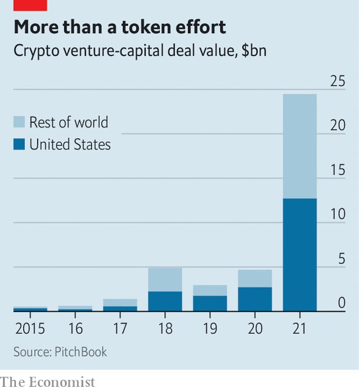

###### Rewebbing the net

# Will web3 reinvent the internet business? 

##### In parts, yes. But probably not as sweepingly as its boosters reckon 

 

> Jan 29th 2022 

LIKE NEARLY everyone these days, Moxie Marlinspike has created a non-fungible token (NFT). These digital chits use clever cryptography to prove, with no need for a central authenticator, that a buyer owns a unique piece of digital property. Alongside cryptocurrencies like bitcoin, NFTs are the most visible instantiation of “web3”—an idea that its advocates and their venture-capital (VC) backers hail as a better, more decentralised version of the internet, built atop distributed ledgers known as blockchains. Technologists like Mr Marlinspike, who created the secure-messaging app Signal, digital artists, celebrities and even the occasional newspaper have issued and sold them to collectors, often for hefty sums (an immaterial version of The Economist’s cover image fetched over $400,000).

Although it looked as cryptographically sound as any other NFT, though, Mr Marlinspike’s token could shift shape depending on who opened it. If you bought it and viewed it on a computer, it transformed into a poop emoji. After a few days the NFT was taken down by OpenSea, a marketplace for digital artefacts. This played into Mr Marlinspike’s hands. For his aim was not to raise cash but to raise awareness. His token showed that NFTs are not as non-fungible as advertised. And OpenSea’s reaction illustrated that the supposedly decentralised web3 has its own gatekeepers.


Can the centre hold?

The Marlinspike caper was the latest turn in perhaps the biggest controversy to erupt in tech-world for several years. On one side sit techno-Utopians, firms offering assorted web3 services and their VC backers. They claim that web3 is the next big thing in cyberspace, that it is truly decentralised—and that it promises juicy returns to boot. Globally, the value of VC deals in the crypto-sphere reached $25bn last year, up from less than $5bn in 2020 (see chart). Last week Andreessen Horowitz, one of Silicon Valley’s most illustrious VC firms, its biggest web3 champion and a16z for short, was reported to be raising a $4.5bn web3-related fund, to add to three existing ones worth a total of $3bn. A senior partner left a16z this month to set up her own firm focused on web3.

 


Pitted against them are the sceptics. They range from Mr Marlinspike, respected even among the techno-Utopians, to Jack Dorsey, who founded two platforms of the sort that web3 promises to supersede (Twitter in social media and Square in payments). They argue that a decentralised internet is a pipe dream—“You don’t own ‘web3’. VCs and their [limited partners] do,” Mr Dorsey warned last month. And a dangerous one at that for the unwary investor: since November some $1trn of the value of cryptocurrencies, the most mature province of web3, has gone up in flames.

The feud may seem abstruse. But the stakes are big. It could change the trajectory of the internet—and the multitrillion-dollar business models that it has enabled.

The history of modern computing is of a constant struggle between decentralisers and recentralisers. In the 1980s the shift from mainframes to personal computers gave individual users more power. Then Microsoft clawed some of it back with its proprietary operating system. More recently, open-source software, which users can download for nothing and adapt to their needs, took over from proprietary programs in parts of the industry—only to be reappropriated by the tech giants to run their mobile operating systems (as Google does with Android) or cloud-computing data centres (including those owned by Amazon, Microsoft and Google).

The web3 movement is a reaction to perhaps the greatest centralisation of all: that of the internet. As Chris Dixon, who oversees web3 investments at a16z, explains it, the original, decentralised web lasted from 1990 to about 2005. This web1, call it, was populated by flat web pages and governed by open technical rules put together by standards bodies. The next iteration, web2, brought the rise of tech giants such as Alphabet and Meta, which managed to amass huge centralised databases of user information. Web3, in Mr Dixon’s telling, “combines the decentralised, community-governed ethos of web1 with the advanced, modern functionality of web2”.

This is possible thanks to blockchains, which turn the centralised databases to which big tech owes its power into a common good that can be used by anybody without permission. Blockchains are a special type of ledger that is not maintained centrally by a single entity (as a bank controls all its customers accounts) but collectively by its users. Blockchains have outgrown cryptocurrencies, their earliest application, and spread into NFTs and other sorts of “decentralised finance” (DeFi). Now they are increasingly underpinning non-financial services.

The portfolio of a16z offers a glimpse of this wild new world. It already includes more than 60 startups, at least a dozen of which are valued at over $1bn. Many are developing the infrastructure for web3. Alchemy provides tools for others to build blockchain applications, much as cloud computing makes it easy for developers to create web-based services. Nym’s “mixnet” is a decentralised network that mixes up messages so that no one else can tell who is sending what to whom.

Other a16z bets are serving end-users. Dapper Labs creates NFT applications such as NBA Top Shot, a website where sports fans can buy and sell digital collectables like depictions of key moments in basketball games. Syndicate helps investment clubs organise themselves into “decentralised autonomous organisations” governed by “smart contracts”, which are rules encoded in software and baked into a blockchain. And Sound.xyz allows musicians to mint NFTs to make money.

What all these companies have in common, explains Mr Dixon, is that it is hard for them to lock in customers. Unlike Google and Meta they do not control their users’ data. OpenSea (in which a16z also has a stake) and Alchemy are just pipes to the blockchain. If their customers are unhappy, they can move to a competing service. Even if he wanted, he could not keep them from leaving, says Nikil Viswanathan, Alchemy’s boss. “As a business, I would love to have proprietary choke points. But there aren’t any. We tried to find them.”

The idea is that this makes web3 companies try harder to satisfy customers and keep innovating. Whether they can do this while also making pots of money is another matter. It is not clear how much demand exists for truly decentralised projects. That was the problem of early web3 offerings (then called “peer-to-peer” or “the decentralised web”). Services such as Diaspora and Mastodon, two social networks, never really took off. Their successors could face the same problem. A service like OpenSea would be much faster, cheaper and easier to use “with all the web3 parts gone”, says Mr Marlinspike.

A more fundamental problem is that even if web3 worked as smoothly as its immediate predecessor, it may nevertheless lend itself to centralisation. Lock-in, reckons Mr Marlinspike, tends to emerge almost automatically. The history of the internet has shown that collectively developed technical protocols evolve more slowly than technology devised by a single firm. “If something is truly decentralised, it becomes very difficult to change, and often remains stuck in time,” he writes. That creates opportunities: “A sure recipe for success has been to take a 1990’s protocol that was stuck in time, centralise it, and iterate quickly.”

Centralisation and lock-in have been incredibly lucrative. In fact, a16z has made billions from Meta, in which it was an early investor; one of a16z’s founders, Marc Andreessen, sits on Meta’s board to this day. Web3’s VC boosters may be counting on something like this happening again. And to a degree, it already is. Despite being a relatively recent phenomenon, web3 is exhibiting signs of centralisation. Because of the complexity of the technology, most people cannot interact directly with blockchains—or find it too tedious. Rather they rely on middlemen, such as OpenSea for consumers and Alchemy for developers.

Albert Wenger of Union Square Ventures, a VC firm that started investing in web3 firms a few years ago, points to other potential “points of recentralisation”. One is that the ownership of the computing power that keeps many blockchains up to date is often very concentrated, which gives these “miners”, as they are called, undue influence. It could even allow them to take over a blockchain. In other systems the ownership of tokens is heavily skewed: at recently launched web3 projects, between 30% and 40% is owned by the people who launched them.

These dynamics, combined with the latest crash that may cool investors’ appetite for all things crypto, suggest that web3 will not dislodge web2. Instead, the future may belong to a mix of the two, with web3 occupying certain niches. Whether or not people keep splurging on NFTs, such tokens make a lot of sense in the metaverse, where they could be used to track ownership of digital objects and move them from one virtual world to another. Web3 may also play a role in the creator economy, another buzzy concept. Li Jin of Atelier, a VC firm, points out that NFTs make it easier for creators of online content to make money. In this limited way, at least, even the masters of web2 see the writing on the wall: on January 20th both Meta and Twitter integrated NFTs into their platforms. ■


