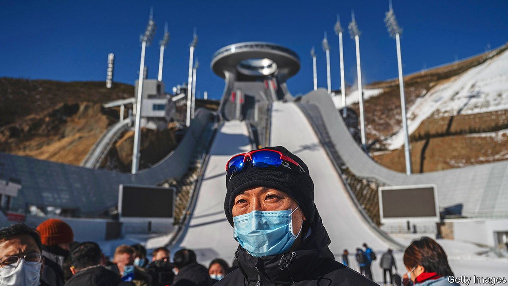
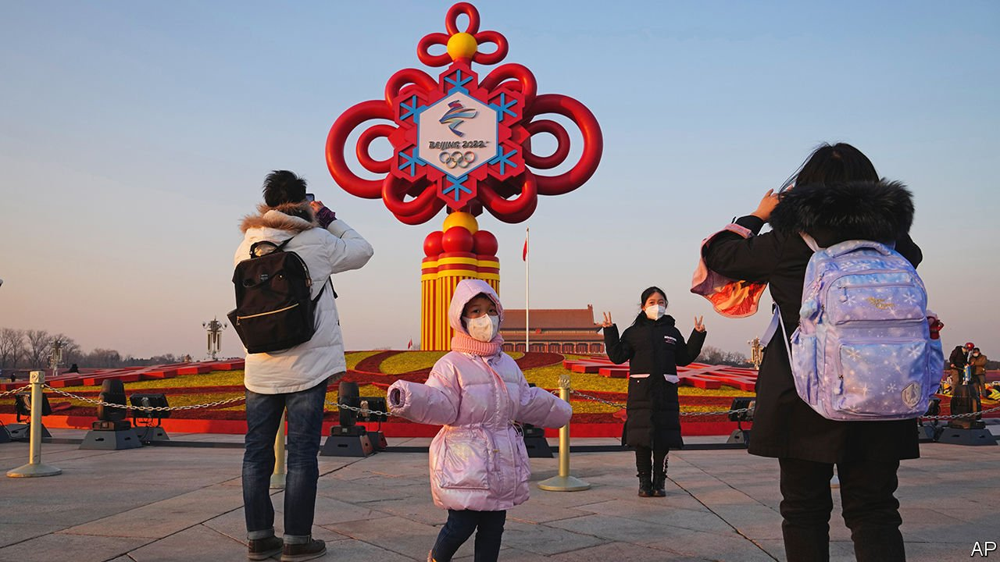

###### Faster, higher, bossier

# China is determined to make the Winter Olympics go smoothly 

##### It must cope with boycotts, covid and the unexpected 

 

> Jan 26th 2022 

CHINESE OFFICIALS like to call Beijing the “double-Olympic city”. No other can boast having staged both the summer games and its winter equivalent, the 24th iteration of which will open in the Chinese capital on February 4th. The winter games will arouse less enthusiasm, in China and globally, than the summer ones in Beijing in 2008. But for Xi Jinping, China’s leader, they are of great symbolic importance. They are also fraught with risk. Overshadowed by diplomatic boycotts, a potential war in Europe involving China’s close friend, Russia, and by Omicron’s advance, the event will fray nerves.

These are the first games on Mr Xi’s watch. State media point out how much he has been involved with them from the earliest stage, when China was preparing to submit a bid to the International Olympic Committee (IOC) to host them. Beijing won its bid in 2015 by a thin margin, gaining four more votes from IOC delegates than its rival, Almaty in Kazakhstan. That may be a huge relief in retrospect for the IOC: more than 200 people died this month in Kazakhstan, many of them in Almaty, in unrest that was triggered by rising fuel prices. But Mr Xi may now be wishing that Beijing had not been successful.


The games are taking place nearly a decade into Mr Xi’s rule. By convention it should be the year he steps down from his Communist Party roles. But it is expected that he will ignore that unwritten requirement. He will want a well-managed games, praised by the public, which will set the tone for a year that will celebrate his leadership—culminating this autumn in a party congress at which he will be declared, in effect, ruler for as long as he wants.

SARS-CoV-2 poses the biggest challenge. China is doggedly adhering to a “zero-covid” policy aimed at eliminating the virus entirely. But on January 15th the capital reported its first locally transmitted case involving the highly infectious Omicron variant. The city is on edge. Officials have organised mass testing in some areas, including of all the roughly 2m residents of Fengtai district.

Only a handful of Omicron cases have been found in the capital and just a few dozen of the Delta variant. But officials are taking no chances. On January 17th the government said tickets to the games would not be sold. These would have been available only to people in China—spectators from abroad having already been banned. Now the government says it will “organise” people to watch the events. Social media in China have swelled with objections.

The government’s botched handling of the coronavirus during the early days of the outbreak in the central city of Wuhan in late 2019 and early 2020 caused panic and widespread resentment. But the zero-covid approach soon proved effective at stopping transmission. Public confidence in the party soared. It probably remains high (there are no reliable polls). Yet there are signs that discontent is spreading as lockdowns become more common, along with tough quarantine measures in some places that are making travel difficult for many Chinese. The lunar new year begins on February 1st. Many people would normally journey great distances to celebrate the holiday with relatives.

Grumbling has been particularly loud in Xi’an, a western city of 13m people where stay-at-home controls were imposed on December 23rd after the discovery of a few hundred Delta cases. People were not even allowed out to buy food. Officials organised deliveries, but some residents complained that supplies were inadequate and that people could not get urgent medical attention. Restrictions were lifted on January 24th, after one of China’s longest, toughest and biggest lockdowns.

But several other cities have also imposed tight controls. Social media are filled with complaints about the suffering this is causing, and the disruption to lunar new-year plans. Officials say travel is fine as long it is not between areas affected by covid-19. But they often define those areas broadly. Desperate people in Beijing have been writing “I want to go home” on Weibo, a social-media platform, fearing zealous officials will prevent them from seeing family members in their home towns.

In the loop

The spectacle may not attract as many viewers as the one in 2008. China’s first staging of an Olympic games was popular at home. To bolster its image, the party has long encouraged Chinese to remember pre-Communist days when, as officials like to recall, the country was seen in the West as the “sick man” of Asia. In 2008 it won not only the most gold medals in its Olympic history, but more than any other country at those games, exceeding America’s haul by 12. China was proved mighty.

But it is not a winter-sports superpower. Gracenote, an analytics company, says that predicting China’s performance at the winter games is tricky. It reckons the country may get only six gold medals. That would see it placed far behind the front-runners: Norway (22), Germany (12) and Russia (11). America is tipped to get seven. China has a good excuse for failing to dominate winter sports. It is a relative newcomer to them. Skiing became popular only in the 1990s with the rapid growth of an affluent middle class: its members fill slopes around arid Beijing, where snow is usually supplied (as it will be this year) by machines. But it remains a niche activity.

The government will try to stoke patriotism by showing off its organisational ability, including the extraordinary lengths to which it will go to prevent the virus spreading from the foreigners. This involves a “closed-loop management system” designed to keep participants separate from everyone else. Buildings inside the “loop” have been sealed off with fences patrolled by guards. The roughly 11,000 athletes, support staff and media from abroad will be closely watched.

 


It will be difficult to manage. The venues are widely scattered, with the farthest-flung ones located about 200km by road from central Beijing. People travelling between them must use dedicated transport or train carriages. Officials are so nervous of the virus leaking (a few dozen people arriving for the games from abroad have tested positive) that they have told people to stay away from any Olympic vehicle involved in an accident and wait for “specialists” to arrive.

It may help the party that nationalist sentiment, which it has worked hard to foster, is running high. This makes it easy to blame foreigners, especially Westerners, for any difficulties that China may face. Many nationalists believe the party’s conspiracy theories, including one that the virus was created in an American military lab. They rallied round the government after America announced a diplomatic boycott of the games over Chinese human-rights abuses in Xinjiang and elsewhere. Several other Western countries have followed America’s lead, announcing that they will not send senior officials to the event. Online forums in China have filled with scorn. Many Chinese netizens accuse the West of politicising the Olympics.

Yet for China the games are highly political. This will be evident at the opening ceremony, to be held at the “bird’s nest” national stadium where the summer Olympics began in 2008. State media say the main theme of the performance this time will be the building of a “community with a shared future for mankind”—one of Mr Xi’s favourite slogans. Western governments read it as shorthand for efforts to create a world that accepts China’s autocratic form of government, ignores its violations of human rights and rejects Western domination of global rule-making. An adapted version of the slogan is China’s official motto for the games: “Together for a shared future”.

China’s efforts to foster Olympic camaraderie could perhaps be spoiled by Russia, whose president, Vladimir Putin, is due to attend the opening ceremony. Mr Xi is doubtless hoping that his friend will not disrupt the games by repeating in Ukraine what happened in Georgia on the opening day of the summer games in 2008: a Russian invasion. But even if Mr Putin were to be so impolite, China would—as it did then—.

It will not be so restrained should anyone dare to challenge the party directly. On January 18th a Chinese Olympic official warned athletes that they could face punishment for “any behaviour or speech” deemed to be against the Olympic spirit or Chinese law. It is far from clear what would happen should athletes balk at strict covid controls. Angry scenes are possible.

Security will be intense. Local governments have been instructed to prevent petitioners from travelling to the capital. These are usually people who want to draw the central government’s attention to local grievances, not anti-party activists. But people who may cause embarrassing scenes—even handing out a flyer can be deemed such—are always unwelcome near official festivities. The party is using its most trusted supporters to make sure events run smoothly. Members of the party, or people applying to join it, have been given preference when recruiting volunteers to staff the venues.

China’s security forces will remain on high alert for weeks. The Olympics close on February 20th, but the Paralympics will not be held until the next month, from March 4th to 13th. The annual session of China’s parliament is normally held in early March, too. In 2020 the government postponed the session until May because of the outbreak of covid in Wuhan. With cases of covid-19 reappearing, it is possible that officials will again announce a postponement. But the Olympics are set to proceed. They will be a tough early test in Mr Xi’s hoped-for year of triumph. ■

Dig deeper

All our stories relating to the pandemic can be found on our . You can also find trackers showing ,  and the virus’s spread across .

