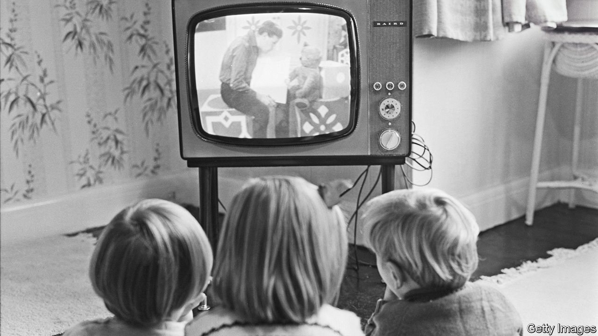

###### The reflective screen

# A history of the BBC makes for a fine history of the British 

##### Television casts a revealing light on its audience 

 

> Jan 29th 2022 

The BBC: A People’s History. By David Hendy. Profile Books; 656 pages; £25 

THE PRIME minister is “seething”. Newspapers have accused the BBC of siding with foreigners. In Parliament, a Conservative MP collars the chairman of the publicly owned broadcaster to declare: “You, sir, are a traitor!” (“Stuff you!” he retorts.) The talk in Downing Street is of cutting off the corporation’s funding.


This could be a scene from 2022, as Boris Johnson’s government denounces the “Brexit-Bashing Corporation” and threatens to abolish the licence fee that pays its way. In fact the bust-up occurred 40 years ago, when the BBC’s coverage of the Falklands war enraged Margaret Thatcher (though she continued to enjoy “Yes Minister”, a BBC political comedy). Worse disputes took place in 1956, amid the Suez crisis, and during the General Strike of 1926. When, on that occasion, the BBC eventually toed the government line, Stanley Baldwin, the prime minister, sent round engraved cigarette cases by way of thanks.

On the broadcaster’s centenary, David Hendy’s lively new history is a reminder that the BBC’s present struggles—government rows, culture wars, foreign rivals and more—are modern manifestations of old problems. His account of the corporation also makes for an incisive history of Britain’s 20th century. Asa Briggs, who wrote the definitive, 4,000-page record of the BBC’s first 50 years, said that “to write the history of broadcasting…is in a sense to write the history of everything else”. The glowing screen of the BBC casts a revealing light on its audience.

Today the corporation’s 22,000 staff work in more than 40 languages and run eight national television channels, 50-plus radio stations and the world’s most-visited English-language news website. But its first experiments in “radiating”, as broadcasting was then known, were amateurish. The boxy studio was just big enough for a microphone and a piano. The director of programmes and his deputy took turns to read children’s stories as “Uncle Arthur” and “Uncle Caractacus”. At a public showing of the first televised play, in 1930, the giant screen of 2,000 light bulbs melted.

Yet the BBC’s young staff soon realised they controlled something powerful. “It was quite clear that if you got some madman in front of the microphone he could do a hell of a lot of damage,” wrote Cecil Lewis, one of its founders. Twenty years later, the first study of viewing habits found households being shaped by broadcasting schedules: changing mealtimes and bedtimes, evening chores abandoned, less drinking in pubs and more at home.

Signs of the times

The BBC was forged in the aftermath of the first world war, which marked its founders—literally in the case of John Reith, the first director-general, who had taken a sniper’s bullet in the cheek in France. But the second world war would change the BBC even more. By 1944 it broadcast in 46 languages, and by the end of hostilities counted 20m listeners in Europe. It co-operated with the Ministry of Defence to smuggle coded messages into news reports or pieces of music. On D-Day more than 1,000 acts of railway sabotage were initiated via the BBC. Things didn’t always go to plan: as one producer put it, “They would play the other band…and the wrong bridge would get blown up in Poland.”

The BBC’s wartime output also reflected changes at home. As wirelesses spread to poorer households, the programming became more down to earth: “The Kitchen Front” gave advice on making cheese from sour milk and cooking bracken fronds. It was also forced to become more fun. During the first winter of the war, up to a third of Britons tuned in to Nazi broadcasters such as William Joyce, nicknamed Lord Haw-Haw, who played livelier music than Reith’s austere BBC. The BBC retaliated with the Forces Programme, which combined news with lashings of variety and music, and less God than in the past. This winning mixture continued after the war.

The loosening of social attitudes in wartime was nothing compared with what was to come. One cultural battlefield was race. The stationing of 130,000 African-American GIs in Britain had obliged the BBC to make its programming more racially sensitive; but in 1950, following viewers’ complaints, its controller of television ruled that “love songs between white and coloured artists must be very scrupulously considered”. The blackface “Black and White Minstrel Show” continued until 1978, more than a decade after a petition had called for it to be axed.

Even bigger battles were waged over sex. The BBC was to blame for a national “moral collapse” in the 1960s and 1970s, believed Mary Whitehouse, a legendary campaigner against “permissiveness” on television. By then TV aerials—the “devil’s forks”, as they were known to some—were sprouting on every rooftop. Reith himself, now retired, lamented after the launch of the music show “Top of the Pops” in 1964 that the BBC “follows the crowd in all the disgusting manifestations of the age”. When Yoko Ono read a poem about her miscarriage on the radio in 1968, the chairman of the BBC’s governors, Charles Hill, objected on the grounds that she and John Lennon were not married.

Yet in the same year the BBC was bold enough to broadcast Harold Pinter’s “Landscape”, a play deemed too filthy for theatres. Earlier it had launched “That Was the Week That Was”, part of a national boom in satire that included Private Eye magazine and the “Beyond the Fringe” stage show. A sense of anti-authoritarian impertinence became so ingrained at the corporation that the Sunday Telegraph noted the rise of an “anti-Establishment establishment”, an echo of today’s right-wing complaints about the liberal elite.

Broadcasting also reflected, and enabled, an erosion of class divisions. In 1937 ordinary subjects could listen to the coronation of George VI, thanks to 58 BBC microphones in and around Westminster Abbey. Sixteen years later, BBC cameras were let in to film the coronation of Elizabeth II. Palace officials enforced a boundary of 30 feet (nine metres), but hadn’t reckoned on zoom lenses, which the BBC swapped in after the rehearsals. In 1997 Princess Diana’s funeral was a test of the BBC’s nascent website, which experimented with audio and video clips for the occasion.

Mr Hendy, a professor at the University of Sussex, combines a historian’s sense of sweep with the eye for colour of the TV producer he once was. His is an authorised account, meaning the BBC gave him archive access but had no editorial control. It is heavy on the BBC’s first half-century, which makes up three-quarters of the book; the internet appears 500 pages in.

Perhaps for this reason it is unpersuasive on how the corporation should deal with Hollywood’s streaming services, which already outperform the public broadcaster among young audiences. Mr Hendy thinks the BBC should get bigger (implying a higher cost to the public). Netflix, though, spends more than five times as much on content as the BBC. How much more should young viewers be compelled to pay for an entertainment offering they have mostly rejected?

Still, in its 100 years the BBC has shown a knack for survival. Winston Churchill and Thatcher both tried to nobble it, and failed. Continental broadcasters and pirate-radio stations wooed audiences but were beaten back. Commercial television stations outperformed the BBC at first, before it developed more popular programming. The age of YouTube presents a challenge to a broadcaster that aims to inform and educate, as well as entertain. But this balancing act, too, is not new. “The BBC must lead, not follow, its listeners,” wrote Reith, “but it must not lead at so great a distance as to shake off pursuit.” ■

