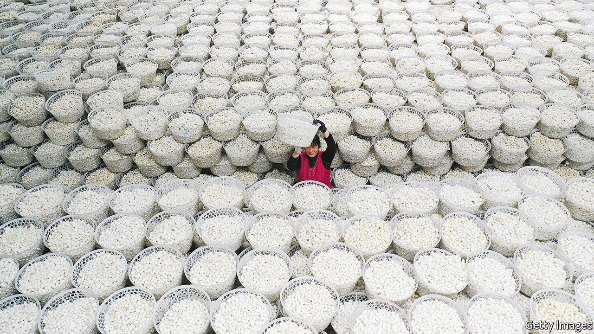

###### Finely spun yarns

# In “Worn”, a clothes maven finds out where they come from 

##### Sofi Thanhauser explores the links between producers of cloth and consumers 

 

> Jan 29th 2022 

Worn: A People’s History of Clothing. By Sofi Thanhauser. Pantheon; 400 pages; $30. Allen Lane; £20

THE STATE of a person’s linens was once a proxy for the state of their soul. A guide to manners of 1740 advised readers that if their clothes were clean “and especially if your linen is white…you will feel your best, even in poverty.” By the early 1780s, simple cleanliness was not enough for some. Fashionable Parisians sent their dirty laundry across the Atlantic to Haiti (then the French colony of Saint-Domingue), to be bleached in the equatorial sun with a touch of indigo.


The result had “a fineness and an azure whiteness entirely different from the linen of France” and “drew everyone’s eyes”. Still, linens used next to the skin, especially in the bedchamber, could not escape the taint of the illicit. Alleged fornicators and adulterers in the American colonies had to do penance by standing in churches or marketplaces while wearing only bed sheets.

Sofi Thanhauser opens “Worn” by evoking her love of clothing, particularly the bargains she picked up second-hand as a girl in Martha’s Vineyard. “A loden coat. A Barbour jacket. A pink silk cocktail dress from the 1950s with a cream-coloured taffeta lining…” Her passion and magpie-like eye for clothes and the stories they contain led her to write this book. It makes no claims to be definitive; rather it follows the thread of her interests, travelling from bygone centuries to the present, and from Phoenix, Arizona, to the Yangzi Delta in China. Throughout, she explores the complex systems woven between the producers of cloth and its consumers.

Each of the five sections of “Worn” tackles a different raw material—linen, cotton, silk, synthetics and wool—and is divided into chapters in which Ms Thanhauser visits a related site or explains an aspect of the textile’s manufacture. The result is a book that bulges at the seams with finely spun descriptions of the places and people she encounters.

In Lubbock, Texas, the author meets a wealthy farming family in a blue, white and brown landscape denuded of all greenery by the liberal use of paraquat, a defoliant similar to Agent Orange, which makes cotton easier to harvest. Edwin and Linda, her hosts, live in a mansion as “waxed and echoless as a funeral parlour”. A girl in red leggings and pearl earrings in Choloma, Honduras, walks along a road “thwacking the back of her wrist against her palm rhythmically”: a tic to ease the pain of a 12-hour shift operating a sewing machine. In Yangzi the author sees silk cocoons being sorted by grade and then unspooled by keen-eyed young women. (The silk filaments are so fine that they are all but invisible to the naked eye.)

As she points out, stories and myths about cloth and clothing—from the Greek Fates to Rumpelstiltskin via those luminous, blue-white Parisian linens—are often really about other things: avarice, status, pride, the difficulty of finding true love, or the helplessness of humanity in the face of forces beyond its control. “Worn” is no different. Ms Thanhauser emphasises the experience of workers, usually women, who are enmeshed in lucrative global industries linked to textiles and clothing.

They include medieval linen-weavers who were reviled for their efforts to form guilds, and rayon workers exposed to lethal carbon disulphide, which caused “devastating neurological symptoms akin to end-stage syphilis”. Some Uyghur Muslims in the Xinjiang region of China have reportedly been forced to make goods for well-known Western companies. A knowledgeable and fascinating book, “Worn” makes for uncomfortable reading, no matter how spotless your linens. ■

