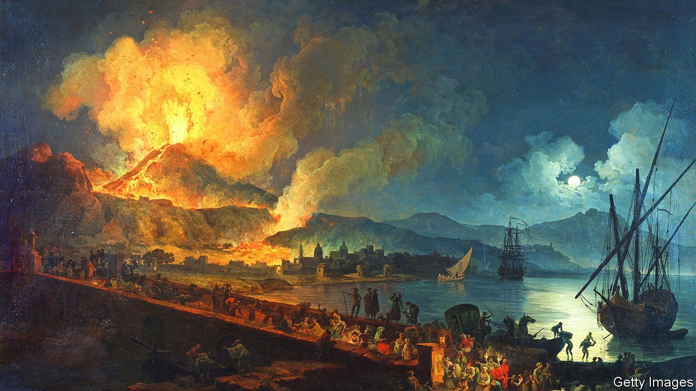

###### Home Entertainment

# To understand the Roman empire, read Pliny the Younger 

##### His letters contain fascinating observations on everyday life—and the joys of remote work 

 

> Jan 29th 2022 

THE PLINYS were well ahead of you. You may think it is terribly contemporary and efficient to go for a walk with your AirPods in and an audiobook on. It is also very Roman. For as Pliny the Younger records, people were doing this (mutatis mutandis) in those days too. While “going about anywhere”, the author’s uncle, Pliny the Elder, instructed someone to follow him, clutching a book and reading out loud. This happened as the elder Pliny ate, as he sunbathed, even at the baths; he was an antique audiobook enthusiast.

The reasons for this habit were much the same as those modern metropolitans might cite if you tapped them on the shoulder and asked them to explain the headphones. Namely: saving time. Pliny’s uncle knew the world was wide and that life was short. How better, then, to make the most of both than to multitask? The elder Pliny even travelled by chair, rather than walking, so his secretary could sit alongside him, book in hand (gloved hands in winter). “You need not”, he told his nephew, “lose these hours.”


People don’t read Pliny the Younger much any more. Some still pick up Marcus Aurelius (for the philosophy) and Catullus (for the smut). Horace remains popular for those fridge-magnet phrases: carpe diem is his, so too are nil desperandum and dulce et decorum est. Even among the classically inclined, though, Pliny is out of fashion. His back story is so uninspiring, for one thing. The elder Pliny was a sometime military commander, at least, but the younger one was neither emperor nor soldier nor famed lover, but merely a lawyer. In other words, he resembled the numberless boring bureaucrats of today. And what could be interesting about that?

Everything, is the answer. If you really want to understand an empire—to feel its muscle and its might, sense its power beneath your fingers on the page—then forget the poets and poseurs. What you need are its laws and its lawyers. Their prose may not be fine or fancy. Their topics aren’t elevated. They talk about beggars and beatings and the price of bread. They rule on who could wear purple (imperial household only) or jewellery (not actresses), or, later, who could dress as nuns (not prostitutes). And as Pliny the Younger shows, their observations can be riveting.

Flip through his correspondence and there, in Letter 10.96, you find the first mention of Christians in the work of any Roman author. They are irksome, Pliny thinks, and they pray too much. Pick up Letter 6.16, and there is the only eyewitness account of the eruption of Vesuvius in 79AD (“flames blazed”). Occasionally there are dull parts—he was a lawyer after all. But the good bits are breathtaking.

There is one more reason to read Pliny the Younger in 2022. Flick to Letter 1.6 and you find an early championing of working from home (WFH). Or rather Working While On A Boar Hunt, the equivalent for well-off Romans. Like most people who WFH, Pliny found he got a lot more done. “The mere fact of being alone in the depths of the woods in the silence”, he wrote, “is a positive stimulus for thought.” The same might be said of being alone with him. ■

