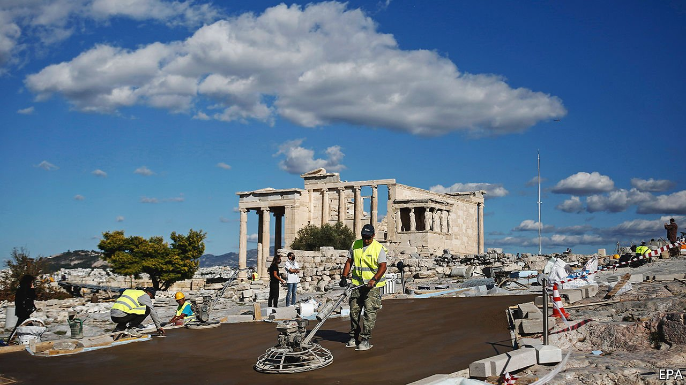

###### Monumental mistakes

# As the pandemic raged, Europe bulldozed historic buildings 

##### While people were locked down, their heritage was knocked down 

 

> Jan 29th 2022 

COVID-19 HAS been a mixed bag for Europe’s architectural treasures. During the pandemic’s first year, overnight stays by international tourists dropped by 68% across the continent. Fewer visitors means less wear and tear on monuments, but also less income to maintain them. Gargoyles are not falling off cathedrals yet. But while attention was distracted, authorities have carried out some dubious renovations.

Take the Acropolis. (Xerxes did.) During Greece’s second lockdown in October 2020, builders poured wide concrete pathways around its temples. Authorities say the paths improve accessibility. Critics say they are causing floods. One academic accused the site’s administration of using the lockdown as a “smokescreen”.


At least the pathways are meant as an improvement. Elsewhere heritage sites have been levelled. In May 2020 Albania’s government bulldozed the National Theatre in Tirana to make way for commercial development. The theatre was a humble modernist brick building built in 1939, but theatregoers loved it. Protests had blocked the demolition for years. Also felled in 2020 was the y-Block in Oslo, a curvy concrete icon of 1960s minimalism, though its Picasso murals were removed first.

The latter two monuments had been among the seven “most endangered” heritage sites listed annually by Europa Nostra, a cultural association. Its secretary-general, Sneska Quaedvlieg-Mihailovic, says 2020 was the only year in which sites on the list have been demolished. Whether or not city planners deliberately took advantage of the pandemic to let the wrecking balls swing, the distraction cannot have hurt.

Europe’s biggest heritage-site restoration project is in Paris. Authorities want to repair Notre Dame cathedral, damaged by a catastrophic fire in 2019, before the city hosts the Olympics in 2024. The church’s age and fame make it less vulnerable to ill-considered upgrades: governments are less cavalier with 12th-century churches than with 1960s office blocks. Crowdfunding may help, too. Tens of thousands of people have donated to the restoration, and they want to know how their money is being spent. The modernisation plans have touched off controversies in the media. All the better; as Athens has learned the hard way, public discussion before plans go ahead is a good thing.

Dig deeper

All our stories relating to the pandemic can be found on our . You can also find trackers showing ,  and the virus’s spread across .

