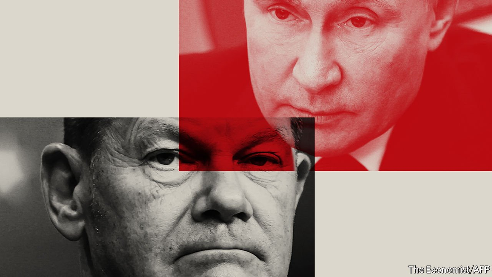

###### Misplaced sympathy

# Germany’s new chancellor dithers in the face of Russia’s threats 

##### But Olaf Scholz is starting to firm up 

 

> Jan 29th 2022 

A CAMERA STOOD next to the table, live-streaming the proceedings. But if Vice-Admiral Kay-Achim Schönbach, the head of the German navy, did not know he was speaking on the record, it did not take long to find out. He told a think-tank in Delhi that Vladimir Putin wanted respect, and “probably also deserves” it. The West should recruit Russia as an ally against China, he added; something he, as a “radical Roman Catholic”, would welcome.

One viral video clip and a very public brouhaha later, Mr Schönbach was gone. The pace of his departure showed that Germany’s government will not tolerate such comments when an unprovoked Russian attack on Ukraine is . Yet to many foreign observers the admiral was merely voicing soft-on-Russia sentiments that are widespread among German decision-makers. Ukraine’s foreign minister has said Germany’s refusal to send his country weapons is “encouraging Vladimir Putin”. The wife of a former Ukrainian president proposed a boycott of German cars. Even NATO allies like Poland publicly bristled.


There is much to grouch about. Germany’s refusal to arm Ukraine, or to allow allies to do so, betrays a misunderstanding of the concept of deterrence. It has been deaf to allies’ concerns over (NS2), a completed but not-yet-approved gas pipeline from Russia to Germany that bypasses Ukraine, depriving it of leverage and income. The Social Democrats (SPD), who lead Germany’s government, are particularly guilty in this telling. Critics spy a party stuffed with Putinversteher (Putin sympathisers) basking in nostalgia for the days of cold-war Ostpolitik, when SPD-led governments opened up to the east.

Yet there is little evidence that Germany has gone soft where it matters. The government has signed up to the European consensus that further Russian military aggression against Ukraine will carry “massive consequences'', in the words of an EU communiqué last month. There is broad transatlantic concord over potential sanctions, if disagreement on details. Germany has even hinted at a shift on NS2. Asked about the pipeline last week, , the chancellor, said “all this will have to be discussed” should Russia invade. His NS2-sceptical Green coalition partners have been clearer still. Few imagine the pipeline will begin operating if Russia does attack.

A bigger problem is the chancellor himself. The three parties in Germany’s new “traffic-light” coalition are visibly split on Russia, and Mr Scholz, a taciturn type who tends to speak in abstractions, has allowed a degree of cacophony. He has made no attempt to prepare Germans for trials that may lie ahead should Russia escalate, from  to a refugee influx. Nor has he responded to Germany’s chorus of critics. “This government has a terrible communications problem,” says Stefan Meister, a Russia-watcher at the German Council on Foreign Relations in Berlin.

That extends to the international scene. A comparison with Angela Merkel, Mr Scholz’s predecessor, is telling. When Russia annexed Crimea in 2014 Mrs Merkel marshalled the EU’s 28 fractious members to impose sanctions. Together with France, Germany established the “Normandy format” with Russia and Ukraine, placing Europe at the negotiating table. Her chancellery co-ordinated closely with Barack Obama’s White House whenever Russian forces probed Ukrainian defences. Today Mr Scholz is one European leader among many, Normandy is moribund and the transatlantic relationship looks testy. “It’s not that Germany has impeded consensus decision-making in NATO,” says John Lough, author of “Germany’s Russia Problem”. “It’s just that it is not carrying as much water as many of us would like.”

Mrs Merkel also enjoyed Mr Putin’s respect, even as she came to despise his lies. She discussed Ukraine and eastern European security with Russia’s president half a dozen times in her last months in office. In his seven weeks Mr Scholz has done so only once, despite the urgency. Mr Putin now prefers to talk to America over Europeans’ heads. By weakening Europe, an equivocal Germany plays plumb into the Kremlin’s hands, says Mr Meister. Mrs Merkel learned that Russian menaces were better faced down if Germany led Europe’s response. It is an idea in which her successor has so far shown little interest. ■

