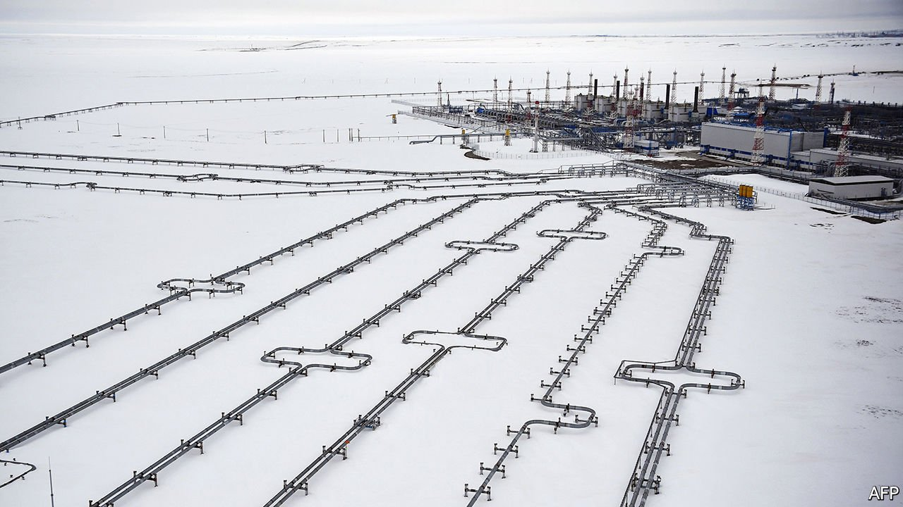
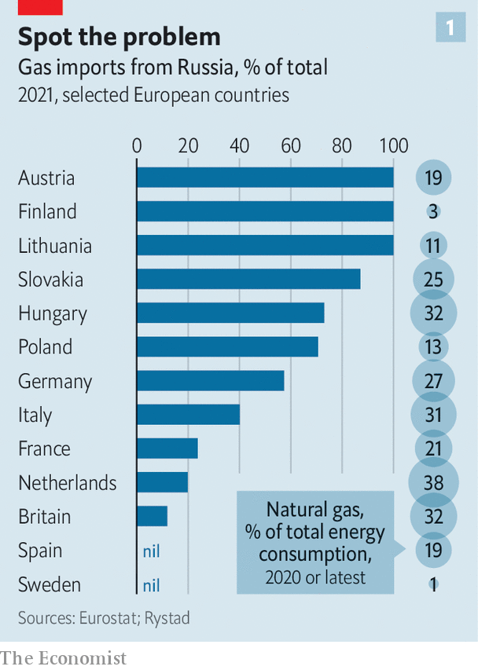
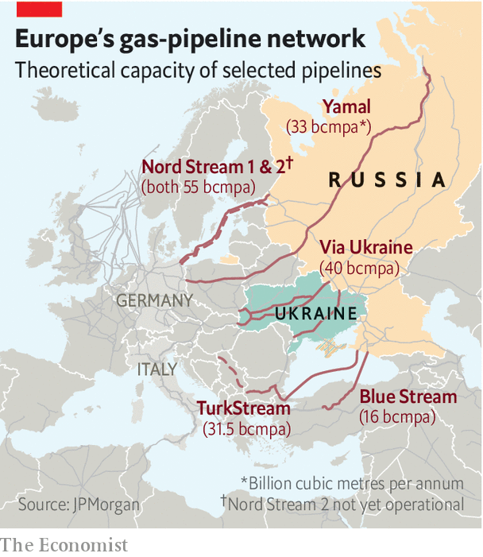
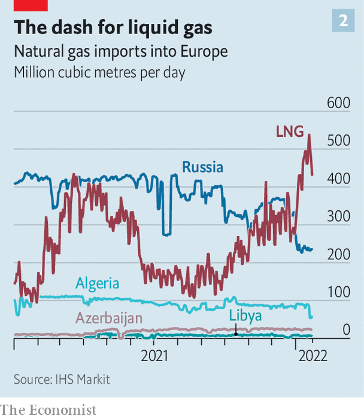

###### Putin’s energy weapon

# How will Europe cope if Russia cuts off its gas? 

##### Better than you might think 

 

> Jan 29th 2022 

EVERY FOUR years the European Network of Transmission System Operators for Gas is required to carry out a simulation of disaster scenarios. In the most recent such exercise last year the ENTSOG boffins considered 20 shades of disaster, and concluded that “European gas infrastructure provides sufficient flexibility for the EU Member States to…ensure security of gas supply.” Cheering words. But the gasmen did not examine the spectre now haunting Europe. What happens if Vladimir Putin , the West hits Russia with sanctions, and Mr Putin retaliates by shutting down all the pipelines ?

The conventional wisdom used to be that a complete shutdown of piped gas from Russia, which makes up roughly a third of the gas burned in Europe, was unthinkable. Thane Gustafson, author of “Klimat”, a thoughtful book on Russian energy, observes that even at the height of the cold war, the Soviet Union did not shut off gas exports. And during Russia’s fiercest dispute over gas with Ukraine, in 2009, only the gas flowing through that country was disrupted, and then only fleetingly.


But a shutdown is no longer unthinkable. Mr Gustafson now says: “I don’t think it is unlikely at all that Putin would actually reach for the gas tap over Ukraine.” Unlike his Soviet predecessors, the Russian president can afford the cost of a brief . Jaime Concha of Energy Intelligence, an industry publisher, has crunched the numbers. Not counting any penalties and assuming the average daily price seen in the fourth quarter of 2021, he reckons a complete cut-off of piped gas to Europe would cost Gazprom between $203m and $228m a day in lost revenues. So if such an embargo lasted three months (Mr Putin’s leverage fades in spring, when gas demand drops to just 60% of that in January), lost sales would add up to about $20bn.

A loss of that size would have been devastating for the rickety Soviet economy, which relied heavily on hard currency earned by selling gas to the West. But Russia today has some $600bn sitting in its  and could easily handle such a blow. And it could even come out ahead financially, in the short term at least. Mere sabre-rattling over Ukraine has already sent prices soaring for gas and oil (the latter accounts for most of Russia’s energy revenues, not gas). Without a war, JPMorgan Chase, a bank, forecasts that higher prices will lead to Gazprom making over $90bn in gross operating profit this year, up from $20bn in 2019.

 


If Russia does wield the gas weapon, how much would it hurt the West? If the interruption were limited to gas passing through Ukraine, as in 2009, the rest of Europe would manage fine. For one thing, Gazprom has already slashed the flow of gas through Ukraine. Citigroup, a bank, reckons it is half the level seen last year and a quarter of that in 2019.

What if Mr Putin cuts off all gas to Europe? Some immediate disruption would be inevitable. This would be felt most acutely in Slovakia, Austria and parts of Italy (see chart), reckons David Victor of the University of California, San Diego. Of the big European countries, Germany is the most vulnerable. Because of its climate-motivated push to retire coal-fired power stations and its rash decision, taken in the wake of Japan’s Fukushima disaster, to shut down its nuclear plants, it remains more reliant on natural gas than it need be. It is Europe’s largest consumer of gas, which accounts for roughly a quarter of its total energy consumption, with Russia supplying over half of its imports.

The good news is that Europe’s energy system is more resilient than it was during the crisis of 2009. Andreas Goldthau of the University of Erfurt in Potsdam points to some useful changes. Pro-competition measures (like a ban on “destination clauses” that forbid the resale of gas) have weakened Gazprom’s grip. A dense web of gas interconnectors now links previously isolated countries (see map).

 


Another source of cheer is liquefied natural gas (LNG). Heavy investments in regasification plants mean that Europe has plenty of idle capacity. Citigroup estimates that with historical utilisation rates for those plants running at 50% of capacity or less, the region can in theory handle enough to replace nearly two-thirds of Russian piped gas imports. So the limiting factor is not regasification capacity, but the available supply of LNG. Since it takes a long time to expand new production and export capacity, Europe’s best hope would be to get hold of existing LNG cargoes originally destined for elsewhere.

One investor notes that when European prices shot up threefold between October and December last year “an armada of LNG” sailed to Europe as cargoes were diverted from Asia. This inflow offset a decline in Russian gas imports (see chart 2). Market rumours suggest that a new armada is coming. Chinese state-owned energy firms, envisaging quick profits from high European gas prices, are hoping to sell dozens of LNG shipments. Massimo Di Odoardo of Wood Mackenzie, a consultancy, adds that because the journey from America to Europe is shorter than the one to Asia, LNG tankers can complete more trips—squeezing an extra 10% or so in export capacity to Europe. All told, he thinks extra LNG could fill 15% of the shortfall that would result from a complete Russian cut-off.

 


Another source of resilience is the amount of gas held in storage. Last year’s bitter winter, along with Gazprom’s reluctance to fill storage units it controls in Europe, left gas storage at levels below the five-year norm. Even so, Rystad, an energy research firm, calculates that a continuation of normal weather this winter would leave enough gas in storage by spring to make up for two months of lost Russian gas exports. Some analysts believe the excess might even cover four months of a cut-off, though a cold snap would reduce this buffer quickly.

Europe also has a secret weapon. Mr Di Odoardo points to its massive but little-discussed stores of “cushion gas”. For technical and safety reasons, regulators insist that storage units like salt caverns and aquifers maintain a huge amount of gas that is not normally available to put on the market. The analysts at Wood Mackenzie reckon that up to a tenth of this cushion can be used without causing problems. If regulators gave permission, as they might in a war-induced crisis, that would amount to well over a month’s-worth of Russian imports.

In sum, Europe will suffer if Russia cuts off the gas; but that price will be paid from the wallet rather than through physical suffering. That cost will be exacerbated, predicts Jonathan Elkind of Columbia University, because “Europe is not starting from calm, but from a market on edge.” The continent’s energy markets have only just been through an early-winter price shock, and the price outlook for all energy commodities is ugly. JPMorgan Chase predicts that, even without a Russian gas cut-off, Europe will spend some $1trn on energy this year, up from $500bn in 2019. If the region were forced to consume its gas stocks to survive a Russian cut-off, it would then have to spend even more during summer frantically rebuilding its reserves to avoid an energy crisis next winter.

That is an unpleasant prospect. But a bigger price would be paid by Russia over the longer term. One source notes that Gazprom would face “massive” commercial fallout, ranging from penalties payable to customers to a halt in dollars flowing to Russia for contract payments. Gazprom would find it difficult to secure any long-term contracts in Europe after such a display of aggressive unreliability. And the Nord Stream 2 pipeline so cherished by Mr Putin would surely bite the dust. A shutdown might even persuade China, now cautiously importing more Russian gas, that its long-standing concerns about Russian reliability are well founded.

Mr Victor argues that such a brazen use of the energy weapon would probably lead Europe to try much harder to cut its dependence on Russian exports of gas “less because they are insecure and more because the revenue…is what funds Russian bad behaviour.” As Mr Gustafson pithily puts it: “If Putin wanted to destroy Gazprom’s business in Europe, he couldn’t go about it in a better way.” ■

Correction (January 25th 2022): The original version of this story said that Jaime Concha’s estimate for the amount that a cut-off of piped gas to Europe would cost Gazprom was based on the average daily price seen in 2021. In fact it was based on the fourth-quarter price alone.

All of our recent coverage of the Ukraine crisis can be found 

