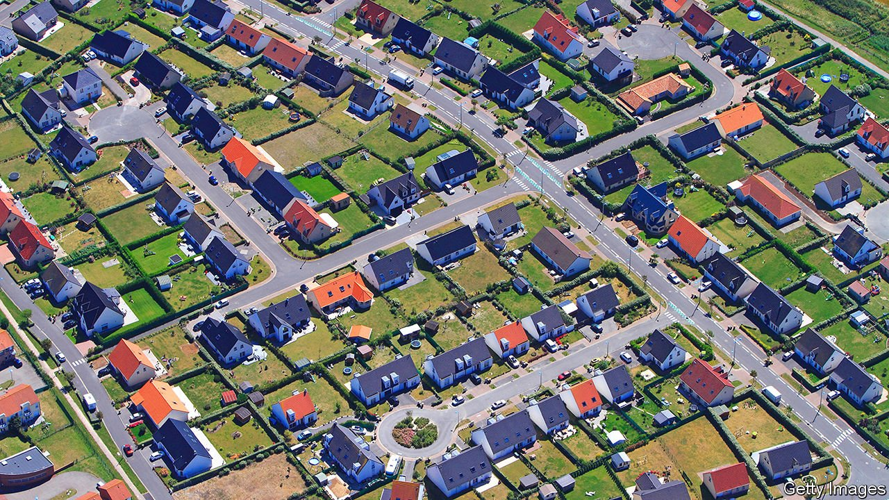

###### Road-testing the French dream

# Macron’s path to re-election runs through France’s outer suburbs 

##### Swing voters love cars but can’t afford electric ones 

 

> Jan 29th 2022 

ON THE FRINGES of greater Paris, where urban concrete meets farmed fields, lies the suburb of Saint-Brice-sous-Forêt. Gently curved streets of two-storey houses, each with a parking space and garage, cover what were once apple and pear orchards. The narrow high street has just one café, and a “Cheesy Pizza” takeaway joint; but there is a drive-in Burger King on the outskirts. This is what the mayor, Nicolas Leleux, calls “the border of two universes”: city and countryside. It captures the worries and hopes of middle France, and exemplifies a crucial electoral battleground for April’s presidential poll.

Shy of extremes, the suburb tilts to the centre-right. In 2017 Saint-Brice-sous-Forêt preferred the centre-right presidential candidate, François Fillon, in the first round, but backed the centrist Emmanuel Macron against the nationalist Marine Le Pen in the second. In 2020 it replaced a centre-right mayor with Mr Leleux, a former navy submariner who belongs to Mr Macron’s party. Locals, in other words, may be torn at the presidential poll this time between a vote for Mr Macron, assuming he runs for re-election, and his centre-right rival, Valérie Pécresse. A well-known figure locally, she is the president of the Ile-de-France region, which encompasses the city of Paris itself and Saint-Brice-sous-Forêt, 17 kilometres (11 miles) away.


Less than three months before polling day, however, talk is all about covid-19. Nobody spontaneously raises national politics. Daily new infections are still high across France, and shifting national rules about testing have caused chaos in schools. The mayor has opened a municipal testing centre to try to ease the stress. Residents also worry about heating bills and petty crime. The brutalist tower blocks of Sarcelles, a rough banlieue north of Paris, are not far away, and there are nagging concerns about “imported crime”. Yet fear of immigration, which the two nationalist candidates—Ms Le Pen and Eric Zemmour—insist tops French concerns, seems largely absent.

Not that everybody is happy with Mr Macron. On a roundabout on the edge of town, ringed by car parks serving a giant hypermarket, Agnès, Josée Laure and Evelyne are standing defiantly in the cold, their hoods up against the wintry drizzle. Next to them lies a yellow-painted concrete block, which reads “ Gilets jaunes St Brice: we won’t give up”. It is a vestige of the “yellow jackets” uprising, which emerged across the country in 2018 against a rise in the carbon tax on motor fuel. The protests have subsided elsewhere. But this group is still active. “We put up our banners every Saturday,” says Agnès, a 48-year-old health-care worker, “but we pack them up after, and don’t leave any mess behind.”

Their current gripe is a new national rule, introduced on January 24th, which makes vaccination compulsory for access to restaurants, cafés, long-distance trains and other public places. Only one of the trio says she is vaccinated; the others consider it an “infringement of our liberties”, if not an attempt “to poison the population”. Above all, they are indignant at the way Mr Macron has favoured the rich and displayed “contempt” towards ordinary people. As a spur to getting people jabbed, he recently said he wanted to emmerder (piss off) the unvaccinated. As for Mrs Pécresse, “she’s just the carbon copy” of him.

April’s election seems set to be determined on the right, as Mrs Pécresse, Ms Le Pen and Mr Zemmour battle for a place in the run-off against the president. Mr Macron consistently tops first-round voting intentions; the various candidates of the left are trailing far behind. If so, disillusioned left-leaning voters such as those on the Saint-Brice roundabout may well end up abstaining. Josée Laure is considering this. Evelyne says she will vote for Jean-Luc Mélenchon, a perennial hard-left candidate with a knack for the late surge.

What comes into sharpest relief in Saint-Brice is the collision between the needs of daily life, notably the car, and the desire for a greener future. A place of quiet middle-of-the-road aspiration, it evokes what Mr Leleux calls the “French dream”. “People have left the city to come here, not to live in a tower block, but in a house with a little garden, with neighbours, and a place to barbecue.” Nearly 88% of households own at least one car. His task, he explains, is to reconcile that dream with the need to reduce car usage. Few can afford an electric vehicle. Mr Leleux is planning cycle lanes and building a bike shelter at the railway station, on a direct line to Paris. Yet on a cold day in January there are no cycles to be seen on the streets.

The Ile-de-France region, says Othman Nasrou, one of Mrs Pécresse’s vice-presidents and in her campaign team, is “like a small France”: it includes many car-dependent suburbs, so she is familiar with these complexities. Mrs Pécresse has proposed subsidies for households to buy electric cars, and mocked those who deride car use from the comfort of their nearby Parisian metro station. Anne Hidalgo, mayor of Paris and the Socialists’ presidential candidate, is on just 3% in national polls.

Fashionable Parisian talk of the ideal “15-minute city” is all very well, says Mr Leleux. The reality is that to buy a baguette in under 15 minutes without a car is not possible in much of suburbia. If anybody has learned this, it ought to be Mr Macron, who won a huge majority of the vote in big cities in 2017, but later faced months of gilets jaunes protests. For now, insists the mayor, locals credit the president nonetheless with having been a “good captain” in difficult times. In April, it is on the streets of middle France, not the parquet-floored salons of Paris or its tenements, that such a claim will be tested. ■

