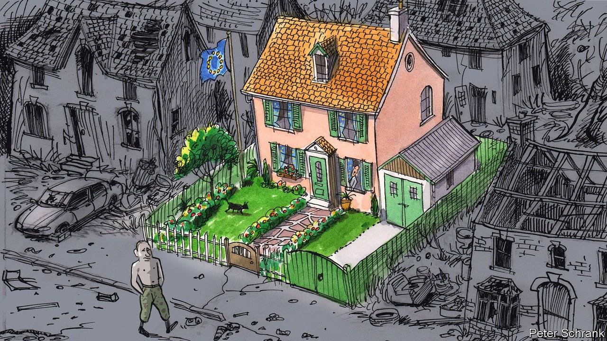

###### Charlemagne

# Peace and order reign in the EU, but seldom near it 

##### Why a rich club has such turbulent neighbours 

 

> Jan 29th 2022 

PRESS A EUROCRAT hard enough about the EU’s many imperfections, and sooner or later you hear a familiar defence. Never mind about coddled French farmers or Polish populists tearing up the rules: the crucial thing about the European project is that it has delivered peace. (The emphasis on this word is emotional; a small tear may well up at this point). Replacing centuries of warfare with decades of late-night summits quibbling over fish quotas is the European project’s proudest achievement. Fair enough. But peace stops at the EU’s borders. Surrounding the club is a zone of turmoil, which Europe seems powerless to soothe.

The prospect of war in Ukraine currently dominates the headlines. But look in just about any direction and Europe’s neighbourhood is a mess. Belarus, Europe’s last dictatorship, recently flew in migrants from Iraq, dumped them at the Polish border fence, gave them boltcutters and ordered them to try to break into the EU in the hope of causing another refugee crisis. The Belarusian despot is now welcoming Russian soldiers, perhaps on their way to invade Ukraine.


In Turkey, an eccentric autocrat presides over a crashing currency. In the western Balkans, pound-shop demagogues rant and loot. Across the Mediterranean, a mere people-smuggling dinghy ride from the EU, North Africa now mixes a drift away from democracy (Tunisia) with civil war (Libya). Only Norway, Switzerland and occasionally Britain look like functional places. To lose one neighbour to strife or demagoguery may be regarded as a misfortune. To lose nearly all of them looks like carelessness.

To be fair, much of the disarray has been deliberately fomented by one exceptionally aggressive neighbour. Besides grabbing bits of Ukraine and threatening much worse, Vladimir Putin has sown discord across the whole region. He props up a despot in Belarus and may one day swallow the country into Russia. His troops and cash support a breakaway sliver of Moldova, making life hard for its pro- EU government. He has stirred up disarray in the Balkans, not least in Bosnia, where his support for separatist Serb forces has brought the country to the brink of anarchy.

Europe once had a viable strategy to counter such meddling. Countries that wanted to escape from Russia’s coercive “sphere of influence” were welcomed into the EU. The prospect of attending those dull fish-themed European summits, not to mention trading with and receiving subsidies from some of the world’s richest economies, was more than enough to lure countries like Bulgaria and Poland into the club. Accession talks required them to adopt hard but mostly sensible economic and political reforms. Being in the antechamber of the EU was itself a stabilising force.

Now the prospects for further EU enlargement are essentially zero. The last country to join was Croatia, in 2013. Britain was the big state keenest to bring in fresh blood, notes Rosa Balfour of Carnegie Europe, a think-tank in Brussels. Today’s members are more likely to rue having let in Hungary than to look for ways to include Albania. To places with no hope of EU membership, promises of Russian or Chinese investment may sound rather appealing, though they come with strings attached.

The EU has other carrots, which it has long dangled at countries that had no real chance of joining the bloc; Turkey has officially been a candidate for accession since 1963, though more in theory than in practice. The prospect of visa-free travel may induce governments to clamp down on corruption, say. Europe sends money, and recently vaccines, as part of its “neighbourhood policy”, which extends to bits of the Middle East. But the task is low on its list of priorities. The commissioner in charge of such policies comes from Hungary, where the government is notoriously corrupt and hostile to foreigners.

It could have been EU

The way Europe deals with its neighbourhood is an extension of how it was built. The EU has no standing armies to push its agenda. Even if it had, internal divisions would dilute Europe’s influence beyond its borders. The club still comes with 27 different flavours of foreign policy, in addition to one nominally designed at the European level. Some countries focus on the bloc’s southern flank, where foreign policy is an extension of domestic imperatives—namely the desire to stem irregular migration. Various grubby deals have been struck with countries including Libya and Turkey to cut down the number of boats attempting the crossing into Europe from their shores. In Libya’s case, Italy and France have backed rival warlords: hardly a recipe for fostering harmony.

The lack of unity is even more apparent when it comes to matters of war and peace. Bits of eastern Europe see NATO, and specifically America, as the bedrock of their security. By contrast, France’s President Emmanuel Macron relentlessly pushes the idea that Europe must develop its own “strategic autonomy”. Russia has long depended on a series of all-weather friends within the EU, notably Greece, Hungary and often Germany and Italy, to play down its wrongdoing. Meanwhile swathes of the continent depend precariously on gas from Russia to keep warm. Domestic politics nearly always trumps foreign relations. Even with 100,000 Russian troops menacing Ukraine, Germany’s new coalition is still dithering over whether to toughen its stance towards Russia. France is in pre-election mode, as Italy may soon be.

Perhaps it was inevitable that the EU would be surrounded by dysfunction. All the functional countries in the neighbourhood were qualified to join the club and, apart from Norway and Switzerland, they did so. Thus the club kept expanding until it hit a wall of prickles—the countries that were too turbulent or ill-run to be admitted. That was once a mild irritant. Now its neighbours’ instability looks like a risk to the solemnly invoked peace that underpins the whole European project. And that could prompt tears of a different kind. ■

Read more from Charlemagne, our columnist on European politics: (Jan 22nd)

 (Jan 15th) (Jan 8th)

