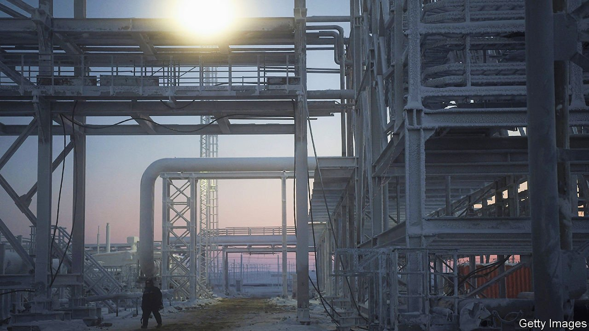
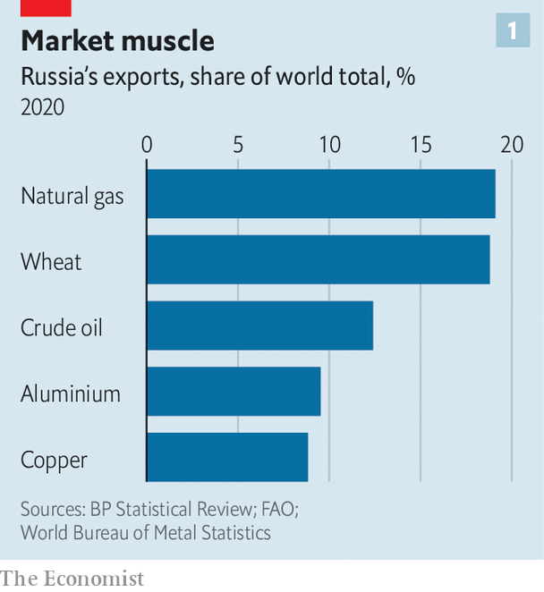
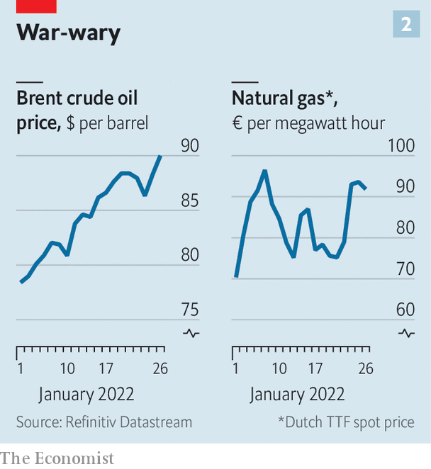

###### Material moves

# Commodities traders brace for a war in Ukraine 

##### Tight markets mean that prices are all too responsive to rising tensions 

 

> Jan 29th 2022 

“IF RUSSIAN TANKS cross the border, markets will freak out.” That is the considered judgment of Helima Croft, head of commodity strategy at RBC Capital Markets, an investment bank, and a former analyst at America’s Central Intelligence Agency. Were Russia to invade Ukraine, the biggest impact would first be felt on European gas markets. But Ms Croft is not alone in thinking that the shock waves would spread far more widely.

The potential for disruption stems from Russia’s huge importance for commodity markets (see chart 1). It is the world’s biggest exporter of natural gas, and the second-largest exporter of oil. It supplies nearly a tenth of the world’s aluminium and copper, and produces a range of other metals, including 43% of the world’s palladium, a component of catalytic converters. It is also the largest exporter of wheat.


 


The worst-case scenario is that the flow of these vital raw materials is cut off as . That could happen because Russian exports, or the payments infrastructure needed to facilitate them, are hit by Western sanctions. Alternatively, Russia could itself decide to halt some exports—notably of gas—in an attempt to cow its opponents.

The mere fear of disruptions has sent prices higher. On January 26th Brent crude oil approached $90 a barrel, a seven-year high; the  stood at about €90 ($101) per megawatt hour, compared with €70 at the start of the year. The copper price is flirting with its multi-year peak.

 


The tightness of commodity markets makes prices all-too-sensitive to war talk. During the global financial crisis of 2007-09 both global industrial production and commodity prices plunged in tandem, notes Macquarie, another bank. The pandemic, by contrast, has been accompanied by a surge in both manufacturing output and raw-material prices. Unexpectedly robust demand and supply-chain disruptions fuelled a 20% rise in the broad Bloomberg Commodities Index in 2021. The prices of a dozen of its elements, from cobalt and coffee to cotton and coal, shot up by even more.

Oil demand is roaring back towards pre-pandemic levels, even as supply has been . Many members of the Organisation of the Petroleum Exporting Countries and its allies (which include Russia) are struggling to meet their quotas for increased production, because of under investment and covid-related complications. America’s shale firms have , favouring investor returns over drilling. The result is that global spare production capacity is falling to precariously low levels. Spare capacity for many metals, too, is limited.

If war breaks out, the oil price could rise to $120 a barrel, reckons Natasha Kaneva, head of commodities strategy at JPMorgan Chase, a bank. Ross Strachan of CRU, a consultancy, says aluminium prices could rise to all-time highs. The precedent for the impact of geopolitical tensions on prices is not exactly heartening. When America imposed sanctions on Rusal, Russia’s largest aluminium producer, in 2018, prices of the metal were turbo-charged.

Russia and Ukraine together export about 29% of the world’s wheat, and a big chunk of Ukrainian cultivation takes place in the regions that are most exposed to invasion. Carlos Mera of Rabobank, a Dutch firm, says withdrawing such volumes from the market would have an “extraordinary” impact, because the demand for wheat is so inelastic. Prices could easily double, he reckons. That would trigger a struggle to secure supplies, especially among the large importers of northern Africa and the Middle East.

Some countries, such as China and Iran, might bypass Western sanctions and buy Russian metals and grains at discounted rates. That could in principle offer relief by satisfying some demand. But China and Iran together imported 17m tonnes of wheat last year, hardly a match for Russian and Ukrainian exports of 59m tonnes. Falling grain stocks in America and Europe and bad weather in South America threaten to starve the market further, says Geordie Wilkes of Sucden Financial, a broker. Moreover, Russia is a big producer of urea and potash, important ingredients for fertilisers. An export embargo would give grain prices a further leg-up.

For as long as tensions stay high, the pivotal role of energy in the economy means price rises will spill over to other markets, even if sanctions are not ultimately deployed. Expensive power has already caused some aluminium smelters to close in Europe. A surge in gas prices could cause more furnaces to shut down. It could also hit fertiliser production on the continent—for which gas is used as both raw material and fuel—hampering the next growing season.

If the tensions are resolved altogether, then it might be possible to imagine markets cooling off. Europe endured a natural-gas price shock last year, but a warm winter means that “a lot of angst has been taken out of the market, even though we still remain at very elevated price levels”, says Saad Rahim of Trafigura, a trading firm. But the tightness of supply means that prices will cool off only a bit. Ms Kaneva reckons that the risks with oil are asymmetric. If peace prevails, the oil price would merely drop to $84 per barrel. But if war breaks out, “everything just goes up massively”. ■

All of our recent coverage of the Ukraine crisis can be found . For more expert analysis of the biggest stories in economics, business and markets, , our weekly newsletter.

