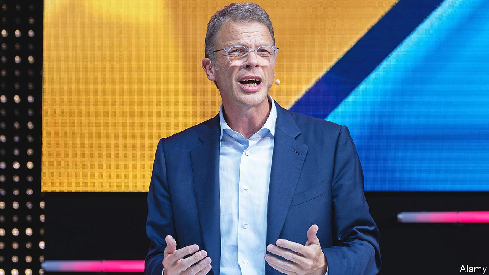

###### Rescue mission

# Has Deutsche Bank turned the corner? 

##### Investors seem to think the bank has stabilised at last 

 

> Jan 29th 2022 

WHEN IN APRIL 2018 Christian Sewing took over as chief executive of Deutsche Bank few thought he would last very long. The bank, one of Europe’s biggest by assets, had been through four chief executives in six years, and its very survival was at stake. It was unable to make enough profits to generate anything resembling a decent return for investors, and seemed to be frequently ensnared in costly litigation. There was talk of the bank being taken over, and even wound down.

Mr Sewing is, impressively, still in his job—and his contract was extended last year, to 2026. On January 27th he presented the bank’s annual results for 2021 at Deutsche’s headquarters in Frankfurt. They seemed to confirm that the lender has stabilised at last. Mr Sewing reported a pre-tax profit of €3.4bn ($3.8bn) and a net profit of €2.5bn for 2021. In the final three months of the year it made a net profit of €315m, a year-on-year increase of 67%, beating analysts’ expectations. Across 2021 as a whole “we delivered our best result in ten years”, said Mr Sewing. Shareholders seem to agree. Since its record low in March 2020, Deutsche’s share price has almost doubled.


Has Deutsche turned the corner? A year after he took over Mr Sewing announced his grand plan for saving the 152-year-old bank that once financed Germany’s industrialisation. It would be “the most fundamental transformation” of the bank in decades, he promised in July 2019. He said he would shrink its investment bank, and shut down the trading of shares altogether. And he announced that he would cut costs by €5.8bn a year, a quarter of the total, to €17bn in 2022. Eighteen thousand jobs, a fifth of the payroll, would go.

Mr Sewing’s restructured bank consists of four pillars. The two biggest in terms of revenue are its retail arm and its investment bank. After its merger in 2018 with Postbank, a German postal bank, Deutsche remains the country’s biggest retail lender. The investment bank, which is still substantial, brought in more than a third of revenue last year, a chunk of it from trading fixed-income securities, currencies and commodities.

The two other pillars are a corporate bank that provides mainly European businesses with services such as cash management and trade finance, and DWS, Germany’s biggest asset manager, which is mostly owned by Deutsche and is, according to analysts, its most consistently profitable business.

“Mr Sewing has done a good job in a tough environment,” says Stuart Graham, an analyst at Autonomous Research who argued in a report in 2018 that Deutsche Bank’s business model was broken beyond repair. The period when Deutsche was frequently in trouble with the law seems to have passed. Credit-rating agencies such as Fitch and S&amp;P upped many of Deutsche’s ratings last year, arguing that its strengthened business model, sound asset quality, decent funding and liquidity positions, as well as its adequate capitalisation, inspired confidence.

Still, no one thinks Deutsche is out of the woods yet. Last year’s boom in fixed-income trading was unexpected and may not last, says Jon Peace of Credit Suisse, a bank. Deutsche needs to start bolstering capital to prepare for Basel 4, a new set of regulations that will take effect in 2025. Moreover, its costs are still high compared with its peers. Mr Sewing must cut them further if he is to meet his ambitious targets.

The big question is whether Mr Sewing will reach his goal of a return on tangible equity of 8% and start to pay shareholders a bounty of up to €5bn in dividends this year. The bank made no payments for 2019 and 2020, and only a small one for last year.

As a result, Deutsche has not persuaded shareholders that it generates enough profits to provide an adequate return. The bank is therefore still trading at less than half of its book value. And analysts are doubtful that Mr Sewing’s target can be reached. Jochen Schmitt at Metzler, a German bank, predicts a 4.8% return on equity this year; the consensus forecast among analysts is 5.5%. Deutsche may have come a long way since hitting rock-bottom. Nevertheless, Mr Sewing may not be able to look back with satisfaction just yet. ■


