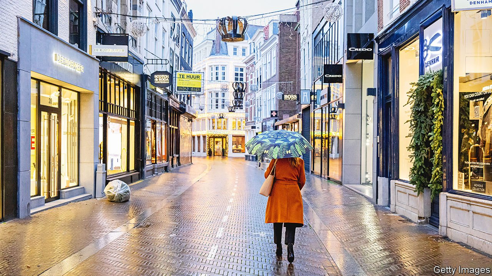
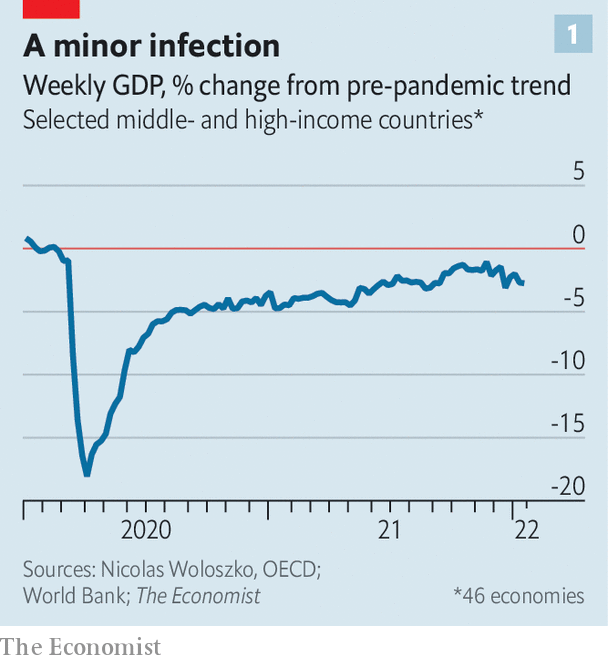
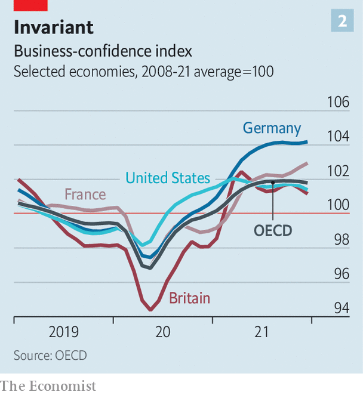

###### Acquired immunity

# How is Omicron affecting the global economic recovery? 

##### High-frequency data suggest the effect may be limited—and short-lived 

 

> Jan 29th 2022 

LATE NOVEMBER almost began to feel like the early days of the pandemic all over again. Global stockmarkets fell as news of what would come to be known as the Omicron variant filtered out and investors feared either another round of restrictions, or that people would shut themselves away. Two months on, Omicron’s impact is slowly coming into focus. So far it is, largely, better than feared. Markets are skittish, but because of the prospect of higher interest rates, rather than covid-19. Goldman Sachs, a bank, has constructed a share-price index of European firms, such as airlines and hotels, that thrive when people are able and willing to be in public spaces. The index, a proxy for anxiety about the virus, has surged relative to wider stockmarkets in recent weeks.

High-frequency economic data back up the cautious optimism. Nicolas Woloszko of the OECD, a rich-country think-tank, produces a weekly GDP index for 46 middle- and high-income economies, using data from Google-search activity on everything from housing and jobs to economic uncertainty. Adapting his index, which has been a good predictor of the official numbers, we estimate that GDP across these countries is about 2.5% below its pre-pandemic trend (see chart 1). That is a little worse than in November, when GDP was 1.6% below trend, but better than a year ago, when output was nearly 5% below it.


 


A few factors explain why the worst fears about the variant’s economic effects have so far not come to pass. The great uncertainty with Omicron relates to whether the bad (greater transmissibility) outweighs the good (lower virulence), and thus whether there is a damaging surge in hospitalisations and deaths from covid-19. So far, though, few governments apart from China’s, which is still wedded to its zero-covid strategy, seem to believe that additional drastic restrictions on people’s movements are required.

A quantitative measure produced by UBS, a bank, ranks global restrictions from zero to ten and finds that the average global score has risen from 3 to 3.5 in recent weeks. Only one rich country, the Netherlands, moved into a proper lockdown (though this was relaxed on January 26th). UBS also finds that the share of international travel routes with covid-related entry restrictions, at 31% globally, has barely budged since October.

More people also seem happy to take risks. Goldman Sachs produces an “effective” lockdown index, which takes into account not only governments’ diktats but also people’s choices. So far its global index has tightened to about the same level as during the Delta wave of last summer, despite four to five times as many daily infections. Even in places where the rapid spread of covid-19 is a novelty, people are largely carrying on as normal. Cases in San Francisco were in the low double digits for most of the autumn. Although the city now averages about 2,000 a day, gyms and restaurants remain busy. Our global “normalcy index”, which looks at how people’s behaviour has changed relative to pre-covid norms, dropped in recent weeks, but now seems to be recovering.

Today’s case numbers suggest that about 5-10% of Americans currently have covid-19. Such high prevalence has created a new difficulty that did not exist with previous variants: a widespread absence of workers. According to a survey conducted at the turn of the year by the Census Bureau, 8.8m Americans were out of work either because they were caring for someone with covid-19 or because they had the disease themselves. At the end of 2021, 138 National Basketball Association players were unable to work for covid-related reasons, though this number has since dropped. In San Francisco a small but growing number of shops, which had already been struggling with a labour shortage, are closing early for lack of staff.

 


Measuring the effect of such absences on output is hard, but it looks likely to be limited—and short-lived. For a start, several factors might offset their impact. Some of the workers who are isolating will be able to toil from home. If a restaurant is closed, prospective diners may still have other places to visit. And for a time at least, co-workers who are uninfected can take up some of the slack. The overall drag could therefore be modest. Research published earlier this month by JPMorgan Chase, another bank, for instance, speculated that absences could reduce Britain’s GDP in January by 0.4%.

Moreover, with case numbers falling both in Britain and in some cities in America, Omicron’s economic effects look likely to fade rapidly. Forward-looking surveys also suggest that firms are not too worried. There is little sign, for instance, of a decline in business confidence (see chart 2).

Despite a better overall performance than expected, the global economic recovery from the lockdowns of 2020 is still uneven. The gap between the best and worst performers is as wide as it has ever been. As South Africa’s Omicron wave has collapsed, GDP has risen and is now in line with its pre-crisis trend. Britain’s economy seems to be recovering fairly quickly.

Other places are still struggling, however, whether because of a slow roll-out of boosters, low population immunity or plain bad luck. According to the OECD’s measure, the Spanish economy is still roughly 7% smaller relative to its pre-covid trend. Omicron has not done too much to knock the global economic recovery off course. But some places still feel a long way from normal. ■

Dig deeper

The Economist devised a “” to determine how life has been upended by covid. It tracks day-to-day behaviour relating to eight indicators split into three categories: transport, recreation and commercial activity. 

For more expert analysis of the biggest stories in economics, business and markets, , our weekly newsletter.

