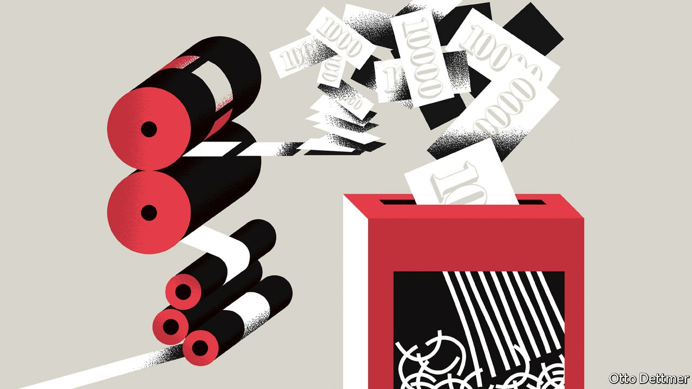

###### Free exchange

# Quantitative tightening is no substitute for higher interest rates 

##### Reversing trillions of dollars of asset purchases may prove to be an unreliable tool 

 

> Jan 29th 2022 

CENTRAL BANKERS almost everywhere are tightening monetary policy to fight inflation. Markets expect interest rates to rise by about a percentage point in America and Britain, and by a tenth of a point in the euro area, over the course of the year. But modern central bankers have more than one lever at their disposal. Many in the rich world are preparing to put into reverse the almost $12trn of quantitative easing (QE), or bond-buying, they have conducted during the pandemic. On January 26th the Federal Reserve said it would end QE soon and gave guidance for the first time about how it might shrink its balance-sheet, a process dubbed quantitative tightening (QT). Reversing trillions of dollars of asset purchases might seem like a powerful way to contain inflation. In fact QT will be an unreliable tool.

Having cut interest rates nearly as far as they could go during the global financial crisis of 2007-09, central banks began experimenting with QE, which was a relatively new and poorly understood tool. But when the time came to tighten they preferred to follow the normal path and raise interest rates, rather than risk the unknown by starting QT. So they maintained the size of their balance-sheets by reinvesting the proceeds from maturing bonds. It was not until rates hit 1-1.25% in late 2017 that the Fed let its balance-sheet “run off”, by stopping reinvestments. The Bank of England in 2018 said it would start QT after rates hit 1.5%—a threshold it never reached.


The Fed’s strategy seemed to work, but because its bonds matured only gradually, it was slow. In the roughly two years for which it was in place, the central bank’s stock of assets fell by $710bn. QT this time will start from a much higher base. The Fed has bought plenty more bonds during the pandemic: it now holds some $4.5trn more in assets than in 2019. Were the glacial pace of reduction to be repeated, the next crisis would probably strike before the balance-sheet had shrunk by very much.

But the thinking has changed. “The period of time between stopping purchases and beginning run-off will be shorter, and… the run-off can be faster,” Jerome Powell, the Fed’s chairman, said on January 11th. The Bank of England plans to stop reinvesting the proceeds of maturing bonds when rates reach just 0.5%, which may happen in February. Even the European Central Bank’s balance-sheet is expected to shrink as it scales back emergency loans to banks, forecasts Goldman Sachs, a bank.

What explains the desire for a quick QT? Andrew Bailey, governor of the Bank of England, has warned of a “ratcheting up” of the bank’s presence in bond markets if it never scales back its holdings. A committee of the House of Lords has accused the bank of having a “dangerous addiction” to buying bonds. Most central banks also face the prospect, as rates rise, of paying interest on the reserves they have created in order to buy bonds via QE. They would in effect be shouldering part of their governments’ debt-interest costs—a role that could become uncomfortable.

Some central bankers also think that QT could allow them to fight inflation without raising interest rates as much as would otherwise be necessary. “I would prefer a flatter funds-rate path and more adjustment on the balance-sheet,” said Mary Daly, president of the San Francisco Fed, earlier in January. The theory is that QE holds down long-term bond yields, so reversing it will cause them to rise, slowing the economy.

However, despite the enormous size of QE—and the universal agreement that it rescued markets in spring 2020—the evidence that it has a sustained, large effect on long-term bond yields is thin. In theory the Fed’s bond holdings compress the term premium, the component of long-term bond yields that compensates investors for locking up money for a long time. But, says Dario Perkins of TS Lombard, a research firm, the term premium does not seem to track central banks’ balance-sheets. Instead it closely follows the dispersion in forecasts of inflation, suggesting that it reflects inflation risk. If QE does not have lasting relevance to bond yields, neither should QT. The ten-year Treasury yield was lower, not higher, by the end of the last round of QT. In other words, although the Fed held fewer bonds, their price had risen.

There is one way in which balance-sheet policy has an obvious and immediate effect: by offering a signal to investors about central bankers’ probable interest-rate decisions. In a downturn bond-buying indicates that things are really bad and so interest rates will stay low for a long time; slowing or reversing QE can signal that rate rises are coming. Perhaps the most famous market reaction to a balance-sheet announcement, the “taper tantrum” of 2013, happened primarily because traders drew inferences about the path of short-term rates from what Ben Bernanke, then the Fed’s chairman, said about plans to slow the pace of bond-buying.

In the late 2010s, central bankers tried to mute such signals. It was common to refer to the Fed’s QT as happening “in the background”. As inflation surged in 2021, however, they showed less discipline. Dissenters on the Bank of England’s monetary-policy committee voted to end QE early. In recent weeks rate-setters’ speculation about QT may have helped convince traders that the Fed really is serious about tightening policy, contributing to sharp falls in asset prices. In its latest plan the Fed has said that interest rates are its primary policy tool. But it has struggled to articulate whether or not more QT means fewer rate rises.

Balance and imbalance

Perhaps it is good that investors have woken up to the Fed’s plans for rates. Yet pivoting to using QT and rate rises as substitutes, as Ms Daly suggests, could put the signalling mechanism into reverse. More QT would mean fewer rate rises, not more, so could cause bond yields to fall. QT would have become, bizarrely, a source of stimulus—the last thing a central banker with an inflation problem should want. ■

Read more from Free Exchange, our column on economics: (Jan 22nd) (Jan 15th)

 (Jan 8th)


