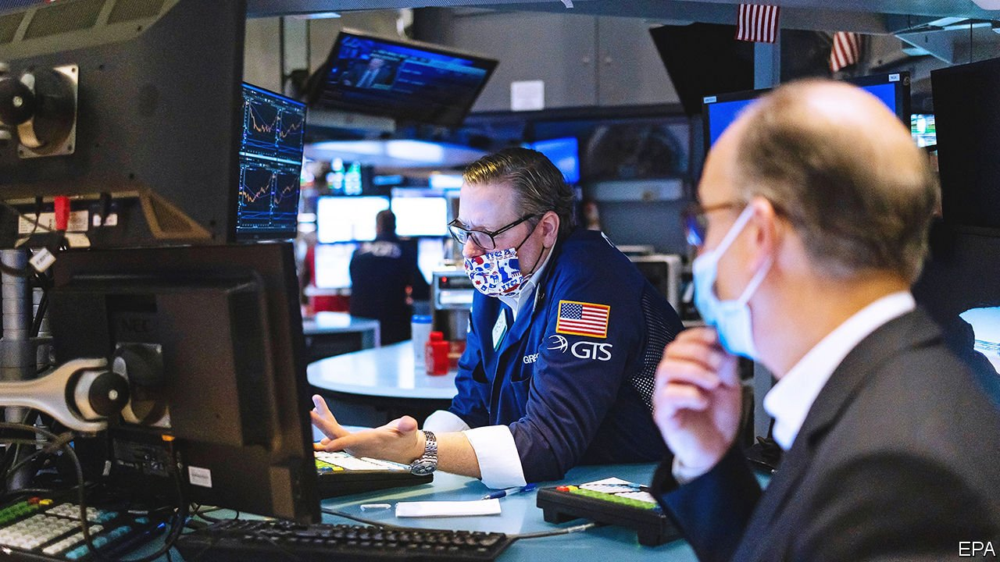
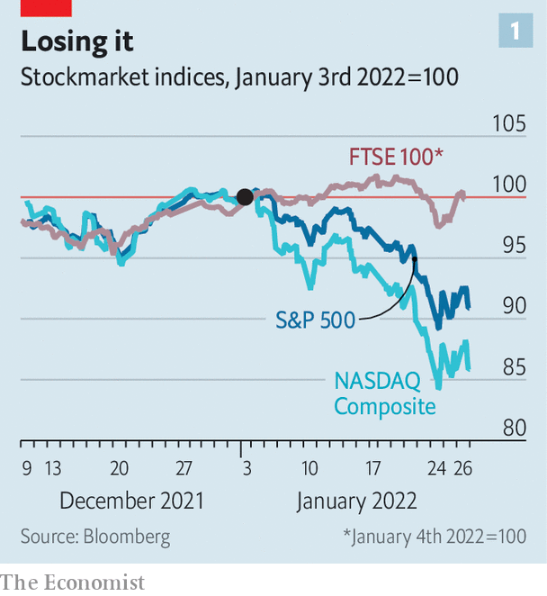
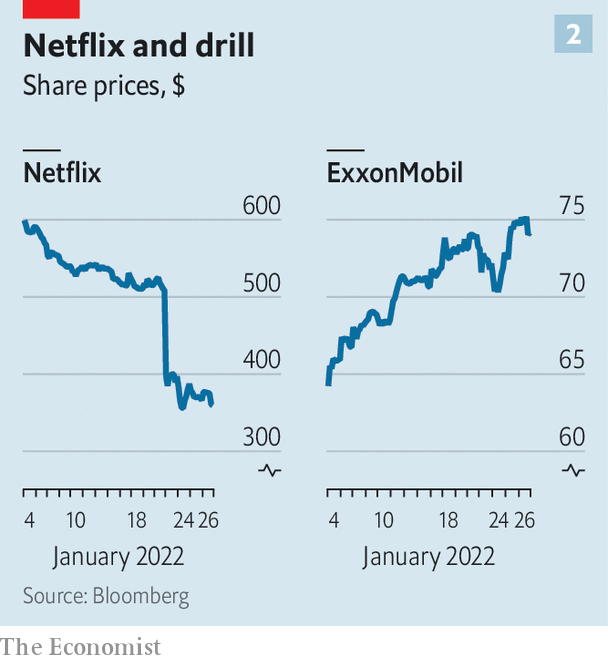

###### Forward in fear

# The reasons behind the stockmarket turmoil 

##### From Fed tightening to rising wage costs, investors see gloomy prospects ahead 

 

> Jan 29th 2022 

AS THE STOCK-TRADING screens turned red, one trader was heard to quip that at least some things are falling in price. By the market close on Wednesday, January 26th, the cumulative loss on the S&amp;P 500 index had moved towards 10% for this year, barely four weeks in. The year-to-date decline in the NASDAQ Composite, a tech-heavy index, is well into the double digits. The message from the Federal Reserve, which concluded its scheduled policy meeting on the 26th, is that interest rates must rise soon to tackle high inflation. It has been a rocky start to 2022 for investors.

The day-to-day numbers for the broad indices do not do full justice to the jumpiness of markets. Much of the drama has been beneath the surface, at the stock or industry level. Technology shares in particular have fared badly. The FTSE 100 index of British stocks, which is light on technology and heavy on oil and commodity firms, has been more resilient than American indices (see chart 1). Prices have swung wildly during each trading day. On Monday, for instance, trading began in New York with a big sell-off, which then intensified. At one point the NASDAQ was down by almost 5%. Then stocks suddenly rallied. The NASDAQ finished the day up by 0.6%. On Tuesday share prices fell again. On Wednesday the S&amp;P 500 had posted a handsome increase before Jerome Powell, the Fed’s chairman, gave his press conference. By the time he had finished speaking, it was in the red.


 


Behind all the minute-to-minute lurches is a market that is somewhat forward-looking. And what has the market now to look forward to? Quite a lot of trouble, it would seem. In six months’ time, the easy money that has supported stock prices for so long will be firmly on the way out. The economy will be weaker. Corporate profits will be feeling the squeeze from decelerating revenue growth and from rising wage costs. There are, in short, more reasons for alarm than hope. No wonder markets are so jittery.

Start with the Fed, which is never far from investors’ thoughts. After spending much of 2021 playing down any immediate need for tighter money, the Fed changed its tune quite abruptly. It sounded a more hawkish note at its monetary-policy meeting in December. The minutes of that meeting, published on January 5th, made clear to investors that rates would soon be going up. The reasons for the volte face are straightforward. Inflation is . It can no longer be dismissed as transitory. And the labour market is . Speaking on the 26th, Mr Powell emphasised the risks to price stability and did not dismiss the idea of a rapid series of interest-rate increases. A 0.25% rate rise at the Fed’s next meeting on March 15th-16th seems nailed-on.

In response to the change in tone, markets have priced in more rapid policy tightening. The rise in long-term real interest rates has been notably sharp. Yields on ten-year Treasury inflation-protected securities (TIPS), which were around -1% at the start of the year, are now approaching -0.5%. Stockmarkets have had to adjust to this. Higher long-term rates reduce the present value of future corporate cashflows, making shares less valuable. The effect is especially marked for the shares of tech companies, which are priced for profit growth long into the future. Hence the violence of the NASDAQ’s decline.

The Fed is not the only concern. Much of the run-up in markets last year was predicated on a stronger economy and handsome revenues and profits. Extraordinary growth in America was fuelled by low interest rates, pent-up demand and a bumper $1.9trn fiscal-stimulus package. These impulses are fading. On January 25th the IMF cut its forecast for GDP growth in America by 1.2 percentage points, to 4%, for 2022, as part of its generally more sombre outlook on the world economy. There are already hints that a sharper slowdown could be under way. Activity in America’s service industries has fallen to an 18-month low, according to the latest survey of purchasing managers. Retail sales slumped in December. Consumer confidence is low. Some of this can be put down to Omicron. But the fear is that it also reflects an ebbing in underlying demand.

As investors consider the demand outlook for the coming months, there is a lot less to excite them. Profits will be squeezed by a slowing economy, and thus slowing revenue, but also by rising costs. Higher commodity prices add to the raw-material bill. A bigger headache is labour. The tight jobs market is bidding up the salaries of scarce workers. “There is real wage inflation everywhere,” lamented David Solomon, boss of Goldman Sachs, on a call to investors last week. His bank had just reported a blowout year for profits, but the nerves of investors were jangled by the one-third increase in Goldman’s wage bill last year. Other businesses that also rely more on brainpower than physical capital will feel the pinch—another reason why tech shares, especially those of fledgling firms, have come under selling pressure.

 


A third concern is valuation. Stocks in America look . A measure popularised by Robert Shiller of Yale University puts America’s stock prices at a steep 36 times their earnings, adjusted for the business cycle. That is above the reading before the 1929 crash (though still lower than the valuation reached during the dotcom boom of the late 1990s). A reckoning had long seemed due, especially for expensive-looking, unproven businesses. ARK Innovation, an exchange-traded fund that invests in young tech firms, has become shorthand for the more speculative end of the market. It is down by more than 50% from its peak. There is scepticism about familiar names, such as Netflix and Zoom, which did well from the stay-at-home economy, but have suffered recently. Investors are taking refuge in hitherto unloved oil stocks, which offer protection against inflation, such as ExxonMobil (see chart 2). “In short”, notes Michael Wilson of Morgan Stanley, a bank, “the froth is coming out of an equity market that simply got too extended on valuation.”

Might anything improve the market mood? There are some bits of good news that investors might eventually cling to. Omicron may prove to be the final wave of the pandemic; its effects may be transient. As it fades, so might the labour bottlenecks behind much of the recent inflation. There are tentative signs that China’s economy is bottoming out. The EU’s “” fund, which will disburse €750bn ($880bn) to member states, still has a lot of fiscal fuel in the tank. A lot of the better news comes from outside America, though. It may not do much for the NASDAQ. And it is hard to .

Investors nursing hefty losses might have hoped for a less hawkish tone from Mr Powell. Instead he sounded far more worried about rising consumer prices than falling share prices. A volatile stockmarket should not be of first-order concern to policymakers. A market correction might even suit the Fed’s purposes, if it brings the people who have retired early on their share-price gains back into work. The Fed would have more reason to worry should the corporate-bond market become badly unstuck, because it is vital for funding. But so far corporate-bond spreads have been stable. It is stock prices that are jumpy. And it is hard to see that changing soon. ■

For more expert analysis of the biggest stories in economics, business and markets, , our weekly newsletter.

