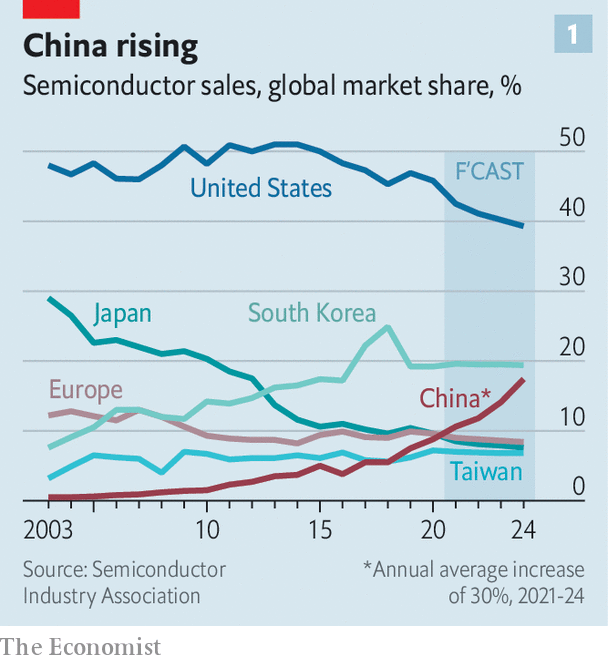
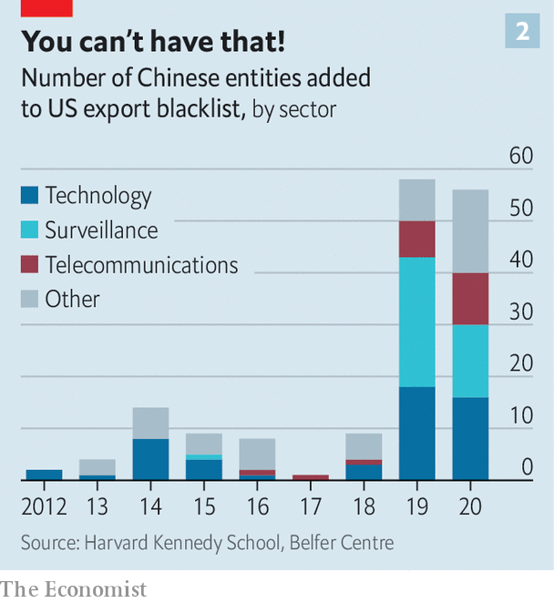

###### Game of chiplomacy

# Will China dominate the world of semiconductors? 

##### America and its allies are crafting rules to try to prevent it 

 

> Jan 29th 2022 

DURING DONALD TRUMP’S presidency many people looked afresh at China’s technological prowess. Some concluded that it posed a threat to Western economies, and perhaps even to global security. In news headlines Huawei, a brilliantly successful manufacturer of telecoms equipment, became the face of that threat. America accused the firm of acting as a conduit for Chinese government surveillance and control. In 2018 America clobbered Huawei. It banned the export to the Chinese firm of American microchips essential for its products. This seems to have had the desired effect. Last year Huawei’s revenues shrank for the first time in a decade, by almost a third.

It was unprecedented for a state to stymie so huge a tech company. Huawei’s revenues were about as big as Microsoft’s. But the feat was not without costs. Because the Trump administration acted without co-operating closely with America’s friends, it prompted investors from far and wide to add missing links to parts of the semiconductor supply chain that are beyond the reach of American law.


Japanese firms, among others, have started quietly marketing their products in such a way as to evade America’s Export Administration Regulations, qualifying them as “ EAR-free”. American firms, many of which sell billions of dollars of equipment to China every year, began looking for neutral territory from which they might continue to export supplies. Singapore and Malaysia led the way. “Who would willingly sign up to be restricted by the US government?” chuckles a lawyer in Washington, who has been navigating tech clients around the new restrictions.

Meanwhile, Chinese firms, spurred on by billions of dollars of investment by the state, have redoubled their efforts to develop their own versions of chip technologies they had previously imported along supply chains linked to firms in America. The way things began to go, it looked as if the American government would steadily lose its grip over the chip supply chain. To avoid that outcome, and to keep a modicum of control over what technology flows into China, it must build a consensus with friendly countries.

Since Joe Biden took office a year ago, his officials have been raising the issue of chip controls whenever they talk to foreign allies. A lobbyist in Washington says that in 25 years he has never seen semiconductors so consistently top the diplomatic agenda. Governments and companies have been setting up forums to align policy over the trade in chips and the equipment and material used to make them.

Some see a parallel with the Organisation of the Petroleum Exporting Countries, better known as OPEC. For decades its members, all oil exporters, have clubbed together to try to control how much oil reaches the world market, in order to influence prices. Today’s new forums mark the first steps towards creating a similar set-up to control the export of semiconductors, in the hope of retaining a technological edge over China. It could be called the Organisation of the Semiconductor Exporting Countries: OSEC.

Diplomatic bodies dedicated to forging multilateral agreements over the export of technology already exist. But they are poor at governing the trade in semiconductors. In 1996 the Wassenaar Arrangement was created, among other things to oversee trade that may have a military use. It is the successor to the Co-ordinating Committee for Multilateral Export Controls, known as COCOM, the cold-war body that in effect kept a Western embargo on trade with the Soviet bloc. Officials pay lip service to the idea of updating Wassenaar so that it might help control the trade in semiconductors. But few expect it to play that role, not least because Russia is a member.

So newer forums are springing up. The most formal is the EU-US Trade and Technology Council, set up last June with a working group dedicated to export controls. Semiconductors are on the agenda. A joint statement after the council’s first meeting in Pittsburgh in September declared its intention to co-operate in “rebalancing” global chip supply chains. That was diplomatic language for keeping them away from China. The chip industry in the West and parts of Asia that are wary of China has welcomed the discussion, at least officially. It hopes that clearer export rules, applied globally, will reduce uncertainty.

But global chip diplomacy is still weak. When semiconductor trade is discussed, it tends to be tacked onto the agenda of other world forums. Export-control lawyers and government officials huddle, often virtually, in the corridors of meetings of the Quad, a club of countries that embraces America, Australia, India and Japan. In September it announced that one of its goals was to secure the supply chains in semiconductors.

Chips have also come up in the sidelines of meetings to discuss sanctions that might be put on Russia if it were to invade Ukraine (see Briefing). The American administration has briefed the Semiconductor Industry Association on how the sort of export controls used against Huawei could be part of a sanctions package against Russia, to cut off its access to Western technology. Unlike China, Russia has no electronics industry to speak of, so such controls would not hurt it as badly. But it might make it harder for Russia to carry out cyber-attacks on its enemies.

Agreements forged between the governments of the leading countries in the chip supply chain—America, Japan and the Netherlands—still matter more than any talking shop. That trio produces the lion’s share of the machinery used to make chips. A consensus between them over trade in chips marked the first step towards constraining China towards the end of Mr Trump’s presidency. A big Dutch company, ASML (originally standing for Advanced Semiconductor Materials Lithography), had been poised to sell its most sophisticated tools to SMIC, China’s biggest and beefiest chipmaker. Japanese and American officials rounded on the Dutch government, which duly refused to give ASML a licence to export its cutting-edge machines to SMIC.

American officials with a more hawkish stance on China who want a clean break in the supply chains favour this narrower coalition-of-the-willing approach to diplomacy. Its small number of members planning discreetly makes it easier to move quickly against perceived threats. It also gives America the main say, echoing Mr Trump’s go-it-alone attitude to China, rather than taking the time to cajole partners and find ways to write a book of clear rules for trading in chips. The Europeans and the Japanese both want a more formal multilateral approach. But America reckons its ability to react fast to a Chinese threat would inevitably be curbed.

No stake, no chips

The snag, as a former official in Barack Obama’s export team argues, is that the more robustly America wants to respond to China, the harder it is to get America’s Western and Asian allies to come along. Without America’s friends on board America’s hard line on exports threatens to weaken its own companies. That is because it could steer investment to places outside America’s reach but which still suit Chinese chipmakers. America is caught between choosing a softer set of controls which may work better in the long run, or a harsher set that could hurt Chinese technology more in the short run but might harm American industry overall. Worse, it might ruin the prospect of American-Chinese chip trade ever reviving in the event that better relations one day resume.

 


For the moment the administration is seeking a compromise by cutting off Chinese access to chips and chipmaking tools above a certain level of sophistication. For example, it completely blocks Huawei from getting chips that run whizzy 5G networking equipment but lets it have older technologies. Likewise SMIC can get older chipmaking tools but not the latest versions that can be used for chips that go into iPhones and self-driving cars. America’s friends, however, have yet to agree to this compromise, which is still being imposed unilaterally through the American government’s export-control rules.

Mr Biden’s administration is anyway hamstrung by politics at home, whatever new course America might try to chart with China. “Many are sceptical because they’re not sure whether or not Biden will be around,” says Richard Thurston, once the top lawyer at the Taiwan Semiconductor Manufacturing Company (TSMC), the world’s largest chipmaker. He says the administration may be losing its appetite for energetic chiplomacy for fear that any agreement it makes may be swept away later this year if Congress turns Republican.

 


Mr Thurston reckons that controlling exports of specific machines and components is unwise anyway, because no net of controls can be drawn tightly enough to stop a determined, powerful country from somehow getting the tools. But it will nonetheless be tricky for China to acquire the knowledge for using those tools to make chips in commercially viable volumes. Mr Thurston suggests that governments, instead of constraining semiconductor supply chains, should focus on protecting trade secrets. American semiconductor companies and those in friendly countries could sell their most advanced chipmaking services to the Chinese market, yet still be able to prevent Chinese firms from developing the most sophisticated manufacturing capacity themselves.

This is not a popular view in Washington, where Mr Biden is all too easily battered by headlines bemoaning the flow of chips and tools to China. Yet an awkward fact is that America’s own semiconductor toolmakers still count China as one of their biggest markets. Applied Materials, a Californian firm that makes machines used to etch minute circuits on silicon wafers, sold tools worth $5bn to China in 2020, more than to any other market.

Meanwhile China keeps making progress. The proportion of global chips sold by China is rising (see chart 1). That is not true for any other major chipmaking country, despite Mr Trump’s campaign to snuff out China’s indigenous industries and Mr Biden’s more multilateral attempts to achieve the same end. America and its allies may yet agree on how to contain China’s semiconductor ambitions. But it may prove impossible for one state to control such a complex industry. If so, America may come to regret trying to intervene. ■

