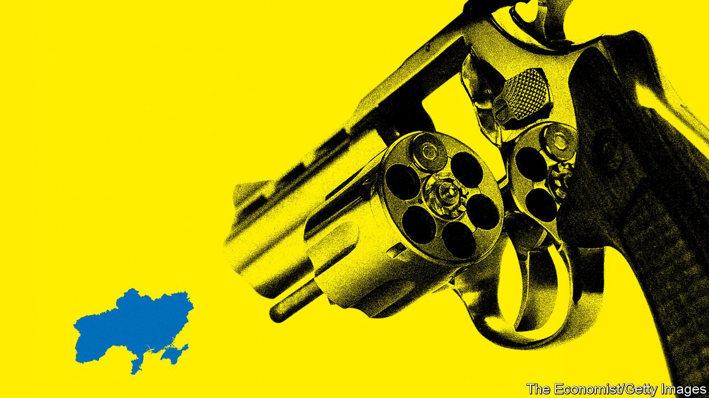

###### Russia’s roulette

# A war in Ukraine could have global consequences 

##### Human suffering, economic shock and a geopolitical realignment 

 

> Jan 29th 2022 

SELDOM IN THE field of human conflict did so much hang on the whims of one man. Is Vladimir Putin about to invade Ukraine, as the massing Russian troops on its borders suggest? Or is he bluffing, to extort concessions from his neighbour and the West? No one can be sure of Mr Putin’s intentions. Even his own foreign minister seems to be kept guessing. But, if fighting is about to break out, the world needs to understand the stakes.

Perhaps Mr Putin is planning a full-scale invasion, with Russian forces thrusting deep into Ukraine to seize the capital, Kyiv, and overthrow the government. Or he may seek to annex more territory in eastern Ukraine, carving out a corridor linking Russia with Crimea, the Ukrainian peninsula Mr Putin grabbed in 2014. Then again, he may want a small war, in which  in Donbas, an eastern region of Ukraine, from supposed Ukrainian atrocities—and, at the same time, degrades Ukraine’s armed forces.


Because Mr Putin has the initiative, it is easy to conclude he has the advantage. In fact he faces perilous choices. A big war entails extraordinary risks. But a smaller war that limits these risks may fail to halt Ukraine’s Westward drift. And if a small war does not bring the capitulation of the government in Kyiv, Mr Putin may ineluctably be drawn into a larger one.

A full Russian invasion would be Europe’s biggest war since the 1940s, and the first toppling since then of a democratically elected European government by a foreign invader. Russians would not only suffer casualties, especially during a long-running insurgency, but also cause the death of untold Ukrainians—fellow Slavs, with whom many have family ties.

Russia would also suffer heavy sanctions. Its banks would be harshly penalised and its economy deprived of crucial American high-tech components. The ultra-rich, including possibly Mr Putin himself, might be prevented from spending and saving abroad. Ordinary Russians would suffer from lower living standards, which have already been falling over the past seven years.

And the subjugation of Ukraine would come at a strategic cost to Russia. Every country in its shadow would revise its security calculations. NATO would reinforce the defences of its eastern members. Sweden and Finland might join the alliance.

For Mr Putin, the economic consequences of war would be survivable, at least in the short term. His central bank has $600bn in reserves—more than enough to weather sanctions. But the political gains in Ukraine could easily be overwhelmed by setbacks at home which, as Mr Putin knows better than anyone, is where his fate will ultimately be determined.

Perhaps, then, he will start with a less ambitious invasion. However, a limited war could claim many lives and be hard to contain. Sanctions might be lighter, but they would still be painful. Russia’s decoupling from the West would still accelerate. Moreover, if the government in Kyiv remained independent, it would only redouble its efforts to join the West. Mr Putin’s thuggery over the past eight years means that even Russian-speakers in eastern Ukraine no longer hanker for closer ties with Moscow.

The coming weeks will determine how Mr Putin chooses, and nobody should doubt the stakes. Europe faces the prospect of . Even in the absence of a cut-off, it was expected to spend $1trn on energy in 2022, twice as much as in 2019. War would affect the prices of other commodities, too. Oil is already spiking. Russia is the world’s largest exporter of wheat, with Ukraine close behind. Russia is a big source of metals: in today’s tight markets even a small shock could .

A successful invasion of Ukraine would also set a destabilising political precedent. The global order has long been buttressed by the norm that countries do not redraw other countries’ borders by force of arms. When Iraq seized Kuwait in 1990 an international coalition led by America kicked it out. Mr Putin, who has a nuclear arsenal at his command, has already got away with annexing Crimea; if he seizes a bigger slice of Ukraine, it is hard to see him suddenly concluding that the time has come to make peace with NATO.

More likely, he would push on, helped by the newly established presence of Russian troops in Belarus to probe NATO’s collective-security pact, under which an attack on one member is an attack on all. Not only would he relish the chance to hollow out America’s commitments to Europe, but he has also come to rely on demonising an enemy abroad to justify his harsh rule at home.

Other potential aggressors would take note, too. The likelihood of China invading Taiwan would surely rise. The regimes in Iran and Syria would conclude they are freer to use violence with impunity. If might is right, more of the world’s disputed borders would be fought over.

With so much at risk, the West should respond in three ways: deter, keep talking and prepare. To deter Mr Putin, Western powers—especially Germany—should stop equivocating, present a united front and make clear that they are willing to pay the price for imposing sanctions on Russia and also to support those Ukrainians who are ready to resist an occupying army. Meanwhile, diplomats should keep talking, looking for common ground on, say, arms control and pressing for a face-saving climbdown that Mr Putin and his captive media would be free to spin however they wish. And Europe should prepare for the next crisis by making clear that its energy transition will cut its dependence on Russian gas by using storage, diversification and nuclear power.

Seldom has the difference between a country’s interests and those of its leader been so stark. Russia would benefit from better, closer, peaceful relations with the West. Such ties would be available if Mr Putin didn’t behave so abominably. Only he benefits from discord, since he can tell Russians they are under siege and need a strongman to defend them. But even the wiliest strongman can miscalculate. Invading Ukraine could ultimately prove Mr Putin’s undoing, if it turns into a bloody quagmire or makes Russians poorer, angrier and more eager for change. Even if just for his own sake, he should claim a victory over the imaginary threat Russia confronts in Ukraine—and back down. ■

Read more of our recent stories on Ukraine


